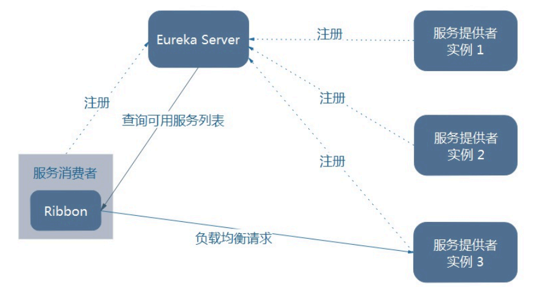

# Spring Cloud Learn
## 一、版本管理

**版本约束：https://start.spring.io/actuator/info**

```json
{
    "bom-ranges": {
        "spring-cloud": {
            "2021.0.8": "Spring Boot >=2.6.0 and <3.0.0",
            "2022.0.3": "Spring Boot >=3.0.0 and <3.2.0-M1"
        }
    }
}
```

### 1.1 Spring Boot
> https://spring.io/projects/spring-boot#learn

| Spring Boot Versiojn | JDK    | Release Notes                                                | Spring Framework Version |
| -------------------- | ------ | ------------------------------------------------------------ | ------------------------ |
| 3.x                  | JDK 17 | [here](https://github.com/spring-projects/spring-boot/wiki/Spring-Boot-3.0-Release-Notes) | 6.0.x                    |
| 2.7.x                | JDK 8  | [here](https://github.com/spring-projects/spring-boot/wiki/Spring-Boot-2.7-Release-Notes) | 5.3.20+                  |
| 2.6.x                | JDK 8  | [here](https://github.com/spring-projects/spring-boot/wiki/Spring-Boot-2.6-Release-Notes) | 5.3.13+                  |

### 1.2 Spring Cloud

> https://spring.io/projects/spring-cloud#overview

If you an existing Spring Boot app you want to add Spring Cloud to that app, the first step is to determine the version of Spring Cloud you should use. The version you use in your app will depend on the version of Spring Boot you are using.

The table below outlines which version of Spring Cloud maps to which version of Spring Boot.

Table 1. Release train Spring Boot compatibility

| Release Train                                                | Release Train                         |
| ------------------------------------------------------------ | ------------------------------------- |
| [2022.0.x](https://github.com/spring-cloud/spring-cloud-release/wiki/Spring-Cloud-2022.0-Release-Notes) aka Kilburn | 3.0.x, 3.1.x (Starting with 2022.0.3) |
| [2021.0.x](https://github.com/spring-cloud/spring-cloud-release/wiki/Spring-Cloud-2021.0-Release-Notes) aka Jubilee | 2.6.x, 2.7.x (Starting with 2021.0.3) |
| [2020.0.x](https://github.com/spring-cloud/spring-cloud-release/wiki/Spring-Cloud-2020.0-Release-Notes) aka Ilford | 2.4.x, 2.5.x (Starting with 2020.0.3) |
| [Hoxton](https://github.com/spring-cloud/spring-cloud-release/wiki/Spring-Cloud-Hoxton-Release-Notes) | 2.2.x, 2.3.x (Starting with SR5)      |
| [Greenwich](https://github.com/spring-projects/spring-cloud/wiki/Spring-Cloud-Greenwich-Release-Notes) | 2.1.x                                 |
| [Finchley](https://github.com/spring-projects/spring-cloud/wiki/Spring-Cloud-Finchley-Release-Notes) | 2.0.x                                 |
| [Edgware](https://github.com/spring-projects/spring-cloud/wiki/Spring-Cloud-Edgware-Release-Notes) | 1.5.x                                 |
| [Dalston](https://github.com/spring-projects/spring-cloud/wiki/Spring-Cloud-Dalston-Release-Notes) | 1.5.x                                 |

> Spring Cloud Dalston, Edgware, Finchley, and Greenwich have all reached end of life status and are no longer supported.

如果同时使用 springboot 和 springcloud ，需要照顾 springcloud ，由 springcloud 决定 springboot 的版本。

> https://docs.spring.io/spring-cloud/docs/2021.0.8/reference/html/


### 1.3 Spring Cloud Alibaba

> https://github.com/alibaba/spring-cloud-alibaba/wiki/%E7%89%88%E6%9C%AC%E8%AF%B4%E6%98%8E

**2021.x 分支**

适配 Spring Boot 2.4，Spring Cloud 2021.x 版本及以上的 Spring Cloud Alibaba 版本按从新到旧排列如下表（最新版本用*标记）：

| Spring Cloud Alibaba Version | Spring Cloud Version  | Spring Boot Version |
| ---------------------------- | --------------------- | ------------------- |
| 2021.0.5.0*                  | Spring Cloud 2021.0.5 | 2.6.13              |
| 2021.0.4.0                   | Spring Cloud 2021.0.4 | 2.6.11              |
| 2021.0.1.0                   | Spring Cloud 2021.0.1 | 2.6.3               |
| 2021.1                       | Spring Cloud 2020.0.1 | 2.4.2               |

### 1.4 版本选择

| Spring Cloud | Spring Boot | Spring Cloud Alibaba |
| ------------ | ----------- | -------------------- |
| 2022.0.3     | 3.0.7       | 2022.0.0.0-RC2       |
| **2021.0.8** | **2.6.15**  | **2021.0.5.0**       |

## 二、微服务组件


**停更前**：


**新版本**：


### 2.1 Eureka

服务注册中心，已停止更新。

1. 服务治理

   在传统的 RPC 远程调用框架中，管理每个服务与服务之间依赖关系比较复杂，管理比较复杂，所以需要使用服务治理，管理服务于服务之间依赖关系，可以实现服务调用、负载均衡、容错等，实现服务发现与注册。

2. 服务注册与发现

   Eureka 采用了 CS 的设计架构，Eureka Server 作为服务注册功能的服务器，它是**服务注册中心**。而系统中的其他微服务，使用 **Eureka Client** 连接到 **Eureka Server** 并维持**心跳**连接。这样系统的维护人员就可以通过 Eureka Server 来**监控**系统中各个微服务是否正常运行。
   在服务注册与发现中，有一个注册中心。当服务器启动的时候，会把当前自己服务器的信息比如：服务地址通讯地址等以**别名**方式注册到注册中心上。另一方（消费者|服务提供者），**以该别名的方式去注册中心上获取到实际的服务通讯地址，然后再实现本地 RPC 调用**。

   RPC 远程调用框架核心设计思想：在于注册中心，因为使用注册中心管理每个服务与服务之间的一个依赖关系（服务治理概念）。在任何 RPC 远程框架中，都会有一个注册中心（存放服务地址相关信息(接口地址））

**Eureka VS Dubbo**：


Eureka 包含两个组件：Eureka Server 和 Eureka Client。

1. Eureka Server

   提供服务注册服务，各个微服务节点通过配置启动后，会在 Eureka Server 中进行注册，这样 Eureka Server 中的服务注册表中将会存储所有可用服务节点的信息，服务节点的信息可以在界面中直观看到。

2. Eureka Client

   通过注册中心进行访问，是一个 Java 客户端，用于简化 Eureka Server 的交互，客户端同时也具备一个内置的、使用轮询（round-robin）负载算法的负载均衡器。

   在应用启动后，客户端将会向 Eureka Server 发送心跳（默认周期为 30 秒）。如果 Eureka Server 在多个心跳周期内没有接收到某个节点的心跳，Eureka Server 将会从服务注册表中把这个服务节点移除（默认 90 秒）。

#### 2.1.1 Eureka Server

`pom.xml`:

```xml
<!-- eureka-server -->
<dependency>
    <groupId>org.springframework.cloud</groupId>
    <artifactId>spring-cloud-starter-netflix-eureka-server</artifactId>
</dependency>
```

`application.yaml`:

```yaml
server:
  port: 7001

eureka:
  server:
    eviction-interval-timer-in-ms: 60  # 定期检测实例状态（心跳机制） 默认60s
    enable-self-preservation: true  # 关闭自我保护 默认为打开状态，生产环境建议打开
  instance:
    hostname: localhost  # eureka 服务器实例名称
  client:
    register-with-eureka: false  # 不向注册中心注册自己
    fetch-registry: false  # false 表示本机是注册中心
    service-url:
      defaultZone: http://${eureka.instance.hostname}:${server.port}/eureka/  # 设置与 eureka 的交互地址
```

`Application.java`:

```java
@EnableEurekaServer
@SpringBootApplication
public class AlbrusCloudEurekaServer7001Application {

    public static void main(String[] args) {
        SpringApplication.run(AlbrusCloudEurekaServer7001Application.class);
    }

}
```


EurekaServer 自我保护机制：


#### 2.1.2 Eureka Client

##### 2.1.2.1 Provider

`pom.xml`:

```xml
<!-- eureka-client -->
<dependency>
    <groupId>org.springframework.cloud</groupId>
    <artifactId>spring-cloud-starter-netflix-eureka-client</artifactId>
</dependency>
```

`application.yaml`:

```yaml
server:
  port: 8001

spring:
  application:
    name: albrus-cloud-payment-service  # 注意在 EurekaServer 中 Application 名称

eureka:
  client:
    register-with-eureka: true  # 将自己注册到 EurekaServer
    fetch-registry: true  # 是否从 EurekaServer 抓取已有的注册信息，默认为 true。单节点无所谓，集群必须设置为 true 才能配合 ribbon 使用负载均衡
    service-url:
      defaultZone: http://localhost:7001/eureka/  # 路径包含 /eureka 是因为 EurekaServer 内部有 web 过滤器
    registry-fetch-interval-seconds: 30  # 隔多久从服务中心拉取一次服务列表，默认 30s
  instance:
    # 使用 IP 注册，否则会使用主机注册（此处考虑老版本的兼容，新版本经过实验都是 IP）
    prefer-ip-address: true
    # 自定义实例显示格式，加上版本号便于多版本管理，注意是 ip-address，早期版本是 ipaddress
    instance-id: ${spring.cloud.client.ip-address}:${spring.application.name}:${server.port}:@project.version@
    # 自定义元数据（key/value 结构）
    metadata-map:
      cluster: cll
      region: rnl
    lease-renewal-interval-in-seconds: 30  # 租约续约间隔时间，默认 30s
    lease-expiration-duration-in-seconds: 90  # 租约到期，服务时效时间，默认值 90s，服务超过 90s 没有发⽣⼼跳，EurekaServer 会将服务从列表移除
```

`Application.java`:

```java
@EnableEurekaClient
@SpringBootApplication
public class AlbrusCloudPayment8001Application {

    public static void main(String[] args) {
        SpringApplication.run(AlbrusCloudPayment8001Application.class, args);
    }

}
```


##### 2.1.2.2 Consumer

`pom.xml`:

```xml
<!-- eureka-client -->
<dependency>
    <groupId>org.springframework.cloud</groupId>
    <artifactId>spring-cloud-starter-netflix-eureka-client</artifactId>
</dependency>
```

`application.yaml`:

```yaml
server:
  port: 80

spring:
  application:
    name: albrus-cloud-order-service

eureka:
  client:
    register-with-eureka: true  # 将自己注册到 EurekaServer
    fetch-registry: true  # 是否从 EurekaServer 抓取已有的注册信息，默认为 true。单节点无所谓，集群必须设置为 true 才能配合 ribbon 使用负载均衡
    service-url:
      defaultZone: http://localhost:7001/eureka/  # 路径包含 /eureka 是因为 EurekaServer 内部有 web 过滤器
    registry-fetch-interval-seconds: 30  # 隔多久从服务中心拉取一次服务列表，默认 30s
  instance:
    # 使用 IP 注册，否则会使用主机注册（此处考虑老版本的兼容，新版本经过实验都是 IP）
    prefer-ip-address: true
    # 自定义实例显示格式，加上版本号便于多版本管理，注意是 ip-address，早期版本是 ipaddress
    instance-id: ${spring.cloud.client.ip-address}:${spring.application.name}:${server.port}:@project.version@
    # 自定义元数据（key/value 结构）
    metadata-map:
      cluster: cll
      region: rnl
    lease-renewal-interval-in-seconds: 30  # 租约续约间隔时间，默认 30s
    lease-expiration-duration-in-seconds: 90  # 租约到期，服务时效时间，默认值 90s，服务超过 90s 没有发⽣⼼跳，EurekaServer 会将服务从列表移除
```

`Application.java`:

```java
@EnableEurekaClient
@SpringBootApplication
public class AlbrusCloudConsumerOrder80Application {

    public static void main(String[] args) {
        SpringApplication.run(AlbrusCloudConsumerOrder80Application.class, args);
    }

}
```


#### 2.1.3 Eureka 集群


单点故障：**集群，负载均衡 + 故障容错**。

启动顺序：

1. Eureka Server * 2
2. Eureka Client Payment * 2
3. Eureka Client Consumer * 1

##### 2.1.3.1 Eureka Server 集群

> **互相注册、互相守望**：[A、B、C] -> [A: [B、C]、B[A、C]、C[A、B]]。

`org.springframework.cloud.netflix.eureka.EurekaClientConfigBean#getEurekaServerServiceUrls`:

```java
@Override
public List<String> getEurekaServerServiceUrls(String myZone) {
    // 从 application.yaml 中获取 service-url 
    String serviceUrls = this.serviceUrl.get(myZone);
    if (serviceUrls == null || serviceUrls.isEmpty()) {
        // 最后会尝试获取 DEFAULT_ZONE = defaultZone 
        serviceUrls = this.serviceUrl.get(DEFAULT_ZONE);
    }
    
    if (!StringUtils.isEmpty(serviceUrls)) {
        // 按 , 分割获取到的服务路径
        final String[] serviceUrlsSplit = StringUtils.commaDelimitedListToStringArray(serviceUrls);
        List<String> eurekaServiceUrls = new ArrayList<>(serviceUrlsSplit.length);
        for (String eurekaServiceUrl : serviceUrlsSplit) {
            // 给结尾添加 /
            if (!endsWithSlash(eurekaServiceUrl)) {
                eurekaServiceUrl += "/";
            }
            eurekaServiceUrls.add(eurekaServiceUrl.trim());
        }
        return eurekaServiceUrls;
    }

    return new ArrayList<>();
}
```

`application.yaml`:

```yaml
# Eureka Server 7001
server:
  port: 7001

eureka:
  server:
    eviction-interval-timer-in-ms: 60  # 定期检测实例状态（心跳机制） 默认60s
    enable-self-preservation: true  # 关闭自我保护 默认为打开状态，生产环境建议打开
  instance:
    hostname: eureka7001.com  # eureka 服务器实例名称
  client:
    register-with-eureka: false  # 不向注册中心注册自己
    fetch-registry: false  # false 表示本机是注册中心
    service-url:
      defaultZone: http://eureka7001.com:7001/eureka/  # 设置与 eureka 的交互地址，用 , 分割配置多个地址

# Eureka Server 7002
server:
  port: 7002

eureka:
  server:
    eviction-interval-timer-in-ms: 60  # 定期检测实例状态（心跳机制） 默认60s
    enable-self-preservation: true  # 关闭自我保护 默认为打开状态，生产环境建议打开
  instance:
    hostname: eureka7002.com  # eureka 服务器实例名称
  client:
    register-with-eureka: false  # 不向注册中心注册自己
    fetch-registry: false  # false 表示本机是注册中心
    service-url:
      defaultZone: http://eureka7002.com:7002/eureka/  # 设置与 eureka 的交互地址，用 , 分割配置多个地址
```

**Eureka Client Provider 注册**

`application.yaml`:

```yaml
server:
  port: 8001

spring:
  application:
    name: albrus-cloud-payment-service

eureka:
  client:
    register-with-eureka: true  # 将自己注册到 EurekaServer
    fetch-registry: true  # 是否从 EurekaServer 抓取已有的注册信息，默认为 true。单节点无所谓，集群必须设置为 true 才能配合 ribbon 使用负载均衡
    service-url:
      # defaultZone: http://localhost:7001/eureka/  # 路径包含 /eureka 是因为 EurekaServer 内部有 web 过滤器
      defaultZone: http://eureka7001.com:7001/eureka/, http://eureka7002.com:7002/eureka/  # 集群配置
    registry-fetch-interval-seconds: 30  # 隔多久从服务中心拉取一次服务列表，默认 30s
  instance:
    # 使用 IP 注册，否则会使用主机注册（此处考虑老版本的兼容，新版本经过实验都是 IP）
    prefer-ip-address: true
    # 自定义实例显示格式，加上版本号便于多版本管理，注意是 ip-address，早期版本是 ipaddress
    instance-id: ${spring.cloud.client.ip-address}:${spring.application.name}:${server.port}:@project.version@
    # 自定义元数据（key/value 结构）
    metadata-map:
      cluster: cll
      region: rnl
    lease-renewal-interval-in-seconds: 30  # 租约续约间隔时间，默认 30s
    lease-expiration-duration-in-seconds: 90  # 租约到期，服务时效时间，默认值 90s，服务超过 90s 没有发⽣⼼跳，EurekaServer 会将服务从列表移除
```

**Eureka Client Consumer 注册**

`application.yaml`:

```yaml
server:
  port: 80

spring:
  application:
    name: albrus-cloud-order-service

eureka:
  client:
    register-with-eureka: true  # 将自己注册到 EurekaServer
    fetch-registry: true  # 是否从 EurekaServer 抓取已有的注册信息，默认为 true。单节点无所谓，集群必须设置为 true 才能配合 ribbon 使用负载均衡
    service-url:
      # defaultZone: http://localhost:7001/eureka/  # 路径包含 /eureka 是因为 EurekaServer 内部有 web 过滤器
      defaultZone: http://eureka7001.com:7001/eureka/, http://eureka7002.com:7002/eureka/  # 集群配置
    registry-fetch-interval-seconds: 30  # 隔多久从服务中心拉取一次服务列表，默认 30s
  instance:
    # 使用 IP 注册，否则会使用主机注册（此处考虑老版本的兼容，新版本经过实验都是 IP）
    prefer-ip-address: true
    # 自定义实例显示格式，加上版本号便于多版本管理，注意是 ip-address，早期版本是 ipaddress
    instance-id: ${spring.cloud.client.ip-address}:${spring.application.name}:${server.port}:@project.version@
    # 自定义元数据（key/value 结构）
    metadata-map:
      cluster: cll
      region: rnl
    lease-renewal-interval-in-seconds: 30  # 租约续约间隔时间，默认 30s
    lease-expiration-duration-in-seconds: 90  # 租约到期，服务时效时间，默认值 90s，服务超过 90s 没有发⽣⼼跳，EurekaServer 会将服务从列表移除
```

##### 2.1.3.2 Eureka Client 集群

**Eureka Client Provider**

`application.xml`:

```yaml
server:
  port: 8001

spring:
  application:
    name: albrus-cloud-payment-service

eureka:
  client:
    register-with-eureka: true  # 将自己注册到 EurekaServer
    fetch-registry: true  # 是否从 EurekaServer 抓取已有的注册信息，默认为 true。单节点无所谓，集群必须设置为 true 才能配合 ribbon 使用负载均衡
    service-url:
      # defaultZone: http://localhost:7001/eureka/  # 路径包含 /eureka 是因为 EurekaServer 内部有 web 过滤器
      defaultZone: http://eureka7001.com:7001/eureka/, http://eureka7002.com:7002/eureka/  # 集群配置
    registry-fetch-interval-seconds: 30  # 隔多久从服务中心拉取一次服务列表，默认 30s
  instance:
    # 使用 IP 注册，否则会使用主机注册（此处考虑老版本的兼容，新版本经过实验都是 IP）
    prefer-ip-address: true
    # 自定义实例显示格式，加上版本号便于多版本管理，注意是 ip-address，早期版本是 ipaddress
    instance-id: ${spring.cloud.client.ip-address}:${spring.application.name}:${server.port}:@project.version@
    # 自定义元数据（key/value 结构）
    metadata-map:
      cluster: cll
      region: rnl
    lease-renewal-interval-in-seconds: 30  # 租约续约间隔时间，默认 30s
    lease-expiration-duration-in-seconds: 90  # 租约到期，服务时效时间，默认值 90s，服务超过 90s 没有发⽣⼼跳，EurekaServer 会将服务从列表移除
    
server:
  port: 8002

spring:
  application:
    name: albrus-cloud-payment-service

eureka:
  client:
    register-with-eureka: true  # 将自己注册到 EurekaServer
    fetch-registry: true  # 是否从 EurekaServer 抓取已有的注册信息，默认为 true。单节点无所谓，集群必须设置为 true 才能配合 ribbon 使用负载均衡
    service-url:
      # defaultZone: http://localhost:7001/eureka/  # 路径包含 /eureka 是因为 EurekaServer 内部有 web 过滤器
      defaultZone: http://eureka7001.com:7001/eureka/, http://eureka7002.com:7002/eureka/  # 集群配置
    registry-fetch-interval-seconds: 30  # 隔多久从服务中心拉取一次服务列表，默认 30s
  instance:
    # 使用 IP 注册，否则会使用主机注册（此处考虑老版本的兼容，新版本经过实验都是 IP）
    prefer-ip-address: true
    # 自定义实例显示格式，加上版本号便于多版本管理，注意是 ip-address，早期版本是 ipaddress
    instance-id: ${spring.cloud.client.ip-address}:${spring.application.name}:${server.port}:@project.version@
    # 自定义元数据（key/value 结构）
    metadata-map:
      cluster: cll
      region: rnl
    lease-renewal-interval-in-seconds: 30  # 租约续约间隔时间，默认 30s
    lease-expiration-duration-in-seconds: 90  # 租约到期，服务时效时间，默认值 90s，服务超过 90s 没有发⽣⼼跳，EurekaServer 会将服务从列表移除
```

**Eureka Client Consumer 服务调用**

`OrderController.java`:

```java
// private static final String BASE_URL = "http://127.0.0.1:8001";
/**
 * 通过在 eureka 上注册过的微服务名称调用
 */
private static final String BASE_URL = "http://ALBRUS-CLOUD-PAYMENT-SERVICE";

// 2023-08-11 19:43:32.669  WARN 17336 --- [  restartedMain] iguration$LoadBalancerCaffeineWarnLogger : Spring Cloud LoadBalancer is currently working with the default cache. While this cache implementation is useful for development and tests, it's recommended to use Caffeine cache in production.You can switch to using Caffeine cache, by adding it and org.springframework.cache.caffeine.CaffeineCacheManager to the classpath.
```

##### 2.1.3.3 服务发现

`@EnableDiscoveryClient`:

```java
@EnableEurekaClient
@SpringBootApplication
@EnableDiscoveryClient
public class AlbrusCloudPayment8001Application {

    public static void main(String[] args) {
        SpringApplication.run(AlbrusCloudPayment8001Application.class, args);
    }

}
```

`private final DiscoveryClient discoveryClient;`:

```java
@Slf4j
@RestController
@RequestMapping("/payment")
public class PaymentController {
    private final DiscoveryClient discoveryClient;

    @Value("${spring.application.name}")
    private String applicationName;
    
    public PaymentController(DiscoveryClient discoveryClient) {
        this.discoveryClient = discoveryClient;
    }
    
    @GetMapping(value = "/discoveryClientInfo")
    public Result<ServiceInstance> getDiscoveryClientInfo() {
        log.info("The discovery client is: {}.", discoveryClient);

        List<String> services = discoveryClient.getServices();
        for (String service : services) {
            log.info("The service is: {}.", service);
        }

        List<ServiceInstance> instances = discoveryClient.getInstances(applicationName);
        for (ServiceInstance instance : instances) {
            log.info("The service instance details: {}, {}, {}, {}.", instance.getInstanceId(), instance.getHost(), instance.getPort(), instance.getUri());
        }

        return new Result<>(200, instances.get(0));
    }
}
```

#### 2.1.4 自我保护

> 当 Eureka Client 由于网络分区故障发生（延时、卡顿、拥挤）与 Eureka Server 断开连接时，Eureka Server 不会立即从服务列表中清除该 Eureka Client 服务，增加可用性（AP）。

Eureka Server 默认在 90s 没有收到 Eureka Client 的心跳时，会将 Eureka Client 服务剔除。若在 90s 内丢失了大量的服务实例心跳，这时 Eureka Server 会开启自我保护机制，不会剔除任何服务实例了。

```yaml
eureka:
  server:
    enable-self-preservation: true  # 默认开启
    
eureka:
  client:
    lease-renewal-interval-in-seconds: 30  # 租约续约间隔时间，默认 30s
    lease-expiration-duration-in-seconds: 90  # 租约到期，服务时效时间，默认值 90s，服务超过 90s 没有发⽣⼼跳，EurekaServer 会将服务从列表移除
```

#### 2.1.5 停更

[Eureka 2.0 (Discontinued)](https://github.com/Netflix/eureka/wiki)

The existing open source work on eureka 2.0 is discontinued. The code base and artifacts that were released as part of the existing repository of work on the 2.x branch is considered use at your own risk.

Eureka 1.x is a core part of Netflix's service discovery system and is still an active project.

### 2.2 ZooKeeper

> ZooKeeper 是一个分布式协调工具，可以实现注册中心功能。

#### 2.2.1 安装启动

配置文件：[zoo.cfg](./Program/ZooKeeper/zoo.cfg)

```properties
# The number of milliseconds of each tick
# 心跳时间，为了确保client-server连接存在，以毫秒为单位，最小超时时间为2个心跳时间
tickTime=2000
# The number of ticks that the initial 
# synchronization phase can take
# 多少个tickTime内，允许其他server连接并初始化数据，如果zookeeper管理的数据较大，则相应增大这个值
initLimit=10
# The number of ticks that can pass between 
# sending a request and getting an acknowledgement
# 多少个tickTime内，允许follower同步，如果follower落后太多，则会被丢弃
syncLimit=5
# the directory where the snapshot is stored.
# do not use /tmp for storage, /tmp here is just 
# example sakes.
# 用户存放内存数据库快照的文件夹，同时用于集群myid文件也存在这个文件夹里
dataDir=/home/albrus/apache-zookeeper-3.6.4-bin/data
# the port at which the clients will connect
# 客户端监听端口
clientPort=2181
```

安装启动：

```bash
tar -zxvf apache-zookeeper-3.6.4-bin.tar.gz
cp zoo.cfg ./conf
sudo ufw allow 2181
./zkServer.sh start
./zkCli.sh
```

#### 2.2.2 Provider 服务入驻

`application.yaml`:

```yaml
server:
  port: 8004

spring:
  application:
    name: albrus-cloud-payment-service  # 服务别名
  cloud:
    zookeeper:
      connect-string: 10.10.20.121:2181  # ZooKeeper
```

`@EnableDiscoveryClient`:

```java
@SpringBootApplication
@EnableDiscoveryClient
public class AlbrusCloudPayment8004Application {

    public static void main(String[] args) {
        SpringApplication.run(AlbrusCloudPayment8004Application.class, args);
    }

}
```

```bash
[zk: localhost:2181(CONNECTED) 2] ls /
[services, zookeeper]
[zk: localhost:2181(CONNECTED) 3] ls /services 
[albrus-cloud-payment-service]
```

#### 2.2.3 测试验证

`http://127.0.0.1:8004/payment/31`:

```json
{"code":200,"msg":"查询成功","data":{"id":31,"serial":"尚硅谷111"}}
```

`ZooKeeper`:

```bash
[zk: localhost:2181(CONNECTED) 13] ls /services/albrus-cloud-payment-service 
[21cfe505-2441-41d6-bc04-21c0ef7a574d]
[zk: localhost:2181(CONNECTED) 14] get /services/albrus-cloud-payment-service/21cfe505-2441-41d6-bc04-21c0ef7a574d 
{
	"name": "albrus-cloud-payment-service",
	"id": "21cfe505-2441-41d6-bc04-21c0ef7a574d",
	"address": "localhost",
	"port": 8004,
	"sslPort": null,
	"payload": {
		"@class": "org.springframework.cloud.zookeeper.discovery.ZookeeperInstance",
		"id": "albrus-cloud-payment-service",
		"name": "albrus-cloud-payment-service",
		"metadata": {
			"instance_status": "UP"
		}
	},
	"registrationTimeUTC": 1691805864932,
	"serviceType": "DYNAMIC",
	"uriSpec": {
		"parts": [{
			"value": "scheme",
			"variable": true
		}, {
			"value": "://",
			"variable": false
		}, {
			"value": "address",
			"variable": true
		}, {
			"value": ":",
			"variable": false
		}, {
			"value": "port",
			"variable": true
		}]
	}
}
```

#### 2.2.4 临时节点 && 持久节点

> 临时节点
>
> 带序号的临时节点
>
> 持久节点
>
> 带序号的持久节点

是临时节点，在**服务断连的一段时间**后，ZooKeeper 会剔除断连的服务（CP）。

在服务重新启动后，服务将以一个新节点身份重新上线。

**重启 8004**:

```bash
[zk: localhost:2181(CONNECTED) 15] ls /services/albrus-cloud-payment-service
[a22f75cf-62ad-4a94-9d74-be193afc2849]
```

#### 2.2.5 Consumer 服务入驻

`application.yaml`:

```yaml
server:
  port: 81

spring:
  application:
    name: albrus-cloud-order-service  # 服务别名
  cloud:
    zookeeper:
      connect-string: 10.10.20.121:2181  # ZooKeeper
```

`@EnableDiscoveryClient`:

```java
@SpringBootApplication
@EnableDiscoveryClient
public class AlbrusCloudConsumerOrder81Application {

    public static void main(String[] args) {
        SpringApplication.run(AlbrusCloudConsumerOrder81Application.class, args);
    }

}
```

```bash
[zk: localhost:2181(CONNECTED) 62] ls /services
[albrus-cloud-order-service, albrus-cloud-payment-service]
```

**Consumer 服务调用**

`OrderController.java`:

```java
// private static final String BASE_URL = "http://127.0.0.1:8001";
/**
 * 通过在 ZooKeeper 上注册过的微服务名称调用
 */
private static final String BASE_URL = "http://albrus-cloud-payment-service";
```

`@LoadBalanced`:

```java
/**
 * 使用 @LoadBalanced 注解赋予 RestTemplate 负载均衡的能力
 */
@Bean
@LoadBalanced
public RestTemplate restTemplate() {
    return new RestTemplate();
}
```

### 2.3 Consul

> https://developer.hashicorp.com/consul
>
> https://www.springcloud.cc/spring-cloud-consul.html

**What is Consul?**

HashiCorp Consul is a service networking solution that enables teams to manage secure network connectivity between services and across on-prem and multi-cloud environments and runtimes. Consul offers **service discovery**, **service mesh**, **traffic management**, and **automated updates to network infrastructure device**. You can use these features individually or together in a single Consul deployment.

HashiCorp Consul 是一种服务网络解决方案，使团队能够管理服务之间以及跨本地和多云环境和运行时的安全网络连接。Consul 提供**服务发现**、**服务网格**、**流量管理**和**网络基础设施设备的自动更新**。您可以在单个 Consul 部署中单独或一起使用这些功能。

**What is service discovery?**

*Service discovery* helps you discover, track, and monitor the health of services within a network. Service discovery registers and maintains a record of all your services in a *service catalog*. This service catalog acts as a single source of truth that allows your services to query and communicate with each other.

*服务发现*可帮助您**发现**、**跟踪**和**监控**网络内服务的运行状况。*服务发现在服务目录*中注册并维护所有服务的记录。该服务目录充当单一事实来源，允许您的服务相互查询和通信。

**Benefits of service discovery**

Service discovery provides benefits for all organizations, ranging from simplified scalability to improved application resiliency. Some of the benefits of service discovery include:

- Dynamic IP address and port discovery - 动态 IP 和端口发现
- Simplified horizontal service scaling - 简化水平服务扩展
- Abstracts discovery logic away from applications - 将发现逻辑从应用程序中抽象出来
- Reliable service communication ensured by health checks - 健康检查确保可靠的服务通信
- Load balances requests across healthy service instances - 在健康的服务实例之间负载平衡请求
- Faster deployment times achieved by high-speed discovery - 通过高速发现实现更快的部署时间
- Automated service registration and de-registration - 自动服务注册和注销

**What is a service mesh?**

A *service mesh* is a dedicated network layer that provides secure service-to-service communication within and across infrastructure, including on-premises and cloud environments. Service meshes are often used with a microservice architectural pattern, but can provide value in any scenario where complex networking is involved.

服务*网格*是一个专用网络层，可在基础设施内部和跨基础设施（包括本地和云环境）提供安全的服务到服务通信。服务网格通常与微服务架构模式一起使用，但可以在涉及复杂网络的任何场景中提供价值。

**Benefits of a service mesh**

A service mesh provides benefits for all organizations, ranging from security to improved application resiliency. Some of the benefits of a service mesh include;

- service discovery - 服务发现
- application health monitoring - 应用程序健康监控
- load balancing - 负载均衡
- automatic failover - 自动故障转移
- traffic management - 流量管理
- encryption - 加密
- observability and traceability - 可观察性和可追溯性
- authentication and authorization - 认证和授权
- network automation - 网格自动化

#### 2.3.1 安装运行

```bash
wget -O- https://apt.releases.hashicorp.com/gpg | sudo gpg --dearmor -o /usr/share/keyrings/hashicorp-archive-keyring.gpg
echo "deb [signed-by=/usr/share/keyrings/hashicorp-archive-keyring.gpg] https://apt.releases.hashicorp.com $(lsb_release -cs) main" | sudo tee /etc/apt/sources.list.d/hashicorp.list
sudo apt update && sudo apt install consul
```

**运行（8500）**：

```bash
# 快捷模式
consul agent -dev -client 0.0.0.0

# Sever 模式
consul agent -server -bootstrap-expect 1 -data-dir /tmp/consul -ui -config-dir /etc/consul.d -bind=192.168.1.100

配置参数说明
-server：- Serve 模式（不配置为 Client 模式），数量一般为 3-5 个
-bootstrap-expect： - Server 数量
-data-dir： - 数据目录
-ui-dir： - UI目录
-node： - Node名称
-bind： - 集群通讯地址
Server 模式后台访问地址：http://localhost:8500
ctrl + c：停止服务

#Client 模式
consul agent -data-dir /tmp/consul -node=ubuntu64 -bind=10.9.10.176

#查看集群
consul members

#查看当前服务器状况
consul info

#退出服务器集群
consul leave
```

[配置项](https://developer.hashicorp.com/consul/docs/agent/config)（[引用中文翻译](https://www.cnblogs.com/duanxz/p/9908762.html)）：

- [`-client`](https://www.consul.io/docs/agent/options.html#_client) - Consul将绑定客户端接口的地址，包括HTTP和DNS服务器。默认情况下，这是“127.0.0.1”，只允许回送连接。在Consul 1.0和更高版本中，可以将其设置为要绑定到的空间分隔的地址列表，或者 可能会解析为多个地址的 [go-sockaddr](https://godoc.org/github.com/hashicorp/go-sockaddr/template)模板。
- [`-bind`](https://www.consul.io/docs/agent/options.html#_bind) - 应为内部集群通信绑定的地址。这是集群中所有其他节点都应该可以访问的IP地址。默认情况下，这是“0.0.0.0”，这意味着Consul将绑定到本地计算机上的所有地址，并将第一个可用的私有IPv4地址[通告](https://www.consul.io/docs/agent/options.html#_advertise)给群集的其余部分。如果有多个私有IPv4地址可用，Consul将在启动时退出并出现错误。如果你指定“[::]”，Consul 将 [做广告](https://www.consul.io/docs/agent/options.html#_advertise)第一个可用的公共IPv6地址。如果有多个公共IPv6地址可用，则Consul将在启动时退出并出现错误。Consul同时使用TCP和UDP以及相同的端口。如果您有任何防火墙，请确保同时允许这两种协议。在Consul 1.0和更高版本中，可以将其设置为要绑定到的空间分隔的地址列表，或者可能会解析为多个地址的 [go-sockaddr](https://godoc.org/github.com/hashicorp/go-sockaddr/template)模板。

#### 2.3.2 Provider 服务入驻

`application.yaml`:

```yaml
server:
  port: 8005

spring:
  application:
    name: albrus-cloud-payment-service  # 服务别名
  cloud:
    consul:  # Consul
      host: 10.10.20.121
      port: 8500
      # 服务发现相关配置
      discovery:
        register: true  # 是否需要注册
        instance-id: ${spring.application.name}:${spring.cloud.client.ip-address}:${server.port}  # 注册实例 id（必须唯一）（应用名称+服务器IP+端口）
        service-name: ${spring.application.name}  # 服务名称
        port: ${server.port}  # 服务端口
        prefer-ip-address: true  # 是否使用 ip 地址注册
        ip-address: ${spring.cloud.client.ip-address}  # 服务请求 ip
        health-check-interval: 10s  # 健康检查频率
        health-check-critical-timeout: 30s  # 健康检查失败多长时间后，取消注册
        health-check-path: /health  # 健康检查路径
        heartbeat:
          enabled: true
```

`@EnableDiscoveryClient`:

```java
@SpringBootApplication
@EnableDiscoveryClient
public class AlbrusCloudPayment8005Application {

    public static void main(String[] args) {
        SpringApplication.run(AlbrusCloudPayment8004Application.class, args);
    }

}
```

`ConsulHealthController.java`（心跳检查接口）:

```java
@Slf4j
@RestController
public class ConsulHealthController {

    @GetMapping("/health")
    public String Health() {
        log.info("consul health check.");
        return "OK";
    }

}
```

#### 2.3.3 Consumer 服务入驻

`application.yaml`:

```yaml
server:
  port: 82

spring:
  application:
    name: albrus-cloud-order-service  # 服务别名
  cloud:
    consul:  # Consul
      host: 10.10.20.121
      port: 8500
      discovery:
        ip-address: 10.10.20.115
        service-name: ${spring.application.name}
        heartbeat:
          enabled: true
```

`@EnableDiscoveryClient`:

```java
@SpringBootApplication
@EnableDiscoveryClient
public class AlbrusCloudConsumerOrder82Application {

    public static void main(String[] args) {
        SpringApplication.run(AlbrusCloudConsumerOrder82Application.class, args);
    }

}
```

**Consumer 服务调用**

`OrderController.java`:

```java
// private static final String BASE_URL = "http://127.0.0.1:8001";
/**
 * 通过在 Consul 上注册过的微服务名称调用
 */
private static final String BASE_URL = "http://albrus-cloud-payment-service";
```

`@LoadBalanced`:

```java
/**
 * 使用 @LoadBalanced 注解赋予 RestTemplate 负载均衡的能力
 */
@Bean
@LoadBalanced
public RestTemplate restTemplate() {
    return new RestTemplate();
}
```

#### 2.3.4 配置中心

`pom.xml`:

```xml
<!-- consul-config -->
<dependency>
    <groupId>org.springframework.cloud</groupId>
    <artifactId>spring-cloud-starter-consul-config</artifactId>
</dependency>
```

`application.yaml`:

```yaml
spring:
  application:
    name: order-service # 应用名称
  profiles:
    active: dev # 指定环境，默认加载 default 环境
  cloud:
    consul:
      # Consul 服务器地址
      host: localhost
      port: 8500
      # 配置中心相关配置
      config:
        # 是否启用配置中心，默认值 true 开启
        enabled: true
        # 设置配置的基本文件夹，默认值 config 可以理解为配置文件所在的最外层文件夹
        prefix: config
        # 设置应用的文件夹名称，默认值 application 一般建议设置为微服务应用名称
        default-context: orderService
        # 配置环境分隔符，默认值 "," 和 default-context 配置项搭配
        # 例如应用 orderService 分别有环境 default、dev、test、prod
        # 只需在 config 文件夹下创建 orderService、orderService-dev、orderService-test、orderService-prod 文件夹即可
        profile-separator: '-'
        # 指定配置格式为 yaml
        format: YAML
        # Consul 的 Key/Values 中的 Key，Value 对应整个配置文件
        data-key: orderServiceConfig
        # 以上配置可以理解为：加载 config/orderService/ 文件夹下 Key 为 orderServiceConfig 的 Value 对应的配置信息
        watch:
          # 是否开启自动刷新，默认值 true 开启
          enabled: true
          # 刷新频率，单位：毫秒，默认值 1000
          delay: 1000
```

#### 2.3.5 Eureka VS ZooKeeper VS Consul

##### 2.3.5.1 CAP 理论

> CAP:
>
> - C: Consistency（强一致性）
> - A: Availability（可用性）
> - P: Partition tolerance（分区容错性）
>
> CAP 理论关注粒度是**数据**，而不是整体系统设计的策略。


**AP 架构**：

当网络分区出现以后，为了保证可用性，系统 B 可以**返回脏/旧值**，保证系统的可用性。

违背了一致性 C 的要求，只能满足可用性和分区容错性，即 AP。


**CP 架构**：

当网络分区出现后，为了保证一致性，就必须**拒接请求**，否则无法保证一致性。

违背了可用性 A 的要求，只满足一致性和分区容错性，即 CP。


##### 2.3.5.2 三注册中心对比


| 组件      | 语言 | CAP  | 服务健康检查 | 对外暴露接口 | Spring Cloud 集成 |
| --------- | ---- | ---- | ------------ | ------------ | ----------------- |
| Eureka    | Java | AP   | 可配置支持   | HTTP         | 已集成            |
| ZooKeeper | Java | CP   | 支持         | 客户端       | 已集成            |
| Consul    | GO   | CP   | 支持         | HTTP/DNS     | 已集成            |

### 2.4 Ribbon

#### 2.4.1 简介

[Ribbon](https://github.com/Netflix/ribbon/wiki/Getting-Started)，LB，负载均衡：

将用户请求平摊分配到多个服务上，常见的负载均衡有软件 Nginx、LVS，硬件 F5 等。

**集中式 LB**

在服务的消费方和提供方之间使用独立的 LB 设施，由该设施将访问请求通过某种策略转发至服务的提供方。

Nginx 是服务器负载均衡，客户端所有请求都会交给 Nginx，然后由 Nginx 实现转发请求。即负载均衡是由服务端实现的。

**进程内 LB**

将 LB 集成到消费方，消费方从服务注册中心获取服务列表，再通过某种策略选择一个服务进行访问。

Ribbon 本地负载均衡，在调用微服务接口时候，会在注册中心上获取注册信息服务列表之后缓存到 JVM 本地，从而在本地实现 RPC 远程服务调用技术。

**Ribbon 进入维护阶段，平替方案：Spring Cloud Loadbalancer。**

**Project Status: On Maintenance**

Ribbon comprises of multiple components some of which are used in production internally and some of which were replaced by non-OSS solutions over time. This is because Netflix started moving into a more componentized architecture for RPC with a focus on single-responsibility modules. So each Ribbon component gets a different level of attention at this moment.

More specifically, here are the components of Ribbon and their level of attention by our teams:

- ribbon-core: **deployed at scale in production**
- ribbon-eureka: **deployed at scale in production**
- ribbon-evcache: **not used**
- ribbon-guice: **not used**
- ribbon-httpclient: **we use everything not under com.netflix.http4.ssl. Instead, we use an internal solution developed by our cloud security team**
- ribbon-loadbalancer: **deployed at scale in production**
- ribbon-test: **this is just an internal integration test suite**
- ribbon-transport: **not used**
- ribbon: **not used**



#### 2.4.2 版本 & 更替

> https://www.6hu.cc/archives/108064.html
>
> https://bbs.huaweicloud.com/blogs/366271
>
> https://www.cnblogs.com/Epiphanyi/articles/17032745.html

Spring Cloud `2021.0.8` 版本管理的 Eureka 版本对应是 `<spring-cloud-netflix.version>3.1.7</spring-cloud-netflix.version>`，其中 [`3.1.7` 版本](https://docs.spring.io/spring-cloud-netflix/docs/3.1.7/reference/html/#using-eureka-with-spring-cloud-loadbalancer)已经默认使用 Spring Cloud LoadBalancer 来代替 Ribbon 了。


```xml
<properties>
    <spring-cloud-netflix-ribbon.version>2.2.10.RELEASE</spring-cloud-netflix-ribbon.version>
</properties>

<dependency>
    <groupId>org.springframework.cloud</groupId>
    <artifactId>spring-cloud-starter-netflix-ribbon</artifactId>
    <version>${spring-cloud-netflix-ribbon.version}</version>
</dependency>
```

`Eureka 3.1.7` 集成 `Ribbon 2.2.10.RELEASE` 失败，总是提示 `No instances available for ALBRUS-CLOUD-PAYMENT-SERVICE`，Google、Baidu 都没有找到解决方案，只有 Nacos 集成 Ribbon 的教程，待后续学习到 Nacos 后再回过头来练习 Ribbon，这里先学习理论知识。

#### 2.4.3 负载算法

> https://cloud.tencent.com/developer/article/1601502


- `ZoneAvoidanceRule` - 默认规则，复合判断服务所在区域的性能和可用性来选择服务
- `AvailabilityFilteringRule` - 先过滤掉故障实例，再选择并发较小的实例
- `BestAvailableRule` - 先过滤掉由于多次访问故障而处于断路器跳闸状态的服务，然后选择一个并发量最小的服务
- `RetryRule` - 先按照 `RoundRobinRule` 策略获取服务，如果获取失败则在指定时间内进行重试
- `RoundRobinRule` - 轮询
- `WeightedResponseTimeRule` - 对 `RoundRobinRule` 的扩展实现，响应速度越快的实例选择权重越大
- `RandomRule` - 随机

**查查源码**

`RoundRobinRule`:

```java
public Server choose(ILoadBalancer lb, Object key) {
    if (lb == null) {
        log.warn("no load balancer");
        return null;
    }

    Server server = null;
    int count = 0;
    // 最多尝试 10 次获取
    while (server == null && count++ < 10) {
        List<Server> reachableServers = lb.getReachableServers();
        List<Server> allServers = lb.getAllServers();
        int upCount = reachableServers.size();
        int serverCount = allServers.size();

        // 先判断有没有服务（总的、可用的）
        if ((upCount == 0) || (serverCount == 0)) {
            log.warn("No up servers available from load balancer: " + lb);
            return null;
        }

        // 传递总服务数进去
        int nextServerIndex = incrementAndGetModulo(serverCount);
        server = allServers.get(nextServerIndex);

        // 大佬
        if (server == null) {
            /* Transient. */
            Thread.yield();
            continue;
        }

        // 服务可用
        if (server.isAlive() && (server.isReadyToServe())) {
            return (server);
        }

        // Next.
        server = null;
    }

    // 最多尝试 10 次
    if (count >= 10) {
        log.warn("No available alive servers after 10 tries from load balancer: "
                + lb);
    }
    return server;
}

// modulo 总服务数
private int incrementAndGetModulo(int modulo) {
    // 大佬高性能
    for (;;) {
        int current = nextServerCyclicCounter.get();
        int next = (current + 1) % modulo;
        if (nextServerCyclicCounter.compareAndSet(current, next))
            return next;
    }
}
```

#### 2.4.4 自定义负载算法

**自定义配置类不能放在 `@ComponentScan` 所扫描的当前包下以及子包下**：


**自定义 Ribbon 配置**：


`RibbonConfiguration.java`:

```java
@Configuration
public class RibbonConfiguration {

    @Bean
    public IRule ribbonRule() {
        return new RandomRule();
    }
}
```

`AlbrusCloudConsumerOrderRibbon80Application.java`:

```java
@EnableEurekaClient
@SpringBootApplication
@RibbonClient(name = "ALBRUS-CLOUD-PAYMENT-SERVICE", configuration = RibbonConfiguration.class)
public class AlbrusCloudConsumerOrderRibbon80Application {

    public static void main(String[] args) {
        SpringApplication.run(AlbrusCloudConsumerOrderRibbon80Application.class, args);
    }

}
```

### 2.5 OpenFeign

> https://spring.io/projects/spring-cloud-openfeign
>
> https://docs.spring.io/spring-cloud-openfeign/docs/3.1.8/reference/html/

#### 2.5.1 简介

This project provides OpenFeign integrations for Spring Boot apps through autoconfiguration and binding to the Spring Environment and other Spring programming model idioms.

该项目通过自动配置和绑定到 Spring 环境和其他 Spring 编程模型习惯用法，为 Spring Boot 应用程序提供 OpenFeign 集成。

**Declarative REST Client: Feign**

**声明式 REST 客户端：Feign**

[Feign](https://github.com/OpenFeign/feign) is a declarative web service client. It makes writing web service clients easier. **To use Feign create an interface and annotate it.** It has pluggable annotation support including Feign annotations and JAX-RS annotations. Feign also supports pluggable encoders and decoders. Spring Cloud adds support for Spring MVC annotations and for using the same `HttpMessageConverters` used by default in Spring Web. Spring Cloud integrates Eureka, Spring Cloud CircuitBreaker, as well as Spring Cloud LoadBalancer to provide a load-balanced http client when using Feign.

[Feign](https://github.com/OpenFeign/feign) 是一个声明式 Web 服务客户端。它使编写 Web 服务客户端变得更加容易。**要使用 Feign 创建一个接口并对其进行注释。**它具有可插入的注释支持，包括 Feign 注释和 JAX-RS 注释。Feign 还支持可插入的编码器和解码器。Spring Cloud 添加了对 Spring MVC 注释以及使用`HttpMessageConverters`Spring Web 中默认使用的注释的支持。Spring Cloud集成了 Eureka、Spring Cloud CircuitBreaker 以及 Spring Cloud LoadBalancer，在使用 Feign 时提供负载均衡的 HTTP 客户端。

**为什么要用？**

Ribbon + RestTemplate? 需要关注 URI、方法调用不明确、返回值需要转换...

面向接口编程，Feign 能够使远程方法调用像调用本地方法一样简单！

#### 2.5.2 Feign VS OpenFeign

| Feign                                                        | OpenFeign                                                    |
| ------------------------------------------------------------ | ------------------------------------------------------------ |
| Feign 是 Spring Cloud 组件中的一个轻量级 RESTful 的 HTTP 服务客户端。 | OpenFeign 是 Spring Cloud 在 Feign 的基础上支持了 SpringMVC 的注解，如 @RequesMapping 等等。 |
| Feign 内置了 Ribbon，用来做客户端负载均衡，去调用服务注册中心的服务。Feign 的使用方式是：使用 Feign 的注解定义接口，调用这个接口，就可以调用服务注册中心的服务。 | OpenFeign 的 @FeignClient 可以解析 SpringMVC 的 @RequestMapping 注解下的接口，并通过动态代理的方式产生实现类，实现类中做负载均衡并调用其他服务。 |
| `<dependency>`<br/>`<groupId>org.springframework.cloud</groupId>`<br/>`<artifactId>spring-cloud-starter-feign</artifactId>`<br/>`</dependency>` | `<dependency>`<br/>`<groupId>org.springframework.cloud</groupId>`<br/>`<artifactId>spring-cloud-starter-openfeign</artifactId>`<br/>`</dependency>` |

#### 2.5.3 使用 Feign

`AlbrusCloudConsumerFeignOrder80Application.java`:

```java
@SpringBootApplication
@EnableEurekaClient
@EnableFeignClients
public class AlbrusCloudConsumerFeignOrder80Application {

    public static void main(String[] args) {
        SpringApplication.run(AlbrusCloudConsumerFeignOrder80Application.class, args);
    }

}
```

`PaymentFeignService.java`:

```java
@Component
@FeignClient(value = "ALBRUS-CLOUD-PAYMENT-SERVICE", path = "/payment")
public interface PaymentFeignService {

    @GetMapping(value = "/{id}")
    Result<PaymentVO> getPaymentById(@PathVariable("id") Long id);

    @GetMapping(value = "/discoveryClientInfo")
    Result<ServiceInstance> getDiscoveryClientInfo();

    @PostMapping
    Result<Integer> create(@RequestBody PaymentVOParams paymentVOParams);

}
```

`OrderController.java`:

```java
@Slf4j
@RestController
@RequestMapping("/consumer/order")
public class OrderController {

    private final PaymentFeignService paymentFeignService;

    public OrderController(PaymentFeignService paymentFeignService) {
        this.paymentFeignService = paymentFeignService;
    }

    @GetMapping(value = "/{id}")
    public Result<PaymentVO> getPaymentById(@PathVariable("id") Long id) {
        // http://127.0.0.1:80/consumer/order/31
        return paymentFeignService.getPaymentById(id);
    }

    @PostMapping
    public Result<Integer> create(@RequestBody PaymentVOParams paymentVOParams) {
        // log.info("The result of save payment: [{}] is [{}].", paymentVOParams.getSerial(), result);
        return paymentFeignService.create(paymentVOParams);
    }

}
```

**可以看到，在 `Controller` 中无需再关心 URI、方法返回值转换，方法调用明确，就像调用本地方法一样简单。**

#### 2.5.3 超时 && 日志

**超时时间**

`application.yaml`:

```yaml
feign:
  client:
    config:
      # ALBRUS-CLOUD-PAYMENT-SERVICE:
      default:
        connectTimeout: 4000  # 连接超时时间
        readTimeout: 4000  # 读取（等待）数据时间
        loggerLevel: basic
```

There was an unexpected error (type=Internal Server Error, status=500).

Read timed out executing GET http://ALBRUS-CLOUD-PAYMENT-SERVICE/payment/longtime/31

feign.RetryableException: Read timed out executing GET http://ALBRUS-CLOUD-PAYMENT-SERVICE/payment/longtime/31

**日志级别**

- `NONE`：默认的，不显示任何日志；
- `BASIC`：仅记录请求方法、URL、响应状态码及执行时间；
- `HEADERS`：除了 BASIC 中定义的信息之外，还有请求和响应的头信息；
- `FULL`：除了 HEADERS 中定义的信息之外，还有请求和响应的正文及元数据。

```xml
<!-- Feign 调用日志 -->
<AsyncLogger name="com.albrus.cloud.order.service.PaymentFeignService" level="DEBUG"/>
```

需要在日志框架配置中配置 Feign Service 的日志输出级别。

### 2.6 Hystrix

> https://github.com/Netflix/Hystrix
>
> https://github.com/Netflix/Hystrix/wiki/How-it-Works
>
> https://github.com/Netflix/Hystrix/wiki/How-To-Use
>
> https://www.cnblogs.com/kingszelda/p/10312242.html

Hystrix is a latency and fault tolerance library designed to isolate points of access to remote systems, services and 3rd party libraries, stop cascading failure and enable resilience in complex distributed systems where failure is inevitable.

Hystrix 是一个延迟和容错库，旨在隔离对远程系统、服务和第 3 方库的访问点，阻止级联故障，并在故障不可避免的复杂分布式系统中实现恢复能力。

豪猪，服务降级。

“豪猪”，即平时很温顺，在感受到危险的时候，用刺保护自己；在危险过去后，还是一个温顺的肉球。

#### 2.6.1 服务雪崩

复杂分布式系统架构中，应用程序之间往往有很复杂的依赖关系，而每个依赖在某些时候将不可避免地无法访问（调用失败）。


**扇出**：多个微服务之间，假设微服务 A 调用微服务 B 和微服务 C，微服务 B 和微服务 C 又调用其他的微服务。

如果扇出的链路上某个微服务的调用响应时间过长或无法访问，对上级的调用就会越来越占用系统资源，进而引起系统崩溃，“**雪崩效应**”。

通常，一个模块下的某个实例（微服务）失败后，其仍在接收流量，当这个微服务还需要调用其他微服务时，就会发生级联故障，或者叫做雪崩。

#### 2.6.2 解决什么问题？

一切正常的时候：


当复杂的分布式架构系统服务之一变得潜在危险时，它可能会阻止整个用户请求：


上面是一个常见的系统依赖关系，底层的依赖往往很多，通信协议包括 Socket、HTTP、Dubbo、WebService 等等。当通信层发生网络抖动以及所依赖的系统发生业务响应异常时，我们业务本身所提供的服务能力也会直接收到影响。

这种效果传递下去就很可能造成雪崩效应，即整个业务联调发生异常，比如业务整体超时、或者订单数据不一致。

**那么核心问题就来了，如何检测业务处于异常状态？**

**成功率！**成功率直接反映了业务的数据流转状态，是最直接的业务表现。

当然，也可以根据超时时间做判断，比如Sentinel的实现。其实这里概念上可以做一个转化，用时间做超时控制，超时=失败，这依然是一个成功率的概念。

对于高流量的应用来说，单一的后端依赖可能会导致所有服务器上的所有资源在短时间内饱和。

应用程序中通过网络访问或访问客户端库的每个可能导致网络请求的点都是潜在故障的根源。比故障更糟糕的是，这些应用程序还可能会导致服务之间的延迟增加、备份队列、线程和其他系统资源紧张，导致系统发生更严重的级联现象。


当通过第三方客户端（一个“黑匣子”）执行网络访问时，这些问题会更加严重，其中实现细节被隐藏并且可以随时更改，并且每个客户端库的网络或资源配置都不同，并且通常难以监控和管理。改变。

更糟糕的是传递依赖，它们在应用程序未显式调用的情况下执行可能昂贵或容易出错的网络调用。

网络连接失败或性能下降。服务和服务器出现故障或变慢。新的库或服务部署会改变行为或性能特征。客户端库有错误。

所有这些都代表需要隔离和管理的故障和延迟，以便单个失败的依赖项不会导致整个应用程序或系统瘫痪。

#### 2.6.3 强大的 Hystrix

Hystrix 是一个用于处理分布式系统**延迟**和**容错**的开源库。在分布式系统里，许多依赖不可避免的会无法访问（调用失败），**Hytrix 能够保证在一个依赖出现问题的情况下，不会导致整体服务失败，避免级联故障以提高分布式系统的弹性。**

“断路器”本身是一种开关装置，当某个服务单元发生故障之后，通过断路器的故障监控（熔断保险丝），**向调用方返回一个符合预期、可处理的备选响应（FallBack），而不是长时间的等待或者返回调用方无法处理的异常。**这样就保障了服务调用方的线程不会被长时间、不必要地占用，从而避免了故障在分布式系统中的蔓延、乃至雪崩。


**强大功能**

- 服务降级
- 服务熔断
- 限流
- 隔离 - Hystrix 框架所属的层级为代码层，所以实现的是请求隔离，线程池或信号量
- 接近实时监控

**设计原理**

- 防止任何单个依赖项耗尽所有容器（例如 Tomcat）用户线程。
- 减轻负载并快速失败，而不是排队。
- 在可行的情况下提供后备措施，以保护用户免受失败的影响。
- 使用隔离技术（例如舱壁、泳道和断路器模式）来限制任何一种依赖关系的影响。
- 通过近乎实时的指标、监控和警报来优化发现时间
- 通过配置更改的低延迟传播以及 Hystrix 大部分方面对动态属性更改的支持来优化恢复时间，这使您能够通过低延迟反馈循环进行实时操作修改。
- 防止整个依赖项客户端执行中的故障，而不仅仅是网络流量中的故障。

**Hystrix 如何实现其目标？**

Hystrix 通过以下方式做到这一点：

- 将所有对外部系统（或“依赖项”）的调用包装在一个 `HystrixCommand` 或对象中，该对象通常在单独的线程中执行（这是[命令模式](http://en.wikipedia.org/wiki/Command_pattern) `HystrixObservableCommand` 的示例）。
- 超时调用时间超过您定义的阈值。有一个默认值，但对于大多数依赖项，您可以通过“属性”自定义设置这些超时，以便它们略高于每个依赖项测量的第 99.5 个百分点的性能。
- 为每个依赖项维护一个小型线程池（或信号量）；如果它已满，发往该依赖项的请求将立即被拒绝，而不是排队。
- 测量成功、失败（客户端抛出的异常）、超时和线程拒绝。
- 如果服务的错误百分比超过阈值，则手动或自动触发断路器以在一段时间内停止对特定服务的所有请求。
- 当请求失败、被拒绝、超时或短路时执行回退逻辑。
- 近乎实时地监控指标和配置更改。

When you use Hystrix to wrap each underlying dependency, the architecture as shown in diagrams above changes to resemble the following diagram. Each dependency is isolated from one other, restricted in the resources it can saturate when latency occurs, and covered in fallback logic that decides what response to make when any type of failure occurs in the dependency:

当您使用 Hystrix 包装每个底层依赖项时，上图所示的架构将更改为类似于下图。每个依赖项都是相互隔离的，在发生延迟时将限制饱和的资源，并用 fallback 逻辑覆盖响应，该逻辑决定当依赖项中发生任何类型的故障时要做出什么响应：


**停更转维**

Hystrix: Latency and Fault Tolerance for Distributed Systems

**Hystrix Status**

Hystrix is no longer in active development, and is currently in maintenance mode.

Hystrix 不再处于主动开发中，目前处于维护模式。

#### 2.6.4 服务降级

降级与熔断紧密相关，熔断后业务如何表现，约定一个快速失败的 Fallback，即为服务降级。

**Fallback**: 兜底方案，避免无限制等待并提供友好提示信息：服务器忙，请稍候再试！

哪些情况会发生服务降级：

- 程序运行异常（`RuntimeException`）
- 超时
- 服务熔断触发服务降级
- 线程池/信号量打满也会导致服务降级

#### 2.6.5 服务熔断

达到最大服务访问后，直接拒绝访问，然后调用服务降级的方法并返回友好提示信息。类比保险丝。

服务降级 -> 进而熔断 -> 恢复调用链路

- 当我的应用无法提供服务时，我要对上游请求熔断，避免上游把我**压垮**
- 当我的下游依赖成功率过低时，我要对下游请求熔断，避免下游把我**拖垮**

#### 2.6.6 服务限流

- 这里的限流与 Guava 的 RateLimiter 的限流差异比较大，一个是为了“保护自我”，一个是“保护下游”
- 当对服务进行限流时，超过的流量将直接 Fallback，即熔断。而 RateLimiter 关心的其实是“流量整形”，将不规整流量在一定速度内规整

#### 2.6.7 隔离

- 业务之间不可互相影响，不同业务需要有独立的运行空间
- 最彻底的，可以采用物理隔离，不同的机器部
- 次之，采用进程隔离，一个机器多个 Tomcat
- 次之，请求隔离
- **由于 Hystrix 框架所属的层级为代码层，所以实现的是请求隔离，线程池或信号量**

#### 2.6.8 环境构建

Spring Cloud `2021.0.8` 版本默认已经没有 `spring-cloud-starter-netflix-hystrix` 了，其中 `spring-cloud-alibaba-dependencies 2021.0.5.0` 默认使用 `sentinel 1.8.6` 来代替之。

```xml
<properties>
    <spring-cloud-netflix-hystrix.version>2.2.10.RELEASE</spring-cloud-netflix-hystrix.version>
</properties>

<dependency>
    <groupId>org.springframework.cloud</groupId>
    <artifactId>spring-cloud-starter-netflix-hystrix</artifactId>
    <version>${spring-cloud-netflix-hystrix.version}</version>
</dependency>
```

构建消费端和服务端环境结构简单、问题根因简单，这里不再赘述了。

**模拟：增加接口响应时间（并发压力下，耗时操作消耗了大量线程资源，没有空闲线程支撑服务）**

- 超时导致服务器变慢（转圈）

  超时不再等待

- 出错（宕机或程序运行出错）

  出错要有兜底

**如何解决？**

- 对方服务（8001）超时，调用者（80）不能一直卡死等待，必须有**服务降级**
- 对方服务（8001）down 机，调用者（80）不能一直卡死等待，必须有**服务降级**
- 对方服务（8001）OK，调用者（80）出故障或有自我要求（自己的等待时间小于服务提供者），自己处理**服务降级**

#### 2.6.9 `@HystrixCommand`

##### 2.6.9.1 Provider

`PaymentServiceImpl.java`:

```java
@HystrixCommand(fallbackMethod = "getByIdLongtimeFallHandler", commandProperties = {
        @HystrixProperty(name="execution.isolation.thread.timeoutInMilliseconds", value="3000")
})
@Override
public PaymentBO getByIdLongtime(Long id) {
    // 模拟异常
    // int age = 100 / 0;
    // 或者是超长处理时间
    try {
        Thread.sleep(5_000);
    } catch (InterruptedException e) {
        throw new RuntimeException(e);
    }

    Payment payment = paymentDao.getById(id);
    return new PaymentBO(payment.getId(), payment.getSerial());
}

/**
 * 兜底方案
 */
private PaymentBO getByIdLongtimeFallHandler(Long id) {
    log.warn("Thread: [{}]: failed to get payment by id: [{}].", Thread.currentThread().getName(), id);
    return null;
}
```

`AlbrusCloudHystrixPayment8001Application.java`:

```java
@SpringBootApplication
@EnableEurekaClient
@EnableDiscoveryClient
// 开启服务降级 @Import(EnableCircuitBreakerImportSelector.class)
@EnableCircuitBreaker
public class AlbrusCloudHystrixPayment8001Application {

    public static void main(String[] args) {
        SpringApplication.run(AlbrusCloudHystrixPayment8001Application.class, args);
    }

}
```

##### 2.6.9.2 Consumer

`application.xml`:

```yaml
feign:
  client:
    config:
      # ALBRUS-CLOUD-PAYMENT-HYSTRIX-SERVICE:
      default:
        connectTimeout: 4000  # 连接超时时间
        readTimeout: 4000  # 读取（等待）数据时间
        loggerLevel: FULL
  circuitbreaker:
    enabled: true  # 开启服务降级
```

`AlbrusCloudConsumerFeignHystrixOrder80Application.java`:

```java
@SpringBootApplication
@EnableEurekaClient
@EnableFeignClients
// 开启服务降级 @EnableCircuitBreaker
@EnableHystrix
public class AlbrusCloudConsumerFeignHystrixOrder80Application {

    public static void main(String[] args) {
        SpringApplication.run(AlbrusCloudConsumerFeignHystrixOrder80Application.class, args);
    }

}
```

`OrderController.java`:

```java
@GetMapping(value = "/longtime/{id}")
@HystrixCommand(fallbackMethod = "getByIdLongtimeFallHandler", commandProperties = {
        @HystrixProperty(name="execution.isolation.thread.timeoutInMilliseconds",value="1500")
})
public Result<PaymentVO> getPaymentByIdLongtime(@PathVariable("id") Long id) {
    // http://127.0.0.1:80/consumer/order/longtime/31
    return paymentFeignService.getPaymentByIdLongtime(id);
}

/**
 * 兜底方案
 */
private Result<PaymentVO> getByIdLongtimeFallHandler(Long id) {
    log.warn("Thread: [{}]: failed to get payment by id: [{}].", Thread.currentThread().getName(), id);
    return new Result<>(404, "NOT FOUND");
}
```


#### 2.6.x 小结

- Hystrix 是基于单机应用的熔断限流框架
- 根据熔断器的滑动窗口判断当前请求是否可以执行
- 线程竞争实现“半关闭”状态，拿一个请求试试是否可以关闭熔断器
- 线程池隔离将请求丢到线程池中运行，限流依靠线程池拒绝策略
- 信号量隔离在当前线程中运行，限流依靠并发请求数
- 当信号量竞争失败/线程池队列满，就进入限流模式，执行 Fallback
- 当熔断器开启，就熔断请求，执行 Fallback
- 整个框架采用的 RxJava 的编程模式，回调函数满天飞
