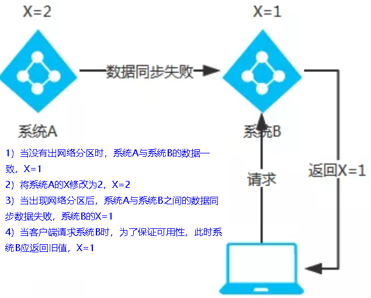
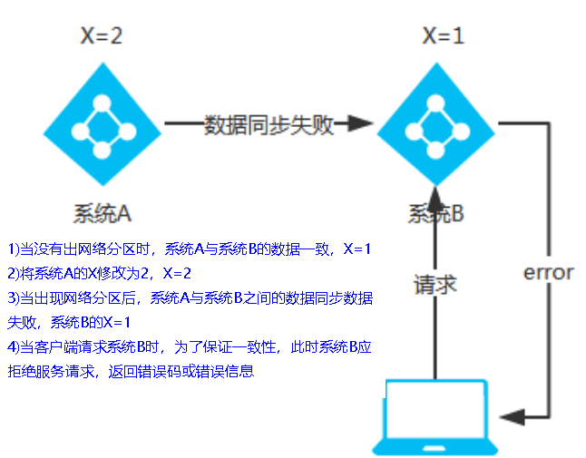
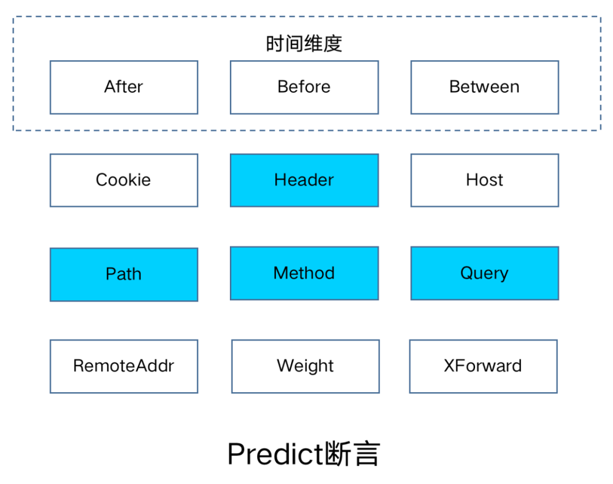

# Spring Cloud Learn
## 一、版本管理

**版本约束：https://start.spring.io/actuator/info**

```json
{
    "bom-ranges": {
        "spring-cloud": {
            "2021.0.8": "Spring Boot >=2.6.0 and <3.0.0",
            "2022.0.3": "Spring Boot >=3.0.0 and <3.2.0-M1"
        }
    }
}
```

### 1.1 Spring Boot
> https://spring.io/projects/spring-boot#learn

| Spring Boot Versiojn | JDK    | Release Notes                                                | Spring Framework Version |
| -------------------- | ------ | ------------------------------------------------------------ | ------------------------ |
| 3.x                  | JDK 17 | [here](https://github.com/spring-projects/spring-boot/wiki/Spring-Boot-3.0-Release-Notes) | 6.0.x                    |
| 2.7.x                | JDK 8  | [here](https://github.com/spring-projects/spring-boot/wiki/Spring-Boot-2.7-Release-Notes) | 5.3.20+                  |
| 2.6.x                | JDK 8  | [here](https://github.com/spring-projects/spring-boot/wiki/Spring-Boot-2.6-Release-Notes) | 5.3.13+                  |

### 1.2 Spring Cloud

> https://spring.io/projects/spring-cloud#overview

If you an existing Spring Boot app you want to add Spring Cloud to that app, the first step is to determine the version of Spring Cloud you should use. The version you use in your app will depend on the version of Spring Boot you are using.

The table below outlines which version of Spring Cloud maps to which version of Spring Boot.

Table 1. Release train Spring Boot compatibility

| Release Train                                                | Release Train                         |
| ------------------------------------------------------------ | ------------------------------------- |
| [2022.0.x](https://github.com/spring-cloud/spring-cloud-release/wiki/Spring-Cloud-2022.0-Release-Notes) aka Kilburn | 3.0.x, 3.1.x (Starting with 2022.0.3) |
| [2021.0.x](https://github.com/spring-cloud/spring-cloud-release/wiki/Spring-Cloud-2021.0-Release-Notes) aka Jubilee | 2.6.x, 2.7.x (Starting with 2021.0.3) |
| [2020.0.x](https://github.com/spring-cloud/spring-cloud-release/wiki/Spring-Cloud-2020.0-Release-Notes) aka Ilford | 2.4.x, 2.5.x (Starting with 2020.0.3) |
| [Hoxton](https://github.com/spring-cloud/spring-cloud-release/wiki/Spring-Cloud-Hoxton-Release-Notes) | 2.2.x, 2.3.x (Starting with SR5)      |
| [Greenwich](https://github.com/spring-projects/spring-cloud/wiki/Spring-Cloud-Greenwich-Release-Notes) | 2.1.x                                 |
| [Finchley](https://github.com/spring-projects/spring-cloud/wiki/Spring-Cloud-Finchley-Release-Notes) | 2.0.x                                 |
| [Edgware](https://github.com/spring-projects/spring-cloud/wiki/Spring-Cloud-Edgware-Release-Notes) | 1.5.x                                 |
| [Dalston](https://github.com/spring-projects/spring-cloud/wiki/Spring-Cloud-Dalston-Release-Notes) | 1.5.x                                 |

> Spring Cloud Dalston, Edgware, Finchley, and Greenwich have all reached end of life status and are no longer supported.

如果同时使用 springboot 和 springcloud ，需要照顾 springcloud ，由 springcloud 决定 springboot 的版本。

> https://docs.spring.io/spring-cloud/docs/2021.0.8/reference/html/


### 1.3 Spring Cloud Alibaba

> https://github.com/alibaba/spring-cloud-alibaba/wiki/%E7%89%88%E6%9C%AC%E8%AF%B4%E6%98%8E

**2021.x 分支**

适配 Spring Boot 2.4，Spring Cloud 2021.x 版本及以上的 Spring Cloud Alibaba 版本按从新到旧排列如下表（最新版本用*标记）：

| Spring Cloud Alibaba Version | Spring Cloud Version  | Spring Boot Version |
| ---------------------------- | --------------------- | ------------------- |
| 2021.0.5.0*                  | Spring Cloud 2021.0.5 | 2.6.13              |
| 2021.0.4.0                   | Spring Cloud 2021.0.4 | 2.6.11              |
| 2021.0.1.0                   | Spring Cloud 2021.0.1 | 2.6.3               |
| 2021.1                       | Spring Cloud 2020.0.1 | 2.4.2               |

### 1.4 版本选择

| Spring Cloud | Spring Boot | Spring Cloud Alibaba |
| ------------ | ----------- | -------------------- |
| 2022.0.3     | 3.0.7       | 2022.0.0.0-RC2       |
| **2021.0.8** | **2.6.15**  | **2021.0.5.0**       |

## 二、微服务组件


**停更前**：


**新版本**：


### 2.1 Eureka

服务注册中心，已停止更新。

1. 服务治理

   在传统的 RPC 远程调用框架中，管理每个服务与服务之间依赖关系比较复杂，管理比较复杂，所以需要使用服务治理，管理服务于服务之间依赖关系，可以实现服务调用、负载均衡、容错等，实现服务发现与注册。

2. 服务注册与发现

   Eureka 采用了 CS 的设计架构，Eureka Server 作为服务注册功能的服务器，它是**服务注册中心**。而系统中的其他微服务，使用 **Eureka Client** 连接到 **Eureka Server** 并维持**心跳**连接。这样系统的维护人员就可以通过 Eureka Server 来**监控**系统中各个微服务是否正常运行。
   在服务注册与发现中，有一个注册中心。当服务器启动的时候，会把当前自己服务器的信息比如：服务地址通讯地址等以**别名**方式注册到注册中心上。另一方（消费者|服务提供者），**以该别名的方式去注册中心上获取到实际的服务通讯地址，然后再实现本地 RPC 调用**。

   RPC 远程调用框架核心设计思想：在于注册中心，因为使用注册中心管理每个服务与服务之间的一个依赖关系（服务治理概念）。在任何 RPC 远程框架中，都会有一个注册中心（存放服务地址相关信息(接口地址））

**Eureka VS Dubbo**：


Eureka 包含两个组件：Eureka Server 和 Eureka Client。

1. Eureka Server

   提供服务注册服务，各个微服务节点通过配置启动后，会在 Eureka Server 中进行注册，这样 Eureka Server 中的服务注册表中将会存储所有可用服务节点的信息，服务节点的信息可以在界面中直观看到。

2. Eureka Client

   通过注册中心进行访问，是一个 Java 客户端，用于简化 Eureka Server 的交互，客户端同时也具备一个内置的、使用轮询（round-robin）负载算法的负载均衡器。

   在应用启动后，客户端将会向 Eureka Server 发送心跳（默认周期为 30 秒）。如果 Eureka Server 在多个心跳周期内没有接收到某个节点的心跳，Eureka Server 将会从服务注册表中把这个服务节点移除（默认 90 秒）。

#### 2.1.1 Eureka Server

`pom.xml`:

```xml
<!-- eureka-server -->
<dependency>
    <groupId>org.springframework.cloud</groupId>
    <artifactId>spring-cloud-starter-netflix-eureka-server</artifactId>
</dependency>
```

`application.yaml`:

```yaml
server:
  port: 7001

eureka:
  server:
    eviction-interval-timer-in-ms: 60  # 定期检测实例状态（心跳机制） 默认60s
    enable-self-preservation: true  # 关闭自我保护 默认为打开状态，生产环境建议打开
  instance:
    hostname: localhost  # eureka 服务器实例名称
  client:
    register-with-eureka: false  # 不向注册中心注册自己
    fetch-registry: false  # false 表示本机是注册中心
    service-url:
      defaultZone: http://${eureka.instance.hostname}:${server.port}/eureka/  # 设置与 eureka 的交互地址
```

`Application.java`:

```java
@EnableEurekaServer
@SpringBootApplication
public class AlbrusCloudEurekaServer7001Application {

    public static void main(String[] args) {
        SpringApplication.run(AlbrusCloudEurekaServer7001Application.class);
    }

}
```


EurekaServer 自我保护机制：


#### 2.1.2 Eureka Client

##### 2.1.2.1 Provider

`pom.xml`:

```xml
<!-- eureka-client -->
<dependency>
    <groupId>org.springframework.cloud</groupId>
    <artifactId>spring-cloud-starter-netflix-eureka-client</artifactId>
</dependency>
```

`application.yaml`:

```yaml
server:
  port: 8001

spring:
  application:
    name: albrus-cloud-payment-service  # 注意在 EurekaServer 中 Application 名称

eureka:
  client:
    register-with-eureka: true  # 将自己注册到 EurekaServer
    fetch-registry: true  # 是否从 EurekaServer 抓取已有的注册信息，默认为 true。单节点无所谓，集群必须设置为 true 才能配合 ribbon 使用负载均衡
    service-url:
      defaultZone: http://localhost:7001/eureka/  # 路径包含 /eureka 是因为 EurekaServer 内部有 web 过滤器
    registry-fetch-interval-seconds: 30  # 隔多久从服务中心拉取一次服务列表，默认 30s
  instance:
    # 使用 IP 注册，否则会使用主机注册（此处考虑老版本的兼容，新版本经过实验都是 IP）
    prefer-ip-address: true
    # 自定义实例显示格式，加上版本号便于多版本管理，注意是 ip-address，早期版本是 ipaddress
    instance-id: ${spring.cloud.client.ip-address}:${spring.application.name}:${server.port}:@project.version@
    # 自定义元数据（key/value 结构）
    metadata-map:
      cluster: cll
      region: rnl
    lease-renewal-interval-in-seconds: 30  # 租约续约间隔时间，默认 30s
    lease-expiration-duration-in-seconds: 90  # 租约到期，服务时效时间，默认值 90s，服务超过 90s 没有发⽣⼼跳，EurekaServer 会将服务从列表移除
```

`Application.java`:

```java
@EnableEurekaClient
@SpringBootApplication
public class AlbrusCloudPayment8001Application {

    public static void main(String[] args) {
        SpringApplication.run(AlbrusCloudPayment8001Application.class, args);
    }

}
```


##### 2.1.2.2 Consumer

`pom.xml`:

```xml
<!-- eureka-client -->
<dependency>
    <groupId>org.springframework.cloud</groupId>
    <artifactId>spring-cloud-starter-netflix-eureka-client</artifactId>
</dependency>
```

`application.yaml`:

```yaml
server:
  port: 80

spring:
  application:
    name: albrus-cloud-order-service

eureka:
  client:
    register-with-eureka: true  # 将自己注册到 EurekaServer
    fetch-registry: true  # 是否从 EurekaServer 抓取已有的注册信息，默认为 true。单节点无所谓，集群必须设置为 true 才能配合 ribbon 使用负载均衡
    service-url:
      defaultZone: http://localhost:7001/eureka/  # 路径包含 /eureka 是因为 EurekaServer 内部有 web 过滤器
    registry-fetch-interval-seconds: 30  # 隔多久从服务中心拉取一次服务列表，默认 30s
  instance:
    # 使用 IP 注册，否则会使用主机注册（此处考虑老版本的兼容，新版本经过实验都是 IP）
    prefer-ip-address: true
    # 自定义实例显示格式，加上版本号便于多版本管理，注意是 ip-address，早期版本是 ipaddress
    instance-id: ${spring.cloud.client.ip-address}:${spring.application.name}:${server.port}:@project.version@
    # 自定义元数据（key/value 结构）
    metadata-map:
      cluster: cll
      region: rnl
    lease-renewal-interval-in-seconds: 30  # 租约续约间隔时间，默认 30s
    lease-expiration-duration-in-seconds: 90  # 租约到期，服务时效时间，默认值 90s，服务超过 90s 没有发⽣⼼跳，EurekaServer 会将服务从列表移除
```

`Application.java`:

```java
@EnableEurekaClient
@SpringBootApplication
public class AlbrusCloudConsumerOrder80Application {

    public static void main(String[] args) {
        SpringApplication.run(AlbrusCloudConsumerOrder80Application.class, args);
    }

}
```


#### 2.1.3 Eureka 集群


单点故障：**集群，负载均衡 + 故障容错**。

启动顺序：

1. Eureka Server * 2
2. Eureka Client Payment * 2
3. Eureka Client Consumer * 1

##### 2.1.3.1 Eureka Server 集群

> **互相注册、互相守望**：[A、B、C] -> [A: [B、C]、B[A、C]、C[A、B]]。

`org.springframework.cloud.netflix.eureka.EurekaClientConfigBean#getEurekaServerServiceUrls`:

```java
@Override
public List<String> getEurekaServerServiceUrls(String myZone) {
    // 从 application.yaml 中获取 service-url 
    String serviceUrls = this.serviceUrl.get(myZone);
    if (serviceUrls == null || serviceUrls.isEmpty()) {
        // 最后会尝试获取 DEFAULT_ZONE = defaultZone 
        serviceUrls = this.serviceUrl.get(DEFAULT_ZONE);
    }
    
    if (!StringUtils.isEmpty(serviceUrls)) {
        // 按 , 分割获取到的服务路径
        final String[] serviceUrlsSplit = StringUtils.commaDelimitedListToStringArray(serviceUrls);
        List<String> eurekaServiceUrls = new ArrayList<>(serviceUrlsSplit.length);
        for (String eurekaServiceUrl : serviceUrlsSplit) {
            // 给结尾添加 /
            if (!endsWithSlash(eurekaServiceUrl)) {
                eurekaServiceUrl += "/";
            }
            eurekaServiceUrls.add(eurekaServiceUrl.trim());
        }
        return eurekaServiceUrls;
    }

    return new ArrayList<>();
}
```

`application.yaml`:

```yaml
# Eureka Server 7001
server:
  port: 7001

eureka:
  server:
    eviction-interval-timer-in-ms: 60  # 定期检测实例状态（心跳机制） 默认60s
    enable-self-preservation: true  # 关闭自我保护 默认为打开状态，生产环境建议打开
  instance:
    hostname: eureka7001.com  # eureka 服务器实例名称
  client:
    register-with-eureka: false  # 不向注册中心注册自己
    fetch-registry: false  # false 表示本机是注册中心
    service-url:
      defaultZone: http://eureka7001.com:7001/eureka/  # 设置与 eureka 的交互地址，用 , 分割配置多个地址

# Eureka Server 7002
server:
  port: 7002

eureka:
  server:
    eviction-interval-timer-in-ms: 60  # 定期检测实例状态（心跳机制） 默认60s
    enable-self-preservation: true  # 关闭自我保护 默认为打开状态，生产环境建议打开
  instance:
    hostname: eureka7002.com  # eureka 服务器实例名称
  client:
    register-with-eureka: false  # 不向注册中心注册自己
    fetch-registry: false  # false 表示本机是注册中心
    service-url:
      defaultZone: http://eureka7002.com:7002/eureka/  # 设置与 eureka 的交互地址，用 , 分割配置多个地址
```

**Eureka Client Provider 注册**

`application.yaml`:

```yaml
server:
  port: 8001

spring:
  application:
    name: albrus-cloud-payment-service

eureka:
  client:
    register-with-eureka: true  # 将自己注册到 EurekaServer
    fetch-registry: true  # 是否从 EurekaServer 抓取已有的注册信息，默认为 true。单节点无所谓，集群必须设置为 true 才能配合 ribbon 使用负载均衡
    service-url:
      # defaultZone: http://localhost:7001/eureka/  # 路径包含 /eureka 是因为 EurekaServer 内部有 web 过滤器
      defaultZone: http://eureka7001.com:7001/eureka/, http://eureka7002.com:7002/eureka/  # 集群配置
    registry-fetch-interval-seconds: 30  # 隔多久从服务中心拉取一次服务列表，默认 30s
  instance:
    # 使用 IP 注册，否则会使用主机注册（此处考虑老版本的兼容，新版本经过实验都是 IP）
    prefer-ip-address: true
    # 自定义实例显示格式，加上版本号便于多版本管理，注意是 ip-address，早期版本是 ipaddress
    instance-id: ${spring.cloud.client.ip-address}:${spring.application.name}:${server.port}:@project.version@
    # 自定义元数据（key/value 结构）
    metadata-map:
      cluster: cll
      region: rnl
    lease-renewal-interval-in-seconds: 30  # 租约续约间隔时间，默认 30s
    lease-expiration-duration-in-seconds: 90  # 租约到期，服务时效时间，默认值 90s，服务超过 90s 没有发⽣⼼跳，EurekaServer 会将服务从列表移除
```

**Eureka Client Consumer 注册**

`application.yaml`:

```yaml
server:
  port: 80

spring:
  application:
    name: albrus-cloud-order-service

eureka:
  client:
    register-with-eureka: true  # 将自己注册到 EurekaServer
    fetch-registry: true  # 是否从 EurekaServer 抓取已有的注册信息，默认为 true。单节点无所谓，集群必须设置为 true 才能配合 ribbon 使用负载均衡
    service-url:
      # defaultZone: http://localhost:7001/eureka/  # 路径包含 /eureka 是因为 EurekaServer 内部有 web 过滤器
      defaultZone: http://eureka7001.com:7001/eureka/, http://eureka7002.com:7002/eureka/  # 集群配置
    registry-fetch-interval-seconds: 30  # 隔多久从服务中心拉取一次服务列表，默认 30s
  instance:
    # 使用 IP 注册，否则会使用主机注册（此处考虑老版本的兼容，新版本经过实验都是 IP）
    prefer-ip-address: true
    # 自定义实例显示格式，加上版本号便于多版本管理，注意是 ip-address，早期版本是 ipaddress
    instance-id: ${spring.cloud.client.ip-address}:${spring.application.name}:${server.port}:@project.version@
    # 自定义元数据（key/value 结构）
    metadata-map:
      cluster: cll
      region: rnl
    lease-renewal-interval-in-seconds: 30  # 租约续约间隔时间，默认 30s
    lease-expiration-duration-in-seconds: 90  # 租约到期，服务时效时间，默认值 90s，服务超过 90s 没有发⽣⼼跳，EurekaServer 会将服务从列表移除
```

##### 2.1.3.2 Eureka Client 集群

**Eureka Client Provider**

`application.xml`:

```yaml
server:
  port: 8001

spring:
  application:
    name: albrus-cloud-payment-service

eureka:
  client:
    register-with-eureka: true  # 将自己注册到 EurekaServer
    fetch-registry: true  # 是否从 EurekaServer 抓取已有的注册信息，默认为 true。单节点无所谓，集群必须设置为 true 才能配合 ribbon 使用负载均衡
    service-url:
      # defaultZone: http://localhost:7001/eureka/  # 路径包含 /eureka 是因为 EurekaServer 内部有 web 过滤器
      defaultZone: http://eureka7001.com:7001/eureka/, http://eureka7002.com:7002/eureka/  # 集群配置
    registry-fetch-interval-seconds: 30  # 隔多久从服务中心拉取一次服务列表，默认 30s
  instance:
    # 使用 IP 注册，否则会使用主机注册（此处考虑老版本的兼容，新版本经过实验都是 IP）
    prefer-ip-address: true
    # 自定义实例显示格式，加上版本号便于多版本管理，注意是 ip-address，早期版本是 ipaddress
    instance-id: ${spring.cloud.client.ip-address}:${spring.application.name}:${server.port}:@project.version@
    # 自定义元数据（key/value 结构）
    metadata-map:
      cluster: cll
      region: rnl
    lease-renewal-interval-in-seconds: 30  # 租约续约间隔时间，默认 30s
    lease-expiration-duration-in-seconds: 90  # 租约到期，服务时效时间，默认值 90s，服务超过 90s 没有发⽣⼼跳，EurekaServer 会将服务从列表移除
    
server:
  port: 8002

spring:
  application:
    name: albrus-cloud-payment-service

eureka:
  client:
    register-with-eureka: true  # 将自己注册到 EurekaServer
    fetch-registry: true  # 是否从 EurekaServer 抓取已有的注册信息，默认为 true。单节点无所谓，集群必须设置为 true 才能配合 ribbon 使用负载均衡
    service-url:
      # defaultZone: http://localhost:7001/eureka/  # 路径包含 /eureka 是因为 EurekaServer 内部有 web 过滤器
      defaultZone: http://eureka7001.com:7001/eureka/, http://eureka7002.com:7002/eureka/  # 集群配置
    registry-fetch-interval-seconds: 30  # 隔多久从服务中心拉取一次服务列表，默认 30s
  instance:
    # 使用 IP 注册，否则会使用主机注册（此处考虑老版本的兼容，新版本经过实验都是 IP）
    prefer-ip-address: true
    # 自定义实例显示格式，加上版本号便于多版本管理，注意是 ip-address，早期版本是 ipaddress
    instance-id: ${spring.cloud.client.ip-address}:${spring.application.name}:${server.port}:@project.version@
    # 自定义元数据（key/value 结构）
    metadata-map:
      cluster: cll
      region: rnl
    lease-renewal-interval-in-seconds: 30  # 租约续约间隔时间，默认 30s
    lease-expiration-duration-in-seconds: 90  # 租约到期，服务时效时间，默认值 90s，服务超过 90s 没有发⽣⼼跳，EurekaServer 会将服务从列表移除
```

**Eureka Client Consumer 服务调用**

`OrderController.java`:

```java
// private static final String BASE_URL = "http://127.0.0.1:8001";
/**
 * 通过在 eureka 上注册过的微服务名称调用
 */
private static final String BASE_URL = "http://ALBRUS-CLOUD-PAYMENT-SERVICE";

// 2023-08-11 19:43:32.669  WARN 17336 --- [  restartedMain] iguration$LoadBalancerCaffeineWarnLogger : Spring Cloud LoadBalancer is currently working with the default cache. While this cache implementation is useful for development and tests, it's recommended to use Caffeine cache in production.You can switch to using Caffeine cache, by adding it and org.springframework.cache.caffeine.CaffeineCacheManager to the classpath.
```

##### 2.1.3.3 服务发现

`@EnableDiscoveryClient`:

```java
@EnableEurekaClient
@SpringBootApplication
@EnableDiscoveryClient
public class AlbrusCloudPayment8001Application {

    public static void main(String[] args) {
        SpringApplication.run(AlbrusCloudPayment8001Application.class, args);
    }

}
```

`private final DiscoveryClient discoveryClient;`:

```java
@Slf4j
@RestController
@RequestMapping("/payment")
public class PaymentController {
    private final DiscoveryClient discoveryClient;

    @Value("${spring.application.name}")
    private String applicationName;
    
    public PaymentController(DiscoveryClient discoveryClient) {
        this.discoveryClient = discoveryClient;
    }
    
    @GetMapping(value = "/discoveryClientInfo")
    public Result<ServiceInstance> getDiscoveryClientInfo() {
        log.info("The discovery client is: {}.", discoveryClient);

        List<String> services = discoveryClient.getServices();
        for (String service : services) {
            log.info("The service is: {}.", service);
        }

        List<ServiceInstance> instances = discoveryClient.getInstances(applicationName);
        for (ServiceInstance instance : instances) {
            log.info("The service instance details: {}, {}, {}, {}.", instance.getInstanceId(), instance.getHost(), instance.getPort(), instance.getUri());
        }

        return new Result<>(200, instances.get(0));
    }
}
```

#### 2.1.4 自我保护

> 当 Eureka Client 由于网络分区故障发生（延时、卡顿、拥挤）与 Eureka Server 断开连接时，Eureka Server 不会立即从服务列表中清除该 Eureka Client 服务，增加可用性（AP）。

Eureka Server 默认在 90s 没有收到 Eureka Client 的心跳时，会将 Eureka Client 服务剔除。若在 90s 内丢失了大量的服务实例心跳，这时 Eureka Server 会开启自我保护机制，不会剔除任何服务实例了。

```yaml
eureka:
  server:
    enable-self-preservation: true  # 默认开启
    
eureka:
  client:
    lease-renewal-interval-in-seconds: 30  # 租约续约间隔时间，默认 30s
    lease-expiration-duration-in-seconds: 90  # 租约到期，服务时效时间，默认值 90s，服务超过 90s 没有发⽣⼼跳，EurekaServer 会将服务从列表移除
```

#### 2.1.5 停更

[Eureka 2.0 (Discontinued)](https://github.com/Netflix/eureka/wiki)

The existing open source work on eureka 2.0 is discontinued. The code base and artifacts that were released as part of the existing repository of work on the 2.x branch is considered use at your own risk.

Eureka 1.x is a core part of Netflix's service discovery system and is still an active project.

### 2.2 ZooKeeper

> ZooKeeper 是一个分布式协调工具，可以实现注册中心功能。

#### 2.2.1 安装启动

配置文件：[zoo.cfg](./Program/ZooKeeper/zoo.cfg)

```properties
# The number of milliseconds of each tick
# 心跳时间，为了确保client-server连接存在，以毫秒为单位，最小超时时间为2个心跳时间
tickTime=2000
# The number of ticks that the initial 
# synchronization phase can take
# 多少个tickTime内，允许其他server连接并初始化数据，如果zookeeper管理的数据较大，则相应增大这个值
initLimit=10
# The number of ticks that can pass between 
# sending a request and getting an acknowledgement
# 多少个tickTime内，允许follower同步，如果follower落后太多，则会被丢弃
syncLimit=5
# the directory where the snapshot is stored.
# do not use /tmp for storage, /tmp here is just 
# example sakes.
# 用户存放内存数据库快照的文件夹，同时用于集群myid文件也存在这个文件夹里
dataDir=/home/albrus/apache-zookeeper-3.6.4-bin/data
# the port at which the clients will connect
# 客户端监听端口
clientPort=2181
```

安装启动：

```bash
tar -zxvf apache-zookeeper-3.6.4-bin.tar.gz
cp zoo.cfg ./conf
sudo ufw allow 2181
./zkServer.sh start
./zkCli.sh
```

#### 2.2.2 Provider 服务入驻

`application.yaml`:

```yaml
server:
  port: 8004

spring:
  application:
    name: albrus-cloud-payment-service  # 服务别名
  cloud:
    zookeeper:
      connect-string: 10.10.20.121:2181  # ZooKeeper
```

`@EnableDiscoveryClient`:

```java
@SpringBootApplication
@EnableDiscoveryClient
public class AlbrusCloudPayment8004Application {

    public static void main(String[] args) {
        SpringApplication.run(AlbrusCloudPayment8004Application.class, args);
    }

}
```

```bash
[zk: localhost:2181(CONNECTED) 2] ls /
[services, zookeeper]
[zk: localhost:2181(CONNECTED) 3] ls /services 
[albrus-cloud-payment-service]
```

#### 2.2.3 测试验证

`http://127.0.0.1:8004/payment/31`:

```json
{"code":200,"msg":"查询成功","data":{"id":31,"serial":"尚硅谷111"}}
```

`ZooKeeper`:

```bash
[zk: localhost:2181(CONNECTED) 13] ls /services/albrus-cloud-payment-service 
[21cfe505-2441-41d6-bc04-21c0ef7a574d]
[zk: localhost:2181(CONNECTED) 14] get /services/albrus-cloud-payment-service/21cfe505-2441-41d6-bc04-21c0ef7a574d 
{
	"name": "albrus-cloud-payment-service",
	"id": "21cfe505-2441-41d6-bc04-21c0ef7a574d",
	"address": "localhost",
	"port": 8004,
	"sslPort": null,
	"payload": {
		"@class": "org.springframework.cloud.zookeeper.discovery.ZookeeperInstance",
		"id": "albrus-cloud-payment-service",
		"name": "albrus-cloud-payment-service",
		"metadata": {
			"instance_status": "UP"
		}
	},
	"registrationTimeUTC": 1691805864932,
	"serviceType": "DYNAMIC",
	"uriSpec": {
		"parts": [{
			"value": "scheme",
			"variable": true
		}, {
			"value": "://",
			"variable": false
		}, {
			"value": "address",
			"variable": true
		}, {
			"value": ":",
			"variable": false
		}, {
			"value": "port",
			"variable": true
		}]
	}
}
```

#### 2.2.4 临时节点 && 持久节点

> 临时节点
>
> 带序号的临时节点
>
> 持久节点
>
> 带序号的持久节点

是临时节点，在**服务断连的一段时间**后，ZooKeeper 会剔除断连的服务（CP）。

在服务重新启动后，服务将以一个新节点身份重新上线。

**重启 8004**:

```bash
[zk: localhost:2181(CONNECTED) 15] ls /services/albrus-cloud-payment-service
[a22f75cf-62ad-4a94-9d74-be193afc2849]
```

#### 2.2.5 Consumer 服务入驻

`application.yaml`:

```yaml
server:
  port: 81

spring:
  application:
    name: albrus-cloud-order-service  # 服务别名
  cloud:
    zookeeper:
      connect-string: 10.10.20.121:2181  # ZooKeeper
```

`@EnableDiscoveryClient`:

```java
@SpringBootApplication
@EnableDiscoveryClient
public class AlbrusCloudConsumerOrder81Application {

    public static void main(String[] args) {
        SpringApplication.run(AlbrusCloudConsumerOrder81Application.class, args);
    }

}
```

```bash
[zk: localhost:2181(CONNECTED) 62] ls /services
[albrus-cloud-order-service, albrus-cloud-payment-service]
```

**Consumer 服务调用**

`OrderController.java`:

```java
// private static final String BASE_URL = "http://127.0.0.1:8001";
/**
 * 通过在 ZooKeeper 上注册过的微服务名称调用
 */
private static final String BASE_URL = "http://albrus-cloud-payment-service";
```

`@LoadBalanced`:

```java
/**
 * 使用 @LoadBalanced 注解赋予 RestTemplate 负载均衡的能力
 */
@Bean
@LoadBalanced
public RestTemplate restTemplate() {
    return new RestTemplate();
}
```

### 2.3 Consul

> https://developer.hashicorp.com/consul
>
> https://www.springcloud.cc/spring-cloud-consul.html

**What is Consul?**

HashiCorp Consul is a service networking solution that enables teams to manage secure network connectivity between services and across on-prem and multi-cloud environments and runtimes. Consul offers **service discovery**, **service mesh**, **traffic management**, and **automated updates to network infrastructure device**. You can use these features individually or together in a single Consul deployment.

HashiCorp Consul 是一种服务网络解决方案，使团队能够管理服务之间以及跨本地和多云环境和运行时的安全网络连接。Consul 提供**服务发现**、**服务网格**、**流量管理**和**网络基础设施设备的自动更新**。您可以在单个 Consul 部署中单独或一起使用这些功能。

**What is service discovery?**

*Service discovery* helps you discover, track, and monitor the health of services within a network. Service discovery registers and maintains a record of all your services in a *service catalog*. This service catalog acts as a single source of truth that allows your services to query and communicate with each other.

*服务发现*可帮助您**发现**、**跟踪**和**监控**网络内服务的运行状况。*服务发现在服务目录*中注册并维护所有服务的记录。该服务目录充当单一事实来源，允许您的服务相互查询和通信。

**Benefits of service discovery**

Service discovery provides benefits for all organizations, ranging from simplified scalability to improved application resiliency. Some of the benefits of service discovery include:

- Dynamic IP address and port discovery - 动态 IP 和端口发现
- Simplified horizontal service scaling - 简化水平服务扩展
- Abstracts discovery logic away from applications - 将发现逻辑从应用程序中抽象出来
- Reliable service communication ensured by health checks - 健康检查确保可靠的服务通信
- Load balances requests across healthy service instances - 在健康的服务实例之间负载平衡请求
- Faster deployment times achieved by high-speed discovery - 通过高速发现实现更快的部署时间
- Automated service registration and de-registration - 自动服务注册和注销

**What is a service mesh?**

A *service mesh* is a dedicated network layer that provides secure service-to-service communication within and across infrastructure, including on-premises and cloud environments. Service meshes are often used with a microservice architectural pattern, but can provide value in any scenario where complex networking is involved.

服务*网格*是一个专用网络层，可在基础设施内部和跨基础设施（包括本地和云环境）提供安全的服务到服务通信。服务网格通常与微服务架构模式一起使用，但可以在涉及复杂网络的任何场景中提供价值。

**Benefits of a service mesh**

A service mesh provides benefits for all organizations, ranging from security to improved application resiliency. Some of the benefits of a service mesh include;

- service discovery - 服务发现
- application health monitoring - 应用程序健康监控
- load balancing - 负载均衡
- automatic failover - 自动故障转移
- traffic management - 流量管理
- encryption - 加密
- observability and traceability - 可观察性和可追溯性
- authentication and authorization - 认证和授权
- network automation - 网格自动化

#### 2.3.1 安装运行

```bash
wget -O- https://apt.releases.hashicorp.com/gpg | sudo gpg --dearmor -o /usr/share/keyrings/hashicorp-archive-keyring.gpg
echo "deb [signed-by=/usr/share/keyrings/hashicorp-archive-keyring.gpg] https://apt.releases.hashicorp.com $(lsb_release -cs) main" | sudo tee /etc/apt/sources.list.d/hashicorp.list
sudo apt update && sudo apt install consul
```

**运行（8500）**：

```bash
# 快捷模式
consul agent -dev -client 0.0.0.0

# Sever 模式
consul agent -server -bootstrap-expect 1 -data-dir /tmp/consul -ui -config-dir /etc/consul.d -bind=192.168.1.100

配置参数说明
-server：- Serve 模式（不配置为 Client 模式），数量一般为 3-5 个
-bootstrap-expect： - Server 数量
-data-dir： - 数据目录
-ui-dir： - UI目录
-node： - Node名称
-bind： - 集群通讯地址
Server 模式后台访问地址：http://localhost:8500
ctrl + c：停止服务

#Client 模式
consul agent -data-dir /tmp/consul -node=ubuntu64 -bind=10.9.10.176

#查看集群
consul members

#查看当前服务器状况
consul info

#退出服务器集群
consul leave
```

[配置项](https://developer.hashicorp.com/consul/docs/agent/config)（[引用中文翻译](https://www.cnblogs.com/duanxz/p/9908762.html)）：

- [`-client`](https://www.consul.io/docs/agent/options.html#_client) - Consul将绑定客户端接口的地址，包括HTTP和DNS服务器。默认情况下，这是“127.0.0.1”，只允许回送连接。在Consul 1.0和更高版本中，可以将其设置为要绑定到的空间分隔的地址列表，或者 可能会解析为多个地址的 [go-sockaddr](https://godoc.org/github.com/hashicorp/go-sockaddr/template)模板。
- [`-bind`](https://www.consul.io/docs/agent/options.html#_bind) - 应为内部集群通信绑定的地址。这是集群中所有其他节点都应该可以访问的IP地址。默认情况下，这是“0.0.0.0”，这意味着Consul将绑定到本地计算机上的所有地址，并将第一个可用的私有IPv4地址[通告](https://www.consul.io/docs/agent/options.html#_advertise)给群集的其余部分。如果有多个私有IPv4地址可用，Consul将在启动时退出并出现错误。如果你指定“[::]”，Consul 将 [做广告](https://www.consul.io/docs/agent/options.html#_advertise)第一个可用的公共IPv6地址。如果有多个公共IPv6地址可用，则Consul将在启动时退出并出现错误。Consul同时使用TCP和UDP以及相同的端口。如果您有任何防火墙，请确保同时允许这两种协议。在Consul 1.0和更高版本中，可以将其设置为要绑定到的空间分隔的地址列表，或者可能会解析为多个地址的 [go-sockaddr](https://godoc.org/github.com/hashicorp/go-sockaddr/template)模板。

#### 2.3.2 Provider 服务入驻

`application.yaml`:

```yaml
server:
  port: 8005

spring:
  application:
    name: albrus-cloud-payment-service  # 服务别名
  cloud:
    consul:  # Consul
      host: 10.10.20.121
      port: 8500
      # 服务发现相关配置
      discovery:
        register: true  # 是否需要注册
        instance-id: ${spring.application.name}:${spring.cloud.client.ip-address}:${server.port}  # 注册实例 id（必须唯一）（应用名称+服务器IP+端口）
        service-name: ${spring.application.name}  # 服务名称
        port: ${server.port}  # 服务端口
        prefer-ip-address: true  # 是否使用 ip 地址注册
        ip-address: ${spring.cloud.client.ip-address}  # 服务请求 ip
        health-check-interval: 10s  # 健康检查频率
        health-check-critical-timeout: 30s  # 健康检查失败多长时间后，取消注册
        health-check-path: /health  # 健康检查路径
        heartbeat:
          enabled: true
```

`@EnableDiscoveryClient`:

```java
@SpringBootApplication
@EnableDiscoveryClient
public class AlbrusCloudPayment8005Application {

    public static void main(String[] args) {
        SpringApplication.run(AlbrusCloudPayment8004Application.class, args);
    }

}
```

`ConsulHealthController.java`（心跳检查接口）:

```java
@Slf4j
@RestController
public class ConsulHealthController {

    @GetMapping("/health")
    public String Health() {
        log.info("consul health check.");
        return "OK";
    }

}
```

#### 2.3.3 Consumer 服务入驻

`application.yaml`:

```yaml
server:
  port: 82

spring:
  application:
    name: albrus-cloud-order-service  # 服务别名
  cloud:
    consul:  # Consul
      host: 10.10.20.121
      port: 8500
      discovery:
        ip-address: 10.10.20.115
        service-name: ${spring.application.name}
        heartbeat:
          enabled: true
```

`@EnableDiscoveryClient`:

```java
@SpringBootApplication
@EnableDiscoveryClient
public class AlbrusCloudConsumerOrder82Application {

    public static void main(String[] args) {
        SpringApplication.run(AlbrusCloudConsumerOrder82Application.class, args);
    }

}
```

**Consumer 服务调用**

`OrderController.java`:

```java
// private static final String BASE_URL = "http://127.0.0.1:8001";
/**
 * 通过在 Consul 上注册过的微服务名称调用
 */
private static final String BASE_URL = "http://albrus-cloud-payment-service";
```

`@LoadBalanced`:

```java
/**
 * 使用 @LoadBalanced 注解赋予 RestTemplate 负载均衡的能力
 */
@Bean
@LoadBalanced
public RestTemplate restTemplate() {
    return new RestTemplate();
}
```

#### 2.3.4 配置中心

`pom.xml`:

```xml
<!-- consul-config -->
<dependency>
    <groupId>org.springframework.cloud</groupId>
    <artifactId>spring-cloud-starter-consul-config</artifactId>
</dependency>
```

`application.yaml`:

```yaml
spring:
  application:
    name: order-service # 应用名称
  profiles:
    active: dev # 指定环境，默认加载 default 环境
  cloud:
    consul:
      # Consul 服务器地址
      host: localhost
      port: 8500
      # 配置中心相关配置
      config:
        # 是否启用配置中心，默认值 true 开启
        enabled: true
        # 设置配置的基本文件夹，默认值 config 可以理解为配置文件所在的最外层文件夹
        prefix: config
        # 设置应用的文件夹名称，默认值 application 一般建议设置为微服务应用名称
        default-context: orderService
        # 配置环境分隔符，默认值 "," 和 default-context 配置项搭配
        # 例如应用 orderService 分别有环境 default、dev、test、prod
        # 只需在 config 文件夹下创建 orderService、orderService-dev、orderService-test、orderService-prod 文件夹即可
        profile-separator: '-'
        # 指定配置格式为 yaml
        format: YAML
        # Consul 的 Key/Values 中的 Key，Value 对应整个配置文件
        data-key: orderServiceConfig
        # 以上配置可以理解为：加载 config/orderService/ 文件夹下 Key 为 orderServiceConfig 的 Value 对应的配置信息
        watch:
          # 是否开启自动刷新，默认值 true 开启
          enabled: true
          # 刷新频率，单位：毫秒，默认值 1000
          delay: 1000
```

#### 2.3.5 Eureka VS ZooKeeper VS Consul

##### 2.3.5.1 CAP 理论

> CAP:
>
> - C: Consistency（强一致性）
> - A: Availability（可用性）
> - P: Partition tolerance（分区容错性）
>
> CAP 理论关注粒度是**数据**，而不是整体系统设计的策略。


**AP 架构**：

当网络分区出现以后，为了保证可用性，系统 B 可以**返回脏/旧值**，保证系统的可用性。

违背了一致性 C 的要求，只能满足可用性和分区容错性，即 AP。



**CP 架构**：

当网络分区出现后，为了保证一致性，就必须**拒接请求**，否则无法保证一致性。

违背了可用性 A 的要求，只满足一致性和分区容错性，即 CP。



##### 2.3.5.2 三注册中心对比


| 组件      | 语言 | CAP  | 服务健康检查 | 对外暴露接口 | Spring Cloud 集成 |
| --------- | ---- | ---- | ------------ | ------------ | ----------------- |
| Eureka    | Java | AP   | 可配置支持   | HTTP         | 已集成            |
| ZooKeeper | Java | CP   | 支持         | 客户端       | 已集成            |
| Consul    | GO   | CP   | 支持         | HTTP/DNS     | 已集成            |

### 2.4 Ribbon

#### 2.4.1 简介

[Ribbon](https://github.com/Netflix/ribbon/wiki/Getting-Started)，LB，负载均衡：

将用户请求平摊分配到多个服务上，常见的负载均衡有软件 Nginx、LVS，硬件 F5 等。

**集中式 LB**

在服务的消费方和提供方之间使用独立的 LB 设施，由该设施将访问请求通过某种策略转发至服务的提供方。

Nginx 是服务器负载均衡，客户端所有请求都会交给 Nginx，然后由 Nginx 实现转发请求。即负载均衡是由服务端实现的。

**进程内 LB**

将 LB 集成到消费方，消费方从服务注册中心获取服务列表，再通过某种策略选择一个服务进行访问。

Ribbon 本地负载均衡，在调用微服务接口时候，会在注册中心上获取注册信息服务列表之后缓存到 JVM 本地，从而在本地实现 RPC 远程服务调用技术。

**Ribbon 进入维护阶段，平替方案：Spring Cloud Loadbalancer。**

**Project Status: On Maintenance**

Ribbon comprises of multiple components some of which are used in production internally and some of which were replaced by non-OSS solutions over time. This is because Netflix started moving into a more componentized architecture for RPC with a focus on single-responsibility modules. So each Ribbon component gets a different level of attention at this moment.

More specifically, here are the components of Ribbon and their level of attention by our teams:

- ribbon-core: **deployed at scale in production**
- ribbon-eureka: **deployed at scale in production**
- ribbon-evcache: **not used**
- ribbon-guice: **not used**
- ribbon-httpclient: **we use everything not under com.netflix.http4.ssl. Instead, we use an internal solution developed by our cloud security team**
- ribbon-loadbalancer: **deployed at scale in production**
- ribbon-test: **this is just an internal integration test suite**
- ribbon-transport: **not used**
- ribbon: **not used**


#### 2.4.2 版本 & 更替

> https://www.6hu.cc/archives/108064.html
>
> https://bbs.huaweicloud.com/blogs/366271
>
> https://www.cnblogs.com/Epiphanyi/articles/17032745.html

Spring Cloud `2021.0.8` 版本管理的 Eureka 版本对应是 `<spring-cloud-netflix.version>3.1.7</spring-cloud-netflix.version>`，其中 [`3.1.7` 版本](https://docs.spring.io/spring-cloud-netflix/docs/3.1.7/reference/html/#using-eureka-with-spring-cloud-loadbalancer)已经默认使用 Spring Cloud LoadBalancer 来代替 Ribbon 了。


```xml
<properties>
    <spring-cloud-netflix-ribbon.version>2.2.10.RELEASE</spring-cloud-netflix-ribbon.version>
</properties>

<dependency>
    <groupId>org.springframework.cloud</groupId>
    <artifactId>spring-cloud-starter-netflix-ribbon</artifactId>
    <version>${spring-cloud-netflix-ribbon.version}</version>
</dependency>
```

`Eureka 3.1.7` 集成 `Ribbon 2.2.10.RELEASE` 失败，总是提示 `No instances available for ALBRUS-CLOUD-PAYMENT-SERVICE`，Google、Baidu 都没有找到解决方案，只有 Nacos 集成 Ribbon 的教程，待后续学习到 Nacos 后再回过头来练习 Ribbon，这里先学习理论知识。

#### 2.4.3 负载算法

> https://cloud.tencent.com/developer/article/1601502


- `ZoneAvoidanceRule` - 默认规则，复合判断服务所在区域的性能和可用性来选择服务
- `AvailabilityFilteringRule` - 先过滤掉故障实例，再选择并发较小的实例
- `BestAvailableRule` - 先过滤掉由于多次访问故障而处于断路器跳闸状态的服务，然后选择一个并发量最小的服务
- `RetryRule` - 先按照 `RoundRobinRule` 策略获取服务，如果获取失败则在指定时间内进行重试
- `RoundRobinRule` - 轮询
- `WeightedResponseTimeRule` - 对 `RoundRobinRule` 的扩展实现，响应速度越快的实例选择权重越大
- `RandomRule` - 随机

**查查源码**

`RoundRobinRule`:

```java
public Server choose(ILoadBalancer lb, Object key) {
    if (lb == null) {
        log.warn("no load balancer");
        return null;
    }

    Server server = null;
    int count = 0;
    // 最多尝试 10 次获取
    while (server == null && count++ < 10) {
        List<Server> reachableServers = lb.getReachableServers();
        List<Server> allServers = lb.getAllServers();
        int upCount = reachableServers.size();
        int serverCount = allServers.size();

        // 先判断有没有服务（总的、可用的）
        if ((upCount == 0) || (serverCount == 0)) {
            log.warn("No up servers available from load balancer: " + lb);
            return null;
        }

        // 传递总服务数进去
        int nextServerIndex = incrementAndGetModulo(serverCount);
        server = allServers.get(nextServerIndex);

        // 大佬
        if (server == null) {
            /* Transient. */
            Thread.yield();
            continue;
        }

        // 服务可用
        if (server.isAlive() && (server.isReadyToServe())) {
            return (server);
        }

        // Next.
        server = null;
    }

    // 最多尝试 10 次
    if (count >= 10) {
        log.warn("No available alive servers after 10 tries from load balancer: "
                + lb);
    }
    return server;
}

// modulo 总服务数
private int incrementAndGetModulo(int modulo) {
    // 大佬高性能
    for (;;) {
        int current = nextServerCyclicCounter.get();
        int next = (current + 1) % modulo;
        if (nextServerCyclicCounter.compareAndSet(current, next))
            return next;
    }
}
```

#### 2.4.4 自定义负载算法

**自定义配置类不能放在 `@ComponentScan` 所扫描的当前包下以及子包下**：


**自定义 Ribbon 配置**：


`RibbonConfiguration.java`:

```java
@Configuration
public class RibbonConfiguration {

    @Bean
    public IRule ribbonRule() {
        return new RandomRule();
    }
}
```

`AlbrusCloudConsumerOrderRibbon80Application.java`:

```java
@EnableEurekaClient
@SpringBootApplication
@RibbonClient(name = "ALBRUS-CLOUD-PAYMENT-SERVICE", configuration = RibbonConfiguration.class)
public class AlbrusCloudConsumerOrderRibbon80Application {

    public static void main(String[] args) {
        SpringApplication.run(AlbrusCloudConsumerOrderRibbon80Application.class, args);
    }

}
```

### 2.5 OpenFeign

> https://spring.io/projects/spring-cloud-openfeign
>
> https://docs.spring.io/spring-cloud-openfeign/docs/3.1.8/reference/html/

#### 2.5.1 简介

This project provides OpenFeign integrations for Spring Boot apps through autoconfiguration and binding to the Spring Environment and other Spring programming model idioms.

该项目通过自动配置和绑定到 Spring 环境和其他 Spring 编程模型习惯用法，为 Spring Boot 应用程序提供 OpenFeign 集成。

**Declarative REST Client: Feign**

**声明式 REST 客户端：Feign**

[Feign](https://github.com/OpenFeign/feign) is a declarative web service client. It makes writing web service clients easier. **To use Feign create an interface and annotate it.** It has pluggable annotation support including Feign annotations and JAX-RS annotations. Feign also supports pluggable encoders and decoders. Spring Cloud adds support for Spring MVC annotations and for using the same `HttpMessageConverters` used by default in Spring Web. Spring Cloud integrates Eureka, Spring Cloud CircuitBreaker, as well as Spring Cloud LoadBalancer to provide a load-balanced http client when using Feign.

[Feign](https://github.com/OpenFeign/feign) 是一个声明式 Web 服务客户端。它使编写 Web 服务客户端变得更加容易。**要使用 Feign 创建一个接口并对其进行注释。**它具有可插入的注释支持，包括 Feign 注释和 JAX-RS 注释。Feign 还支持可插入的编码器和解码器。Spring Cloud 添加了对 Spring MVC 注释以及使用`HttpMessageConverters`Spring Web 中默认使用的注释的支持。Spring Cloud集成了 Eureka、Spring Cloud CircuitBreaker 以及 Spring Cloud LoadBalancer，在使用 Feign 时提供负载均衡的 HTTP 客户端。

**为什么要用？**

Ribbon + RestTemplate? 需要关注 URI、方法调用不明确、返回值需要转换...

面向接口编程，Feign 能够使远程方法调用像调用本地方法一样简单！

#### 2.5.2 Feign VS OpenFeign

| Feign                                                        | OpenFeign                                                    |
| ------------------------------------------------------------ | ------------------------------------------------------------ |
| Feign 是 Spring Cloud 组件中的一个轻量级 RESTful 的 HTTP 服务客户端。 | OpenFeign 是 Spring Cloud 在 Feign 的基础上支持了 SpringMVC 的注解，如 @RequesMapping 等等。 |
| Feign 内置了 Ribbon，用来做客户端负载均衡，去调用服务注册中心的服务。Feign 的使用方式是：使用 Feign 的注解定义接口，调用这个接口，就可以调用服务注册中心的服务。 | OpenFeign 的 @FeignClient 可以解析 SpringMVC 的 @RequestMapping 注解下的接口，并通过动态代理的方式产生实现类，实现类中做负载均衡并调用其他服务。 |
| `<dependency>`<br/>`<groupId>org.springframework.cloud</groupId>`<br/>`<artifactId>spring-cloud-starter-feign</artifactId>`<br/>`</dependency>` | `<dependency>`<br/>`<groupId>org.springframework.cloud</groupId>`<br/>`<artifactId>spring-cloud-starter-openfeign</artifactId>`<br/>`</dependency>` |

#### 2.5.3 使用 Feign

`AlbrusCloudConsumerFeignOrder80Application.java`:

```java
@SpringBootApplication
@EnableEurekaClient
@EnableFeignClients
public class AlbrusCloudConsumerFeignOrder80Application {

    public static void main(String[] args) {
        SpringApplication.run(AlbrusCloudConsumerFeignOrder80Application.class, args);
    }

}
```

`PaymentFeignService.java`:

```java
@Component
@FeignClient(value = "ALBRUS-CLOUD-PAYMENT-SERVICE", path = "/payment")
public interface PaymentFeignService {

    @GetMapping(value = "/{id}")
    Result<PaymentVO> getPaymentById(@PathVariable("id") Long id);

    @GetMapping(value = "/discoveryClientInfo")
    Result<ServiceInstance> getDiscoveryClientInfo();

    @PostMapping
    Result<Integer> create(@RequestBody PaymentVOParams paymentVOParams);

}
```

`OrderController.java`:

```java
@Slf4j
@RestController
@RequestMapping("/consumer/order")
public class OrderController {

    private final PaymentFeignService paymentFeignService;

    public OrderController(PaymentFeignService paymentFeignService) {
        this.paymentFeignService = paymentFeignService;
    }

    @GetMapping(value = "/{id}")
    public Result<PaymentVO> getPaymentById(@PathVariable("id") Long id) {
        // http://127.0.0.1:80/consumer/order/31
        return paymentFeignService.getPaymentById(id);
    }

    @PostMapping
    public Result<Integer> create(@RequestBody PaymentVOParams paymentVOParams) {
        // log.info("The result of save payment: [{}] is [{}].", paymentVOParams.getSerial(), result);
        return paymentFeignService.create(paymentVOParams);
    }

}
```

**可以看到，在 `Controller` 中无需再关心 URI、方法返回值转换，方法调用明确，就像调用本地方法一样简单。**

#### 2.5.3 超时 && 日志

**超时时间**

`application.yaml`:

```yaml
feign:
  client:
    config:
      # ALBRUS-CLOUD-PAYMENT-SERVICE:
      default:
        connectTimeout: 4000  # 连接超时时间
        readTimeout: 4000  # 读取（等待）数据时间
        loggerLevel: basic
```

There was an unexpected error (type=Internal Server Error, status=500).

Read timed out executing GET http://ALBRUS-CLOUD-PAYMENT-SERVICE/payment/longtime/31

feign.RetryableException: Read timed out executing GET http://ALBRUS-CLOUD-PAYMENT-SERVICE/payment/longtime/31

**日志级别**

- `NONE`：默认的，不显示任何日志；
- `BASIC`：仅记录请求方法、URL、响应状态码及执行时间；
- `HEADERS`：除了 BASIC 中定义的信息之外，还有请求和响应的头信息；
- `FULL`：除了 HEADERS 中定义的信息之外，还有请求和响应的正文及元数据。

```xml
<!-- Feign 调用日志 -->
<AsyncLogger name="com.albrus.cloud.order.service.PaymentFeignService" level="DEBUG"/>
```

需要在日志框架配置中配置 Feign Service 的日志输出级别。

### 2.6 Hystrix

> https://github.com/Netflix/Hystrix
>
> https://github.com/Netflix/Hystrix/wiki/How-it-Works
>
> https://github.com/Netflix/Hystrix/wiki/How-To-Use
>
> https://www.cnblogs.com/kingszelda/p/10312242.html
>
> https://zhuanlan.zhihu.com/p/498105315

Hystrix is a latency and fault tolerance library designed to isolate points of access to remote systems, services and 3rd party libraries, stop cascading failure and enable resilience in complex distributed systems where failure is inevitable.

Hystrix 是一个延迟和容错库，旨在隔离对远程系统、服务和第 3 方库的访问点，阻止级联故障，并在故障不可避免的复杂分布式系统中实现恢复能力。

豪猪，服务降级。

“豪猪”，即平时很温顺，在感受到危险的时候，用刺保护自己；在危险过去后，还是一个温顺的肉球。

#### 2.6.1 服务雪崩

复杂分布式系统架构中，应用程序之间往往有很复杂的依赖关系，而每个依赖在某些时候将不可避免地无法访问（调用失败）。


**扇出**：多个微服务之间，假设微服务 A 调用微服务 B 和微服务 C，微服务 B 和微服务 C 又调用其他的微服务。

如果扇出的链路上某个微服务的调用响应时间过长或无法访问，对上级的调用就会越来越占用系统资源，进而引起系统崩溃，“**雪崩效应**”。

通常，一个模块下的某个实例（微服务）失败后，其仍在接收流量，当这个微服务还需要调用其他微服务时，就会发生级联故障，或者叫做雪崩。

#### 2.6.2 解决什么问题？

一切正常的时候：


当复杂的分布式架构系统服务之一变得潜在危险时，它可能会阻止整个用户请求：


上面是一个常见的系统依赖关系，底层的依赖往往很多，通信协议包括 Socket、HTTP、Dubbo、WebService 等等。当通信层发生网络抖动以及所依赖的系统发生业务响应异常时，我们业务本身所提供的服务能力也会直接收到影响。

这种效果传递下去就很可能造成雪崩效应，即整个业务联调发生异常，比如业务整体超时、或者订单数据不一致。

**那么核心问题就来了，如何检测业务处于异常状态？**

**成功率！**成功率直接反映了业务的数据流转状态，是最直接的业务表现。

当然，也可以根据超时时间做判断，比如Sentinel的实现。其实这里概念上可以做一个转化，用时间做超时控制，超时=失败，这依然是一个成功率的概念。

对于高流量的应用来说，单一的后端依赖可能会导致所有服务器上的所有资源在短时间内饱和。

应用程序中通过网络访问或访问客户端库的每个可能导致网络请求的点都是潜在故障的根源。比故障更糟糕的是，这些应用程序还可能会导致服务之间的延迟增加、备份队列、线程和其他系统资源紧张，导致系统发生更严重的级联现象。


当通过第三方客户端（一个“黑匣子”）执行网络访问时，这些问题会更加严重，其中实现细节被隐藏并且可以随时更改，并且每个客户端库的网络或资源配置都不同，并且通常难以监控和管理。改变。

更糟糕的是传递依赖，它们在应用程序未显式调用的情况下执行可能昂贵或容易出错的网络调用。

网络连接失败或性能下降。服务和服务器出现故障或变慢。新的库或服务部署会改变行为或性能特征。客户端库有错误。

所有这些都代表需要隔离和管理的故障和延迟，以便单个失败的依赖项不会导致整个应用程序或系统瘫痪。

#### 2.6.3 强大的 Hystrix

Hystrix 是一个用于处理分布式系统**延迟**和**容错**的开源库。在分布式系统里，许多依赖不可避免的会无法访问（调用失败），**Hytrix 能够保证在一个依赖出现问题的情况下，不会导致整体服务失败，避免级联故障以提高分布式系统的弹性。**

“断路器”本身是一种开关装置，当某个服务单元发生故障之后，通过断路器的故障监控（熔断保险丝），**向调用方返回一个符合预期、可处理的备选响应（FallBack），而不是长时间的等待或者返回调用方无法处理的异常。**这样就保障了服务调用方的线程不会被长时间、不必要地占用，从而避免了故障在分布式系统中的蔓延、乃至雪崩。


**强大功能**

- 服务降级
- 服务熔断
- 限流
- 隔离 - Hystrix 框架所属的层级为代码层，所以实现的是请求隔离，线程池或信号量
- 接近实时监控

**设计原理**

- 防止任何单个依赖项耗尽所有容器（例如 Tomcat）用户线程。
- 减轻负载并快速失败，而不是排队。
- 在可行的情况下提供后备措施，以保护用户免受失败的影响。
- 使用隔离技术（例如舱壁、泳道和断路器模式）来限制任何一种依赖关系的影响。
- 通过近乎实时的指标、监控和警报来优化发现时间
- 通过配置更改的低延迟传播以及 Hystrix 大部分方面对动态属性更改的支持来优化恢复时间，这使您能够通过低延迟反馈循环进行实时操作修改。
- 防止整个依赖项客户端执行中的故障，而不仅仅是网络流量中的故障。

**Hystrix 如何实现其目标？**

Hystrix 通过以下方式做到这一点：

- 将所有对外部系统（或“依赖项”）的调用包装在一个 `HystrixCommand` 或对象中，该对象通常在单独的线程中执行（这是[命令模式](http://en.wikipedia.org/wiki/Command_pattern) `HystrixObservableCommand` 的示例）。
- 超时调用时间超过您定义的阈值。有一个默认值，但对于大多数依赖项，您可以通过“属性”自定义设置这些超时，以便它们略高于每个依赖项测量的第 99.5 个百分点的性能。
- 为每个依赖项维护一个小型线程池（或信号量）；如果它已满，发往该依赖项的请求将立即被拒绝，而不是排队。
- 测量成功、失败（客户端抛出的异常）、超时和线程拒绝。
- 如果服务的错误百分比超过阈值，则手动或自动触发断路器以在一段时间内停止对特定服务的所有请求。
- 当请求失败、被拒绝、超时或短路时执行回退逻辑。
- 近乎实时地监控指标和配置更改。

When you use Hystrix to wrap each underlying dependency, the architecture as shown in diagrams above changes to resemble the following diagram. Each dependency is isolated from one other, restricted in the resources it can saturate when latency occurs, and covered in fallback logic that decides what response to make when any type of failure occurs in the dependency:

当您使用 Hystrix 包装每个底层依赖项时，上图所示的架构将更改为类似于下图。每个依赖项都是相互隔离的，在发生延迟时将限制饱和的资源，并用 fallback 逻辑覆盖响应，该逻辑决定当依赖项中发生任何类型的故障时要做出什么响应：


**停更转维**

Hystrix: Latency and Fault Tolerance for Distributed Systems

**Hystrix Status**

Hystrix is no longer in active development, and is currently in maintenance mode.

Hystrix 不再处于主动开发中，目前处于维护模式。

#### 2.6.4 环境构建

Spring Cloud `2021.0.8` 版本默认已经没有 `spring-cloud-starter-netflix-hystrix` 了，其中 `spring-cloud-alibaba-dependencies 2021.0.5.0` 默认使用 `sentinel 1.8.6` 来代替之。

```xml
<properties>
    <spring-cloud-netflix-hystrix.version>2.2.10.RELEASE</spring-cloud-netflix-hystrix.version>
</properties>

<dependency>
    <groupId>org.springframework.cloud</groupId>
    <artifactId>spring-cloud-starter-netflix-hystrix</artifactId>
    <version>${spring-cloud-netflix-hystrix.version}</version>
</dependency>
```

`application.yaml`:

```yaml
hystrix:  # hystrix 配置
  command:
    default:
      execution:
        isolation:
          strategy: THREAD  # THREAD|SEMAPHORE
          thread:
            timeoutInMilliseconds: 1500	 # 超时时间，单位ms，默认为1000
          semaphore:
            maxConcurrentRequests: 300000  # 最大并发请求量，默认10
      circuitBreaker:
        requestVolumeThreshold: 10  # 触发熔断的最小请求次数，默认20
        errorThresholdPercentage: 10000  # 触发熔断的失败请求最小占比，默认50%
        sleepWindowInMilliseconds:  100000  # 触发熔断后的服务休眠时长，休眠结束服务接口将再次启用，默认是5000毫秒
  shareSecurityContext: true
```

参考：

- `com.netflix.hystrix.contrib.javanica.conf.HystrixPropertiesManager`
- `com.netflix.hystrix.HystrixCommandProperties`

构建消费端和服务端环境结构简单、问题根因简单，这里不再赘述了。

**模拟：增加接口响应时间（并发压力下，耗时操作消耗了大量线程资源，没有空闲线程支撑服务）**

- 超时导致服务器变慢（转圈）

  超时不再等待

- 出错（宕机或程序运行出错）

  出错要有兜底

**如何解决？**

- 对方服务（8001）超时，调用者（80）不能一直卡死等待，必须有**服务降级**
- 对方服务（8001）down 机，调用者（80）不能一直卡死等待，必须有**服务降级**
- 对方服务（8001）OK，调用者（80）出故障或有自我要求（自己的等待时间小于服务提供者），自己处理**服务降级**

#### 2.6.5 服务降级

降级与熔断紧密相关，熔断后业务如何表现，约定一个快速失败的 Fallback，即为服务降级。

**Fallback**: 兜底方案，避免无限制等待并提供友好提示信息：服务器忙，请稍候再试！

哪些情况会发生服务降级：

- 程序运行异常（`RuntimeException`）
- 超时
- 服务熔断触发服务降级
- 线程池/信号量打满也会导致服务降级

##### 2.6.5.1 `@HystrixCommand`

**Provider**

`PaymentServiceImpl.java`:

```java
@HystrixCommand(fallbackMethod = "getByIdLongtimeFallHandler", commandProperties = {
        @HystrixProperty(name="execution.isolation.thread.timeoutInMilliseconds", value="3000")
})
@Override
public PaymentBO getByIdLongtime(Long id) {
    // 模拟异常
    // int age = 100 / 0;
    // 或者是超长处理时间
    try {
        Thread.sleep(5_000);
    } catch (InterruptedException e) {
        throw new RuntimeException(e);
    }

    Payment payment = paymentDao.getById(id);
    return new PaymentBO(payment.getId(), payment.getSerial());
}

/**
 * 兜底方案
 */
private PaymentBO getByIdLongtimeFallHandler(Long id) {
    log.warn("Thread: [{}]: failed to get payment by id: [{}].", Thread.currentThread().getName(), id);
    return null;
}
```

`AlbrusCloudHystrixPayment8001Application.java`:

```java
@SpringBootApplication
@EnableEurekaClient
@EnableDiscoveryClient
// 开启服务降级 @Import(EnableCircuitBreakerImportSelector.class)
@EnableCircuitBreaker
public class AlbrusCloudHystrixPayment8001Application {

    public static void main(String[] args) {
        SpringApplication.run(AlbrusCloudHystrixPayment8001Application.class, args);
    }

}
```

**Consumer**

`application.xml`:

```yaml
feign:
  client:
    config:
      # ALBRUS-CLOUD-PAYMENT-HYSTRIX-SERVICE:
      default:
        connectTimeout: 4000  # 连接超时时间
        readTimeout: 4000  # 读取（等待）数据时间
        loggerLevel: FULL
  circuitbreaker:
    enabled: true  # 开启服务降级

hystrix:  # hystrix 配置
  command:
    default:
      execution:
        isolation:
          strategy: THREAD  # THREAD|SEMAPHORE
          thread:
            timeoutInMilliseconds: 1500	 # 超时时间，单位ms，默认为 1000
          semaphore:
            maxConcurrentRequests: 300000  # 最大并发请求量，默认 10
      circuitBreaker:
        enable: true
        requestVolumeThreshold: 10  # 触发熔断的最小请求次数，默认 20
        errorThresholdPercentage: 60  # 触发熔断的失败请求最小占比，默认 50%
        sleepWindowInMilliseconds: 100000  # 触发熔断后的服务休眠时长，休眠结束服务接口将再次启用，默认是 5000 毫秒
  shareSecurityContext: true
```

`AlbrusCloudConsumerFeignHystrixOrder80Application.java`:

```java
@SpringBootApplication
@EnableEurekaClient
@EnableFeignClients
// 开启服务降级 @EnableCircuitBreaker
@EnableHystrix
public class AlbrusCloudConsumerFeignHystrixOrder80Application {

    public static void main(String[] args) {
        SpringApplication.run(AlbrusCloudConsumerFeignHystrixOrder80Application.class, args);
    }

}
```

`OrderController.java`:

```java
@GetMapping(value = "/longtime/{id}")
@HystrixCommand(fallbackMethod = "getByIdLongtimeFallHandler", commandProperties = {
        @HystrixProperty(name="execution.isolation.thread.timeoutInMilliseconds",value="1500")
})
public Result<PaymentVO> getPaymentByIdLongtime(@PathVariable("id") Long id) {
    // http://127.0.0.1:80/consumer/order/longtime/31
    return paymentFeignService.getPaymentByIdLongtime(id);
}

/**
 * 兜底方案
 */
private Result<PaymentVO> getByIdLongtimeFallHandler(Long id) {
    log.warn("Thread: [{}]: failed to get payment by id: [{}].", Thread.currentThread().getName(), id);
    return new Result<>(404, "NOT FOUND");
}
```

##### 2.6.5.2 代码膨胀

每个接口都需要配置，太复杂！

`OrderController.java`:

```java
@Slf4j
@RestController
@RequestMapping("/consumer/order")
@DefaultProperties(defaultFallback = "getByIdLongtimeFallHandler", commandProperties = {
        @HystrixProperty(name="execution.isolation.thread.timeoutInMilliseconds",value="1500")
})
public class OrderController {
    
    @GetMapping(value = "/longtime/{id}")
    @HystrixCommand
    public Result<PaymentVO> getPaymentByIdLongtime(@PathVariable("id") Long id) {
        // http://127.0.0.1:80/consumer/order/longtime/31
        return paymentFeignService.getPaymentByIdLongtime(id);
    }
    
    /**
     * 兜底方案
     */
    private Result<PaymentVO> getByIdLongtimeFallHandler(Long id) {
        log.warn("Thread: [{}]: failed to get payment by id: [{}].", Thread.currentThread().getName(), id);
        return new Result<>(404, "NOT FOUND");
    }

}
```

##### 2.6.5.3 业务侵入

每个业务接口都需要去指定 `@HystrixCommand` 注解，并且需要提供降级方法。

新建一个 Feign 远程调用接口的**降级处理接口实现类**，用于作为降级处理兜底方案：

`PaymentFeignHystrixServiceImpl.java`:

```java
@Component
public class PaymentFeignHystrixServiceImpl implements PaymentFeignService {

    @Override
    public Result<PaymentVO> getPaymentById(Long id) {
        return new Result<>(404, "getPaymentById: " + id);
    }

    @Override
    public Result<PaymentVO> getPaymentByIdLongtime(Long id) {
        return new Result<>(404, "getPaymentByIdLongtime: " + id);
    }

    @Override
    public Result<ServiceInstance> getDiscoveryClientInfo() {
        return new Result<>(404, "getDiscoveryClientInfo");
    }

    @Override
    public Result<Integer> create(PaymentVOParams paymentVOParams) {
        return new Result<>(404, "create: " + paymentVOParams);
    }
}
```

`PaymentFeignService.java`:

```java
@Component
@FeignClient(value = "ALBRUS-CLOUD-PAYMENT-HYSTRIX-SERVICE", path = "/payment", fallback = PaymentFeignHystrixServiceImpl.class)
public interface PaymentFeignService {

    @GetMapping(value = "/{id}")
    Result<PaymentVO> getPaymentById(@PathVariable("id") Long id);

    @GetMapping(value = "/longtime/{id}")
    Result<PaymentVO> getPaymentByIdLongtime(@PathVariable("id") Long id);

    @GetMapping(value = "/discoveryClientInfo")
    Result<ServiceInstance> getDiscoveryClientInfo();

    @PostMapping
    Result<Integer> create(@RequestBody PaymentVOParams paymentVOParams);

}
```

`OrderController.java` 便不再需要指定降级相关处理代码了，业务代码更加清晰单纯。

#### 2.6.6 服务熔断

> https://martinfowler.com/bliki/CircuitBreaker.html
>
> This simple circuit breaker avoids making the protected call when the circuit is open, but would need an **external intervention** to reset it when things are well again. This is a reasonable approach with electrical circuit breakers in buildings, but for software circuit breakers **we can have the breaker itself detect** if the underlying calls are working again. We can implement this self-resetting behavior by trying the protected call again after a suitable interval, and resetting the breaker should it succeed.
>
> 

达到最大服务访问后，直接拒绝访问，然后调用服务降级的方法并返回友好提示信息。类比**保险丝**。

**服务降级 -> 进而熔断 -> 恢复调用链路**

- 当我的应用无法提供服务时，我要对上游请求熔断，避免上游把我**压垮**
- 当我的下游依赖成功率过低时，我要对下游请求熔断，避免下游把我**拖垮**
- 当失败的调用到一定阈值，缺省是 **10 秒内 20 次 50%+** 调用失败，就会启动熔断机制
- 沉默窗口期过后，会尝试恢复服务调用

`application.yaml`:

```yaml
hystrix:  # hystrix 配置
  command:
    default:
      circuitBreaker:
        enable: true
        requestVolumeThreshold: 10  # 触发熔断的最小请求次数，默认 20
        errorThresholdPercentage: 60  # 触发熔断的失败请求最小占比，默认 50%
        sleepWindowInMilliseconds: 100000  # 触发熔断后的服务休眠时长，休眠结束服务接口将再次启用，默认是 5000 毫秒
  shareSecurityContext: true
```

参考：

- `com.netflix.hystrix.contrib.javanica.conf.HystrixPropertiesManager`
- `com.netflix.hystrix.HystrixCommandProperties`

**熔断类型**

- CLOSED

  熔断关闭，不对服务进行熔断

- OPEN

  请求进入降级响应模式，不再调用真实业务逻辑。内部设置时钟一般为 MTTR（平均故障处理时间），当 OPEN 时长达到所设置的始终长度时，将进入半熔断状态（HALF-OPEN）

- HALF_OPEN

  部分请求根据规则调用真实业务，如果请求成功且符合规则则认为当前服务正常，将关闭熔断（CLOSED）


The precise way that the circuit opening and closing occurs is as follows:

1. Assuming the volume across a circuit meets a certain threshold (`HystrixCommandProperties.circuitBreakerRequestVolumeThreshold()`)...
   默认 10 秒内 20 个请求
2. And assuming that the error percentage exceeds the threshold error percentage (`HystrixCommandProperties.circuitBreakerErrorThresholdPercentage()`)...
   默认 10 秒内错误请求次数 50%+
3. Then the circuit-breaker transitions from `CLOSED` to `OPEN`.
   开启熔断
4. While it is open, it short-circuits all requests made against that circuit-breaker.
   所有请求都不再转发，直接进行服务降级流程
5. After some amount of time (`HystrixCommandProperties.circuitBreakerSleepWindowInMilliseconds()`), the next single request is let through (this is the `HALF-OPEN` state). If the request fails, the circuit-breaker returns to the `OPEN` state for the duration of the sleep window. If the request succeeds, the circuit-breaker transitions to `CLOSED` and the logic in **1.** takes over again.
   默认 5 秒钟之后，半开熔断，放过一个请求（**哨兵**）尝试测试服务是否正常，若成功则恢复服务链路（进入 1），否则，继续 4。

#### 2.6.7 服务限流

- 这里的限流与 Guava 的 RateLimiter 的限流差异比较大，一个是为了“保护自我”，一个是“保护下游”
- 当对服务进行限流时，超过的流量将直接 Fallback，即熔断。而 RateLimiter 关心的其实是“流量整形”，将不规整流量在一定速度内规整

#### 2.6.8 隔离

- 业务之间不可互相影响，不同业务需要有独立的运行空间
- 最彻底的，可以采用物理隔离，不同的机器部
- 次之，采用进程隔离，一个机器多个 Tomcat
- 次之，请求隔离
- **由于 Hystrix 框架所属的层级为代码层，所以实现的是请求隔离，线程池或信号量**

Hystrix的资源隔离策略有信号量（SEMAPHORE） 和线程池（THREAD）

1. 信号量隔离: 主要是使用一个原子的计数器来记录当前的值，请求来临之前，首先判断计数器的值是否已经达到了设置的最大值，如果没有，则继续运行计数器 +1；反之，请求处理结束返回后，计数器进行 -1，和令牌桶有点像，但是无法处理突发流量
2. 线程池隔离: 针对不同的服务设置不同的线程池，这样如果其他服务的线程阻塞的时候不会对其他服务造成影响

二者比较

| 比较项           | THREAD                                                       | SEMAPHORE                                                    |
| ---------------- | ------------------------------------------------------------ | ------------------------------------------------------------ |
| **线程**         | 与调用线程非相同线程                                         | 与调用线程相同（Jetty线程）                                  |
| **开销**         | 排队、调度、上下文开销等                                     | 无线程切换，开销低                                           |
| **异步**         | 可以是异步，也可以是同步。看调用的方法                       | 同步调用，不支持异步                                         |
| **并发支持**     | 支持（最大线程池大小hystrix.threadpool.default.maximumSize） | 支持（最大信号量上限maxConcurrentRequests）                  |
| **是否超时**     | 支持，可直接返回                                             | 不支持，如果阻塞，只能通过调用协议（如：socket超时才能返回） |
| **是否支持熔断** | 支持，当线程池到达maxSize后，再请求会触发fallback接口进行熔断 | 支持，当信号量达到maxConcurrentRequests后。再请求会触发fallback |
| **隔离原理**     | 每个服务单独用线程池                                         | 通过信号量的计数器                                           |
| **资源开销**     | 大，大量线程的上下文切换，容易造成机器负载高                 | 小，只是个计数器                                             |

#### 2.6.9 图形监控

`pom.xml`:

```xml
<properties>
    <spring-cloud-netflix-hystrix.version>2.2.10.RELEASE</spring-cloud-netflix-hystrix.version>
</properties>

<dependency>
    <groupId>org.springframework.cloud</groupId>
    <artifactId>spring-cloud-starter-netflix-hystrix-dashboard</artifactId>
    <version>${spring-cloud-netflix-hystrix.version}</version>
</dependency>

<!-- actuator 监控信息完善，所有服务都需要它 -->
<dependency>
    <groupId>org.springframework.boot</groupId>
    <artifactId>spring-boot-starter-actuator</artifactId>
</dependency>
```

`AlbrusCloudHystrixDashboard9001Application.java`:

```java
@SpringBootApplication
@EnableHystrixDashboard
public class AlbrusCloudHystrixDashboard9001Application {

    public static void main(String[] args) {
        SpringApplication.run(AlbrusCloudHystrixDashboard9001Application.class, args);
    }

}
```

**被监控服务**

`HystrixDashboardConfig.java`:

```java
@Configuration
public class HystrixDashboardConfig {

    /**
     * 此配置是为了服务监控而配置，与服务容错本身无关
     * ServletRegistrationBean 因为 Spring Boot 的默认路径不是 /hystrix.stream
     * 只要在自己的项目里配置下面的 Servlet 就可以了
     */
    @Bean
    public ServletRegistrationBean<HystrixMetricsStreamServlet> getServlet() {
        HystrixMetricsStreamServlet streamServlet = new HystrixMetricsStreamServlet();
        ServletRegistrationBean<HystrixMetricsStreamServlet> registrationBean = new ServletRegistrationBean<>(streamServlet);
        registrationBean.setLoadOnStartup(1);
        registrationBean.addUrlMappings("/actuator/hystrix.stream");
        registrationBean.setName("HystrixMetricsStreamServlet");

        return registrationBean;
    }

}
```

http://127.0.0.1:9001/hystrix

http://127.0.0.1:8001/actuator/hystrix.stream


**看懂监控**


- 七色
- 一圆（发现故障实例和高压力实例）
  - 颜色：健康程度（绿色 > 黄色 > 橙色 > 红色）
  - 大小：流量越大该实心圆就越大
- 一线：用来记录 2 分钟内流量的相对变化，可以通过它来观察到流量的上升和下降趋势


#### 2.6.10 小结

**Hystrix 工作流程**

The following diagram shows what happens when you make a request to a service dependency by means of Hystrix:


The following sections will explain this flow in greater detail:

1. [Construct a `HystrixCommand` or `HystrixObservableCommand` Object](https://github.com/Netflix/Hystrix/wiki/How-it-Works#flow1)
2. [Execute the Command](https://github.com/Netflix/Hystrix/wiki/How-it-Works#flow2)
3. [Is the Response Cached?](https://github.com/Netflix/Hystrix/wiki/How-it-Works#flow3)
4. [Is the Circuit Open?](https://github.com/Netflix/Hystrix/wiki/How-it-Works#flow4)
5. [Is the Thread Pool/Queue/Semaphore Full?](https://github.com/Netflix/Hystrix/wiki/How-it-Works#flow5)
6. [`HystrixObservableCommand.construct()` or `HystrixCommand.run()`](https://github.com/Netflix/Hystrix/wiki/How-it-Works#flow6)
7. [Calculate Circuit Health](https://github.com/Netflix/Hystrix/wiki/How-it-Works#flow7)
8. [Get the Fallback](https://github.com/Netflix/Hystrix/wiki/How-it-Works#flow8)
9. [Return the Successful Response](https://github.com/Netflix/Hystrix/wiki/How-it-Works#flow9)

**Hystrix 总结**

- Hystrix 是基于单机应用的熔断限流框架
- 根据熔断器的滑动窗口判断当前请求是否可以执行
- 线程竞争实现“半关闭”状态，拿一个请求试试是否可以关闭熔断器
- 线程池隔离将请求丢到线程池中运行，限流依靠线程池拒绝策略
- 信号量隔离在当前线程中运行，限流依靠并发请求数
- 当信号量竞争失败/线程池队列满，就进入限流模式，执行 Fallback
- 当熔断器开启，就熔断请求，执行 Fallback
- 整个框架采用的 RxJava 的编程模式，回调函数满天飞

### 2.7 Gateway

#### 2.7.1 简介

**Zuul**

> Zuul2 迟迟不肯更新、内部分歧较大，放弃幻想~
>
> https://github.com/Netflix/zuul/wiki/Getting-Started

**Gateway**

> https://spring.io/projects/spring-cloud-gateway
>
> https://docs.spring.io/spring-cloud-gateway/docs/3.1.8/reference/html/
>
> https://zhuanlan.zhihu.com/p/555656762?utm_id=0
>
> https://blog.csdn.net/a1036645146/article/details/106383883

```xml
<spring-cloud-gateway.version>3.1.8</spring-cloud-gateway.version>
```

This project provides an API Gateway built on top of the Spring Ecosystem, including: Spring 5, Spring Boot 2 and Project Reactor. Spring Cloud Gateway aims to provide a simple, yet effective way to route to APIs and provide cross cutting concerns to them such as: security, monitoring/metrics, and resiliency.
该项目提供了一个构建在 Spring 生态系统之上的 API 网关，包括：Spring 5、Spring Boot 2 和 Project Reactor。Spring Cloud Gateway 旨在提供一种简单而有效的方法来路由到 API 并为其提供横切关注点，例如：**安全性**、**监控/指标**和**弹性**。

Spring Cloud Gateway is built on [Spring Boot 2.x](https://spring.io/projects/spring-boot#learn), [Spring WebFlux](https://docs.spring.io/spring/docs/current/spring-framework-reference/web-reactive.html), and [Project Reactor](https://projectreactor.io/docs). 
Spring Cloud Gateway 构建于 [Spring Boot 2.x](https://spring.io/projects/spring-boot#learn)、[Spring WebFlux](https://docs.spring.io/spring/docs/current/spring-framework-reference/web-reactive.html) 和 [Project Reactor](https://projectreactor.io/docs) 之上。

Spring Cloud Gateway 需要 Spring Boot 和 Spring Webflux 提供的 Netty 运行时。它不适用于传统的  Servlet 容器或构建为 WAR 时。
Spring Cloud Gateway requires the Netty runtime provided by Spring Boot and Spring Webflux. It does not work in a traditional Servlet Container or when built as a WAR.


#### 2.7.2 Gateway VS Zuul

Spring Cloud Gateway 是基于 **WebFlux** 框架实现的，而 WebFlux 框架底层则使用了**高性能**的 **Reactor** 模式通信框架 **Netty**。

##### 2.7.2.1 设计理念

**Spring Cloud Gateway**

1. 基于 Spring Framework 5，Project Reactor 和 Spring Boot 2.0
2. 集成 Hystrix 断路器
3. 集成 Spring Cloud DiscoveryClient
4. Predicates 和 Filters 作用于特定路由，易于编写的 Predicates 和 Filters
5. 具备一些网关的高级功能：动态路由、限流、路径重写

**Zuul**

1. Zuul 1.x，是一个基于阻塞 I/O 的 API Gateway
2. Zuul 1.x 基于 Servlet 2.5 使用阻塞架构它不支持任何长连接(如 WebSocket) Zuul 的设计模式和 Nginx 较像，每次 I/O 操作都是从工作线程中选择一个执行，请求线程被阻塞到工作线程完成，但是差别是Nginx 用 C++ 实现，Zuul 用 Java 实现，而 JVM 本身会有第一次加载较慢的情况，使得 Zuul 的性能相对较差
3. Zuul 2.x 理念更先进，想基于 Netty 非阻塞和支持长连接，但 Spring Cloud 目前还没有整合。 Zuul 2.x 的性能较 Zuul 1.x 有较大提升。在性能方面，根据官方提供的基准测试，Spring Cloud Gateway 的 RPS（每秒请求数）是 Zuul 的 1.6 倍

##### 2.7.2.2 Spring Cloud Zuul IO 模型

Spring Cloud 中所集成的 Zuul 版本，采用的是 Tomcat 容器，使用的是传统的 Servlet I/O 处理模型。

大家知道，Servlet 由 Servlet Container 进行生命周期管理。Container 启动时构造 Servlet 对象并调用  `Servlet#init()` 进行初始化；Container 关闭时调用 `Servlet#destory()` 销毁 Servlet；Container 运行时接受请求，并为每个请求分配一个线程（一般从线程池中获取空闲线程）然后调用 `service()`。

**缺点**

Servlet 是一个简单的网络 I/O 模型，当请求进入 Servlet Container 时，Servlet Container 就会为其绑定一个线程，**在并发不高的场景下这种模型是适用的**，但是一旦并发上升，线程数量就会上涨，而线程资源代价是昂贵的（上线文切换，内存消耗大）严重影响请求的处理时间。在一些简单的业务场景下，不希望为每个 Request 分配一个线程，只需要 1 个或几个线程就能应对极大并发的请求，这种业务场景下 Servlet 模型没有优势。


**Spring Cloud Zuul 是基于 Servlet 之上的一个阻塞式处理模型**，即 Spring 实现了处理所有 Request 请求的一个 Servlet（`DispatcherServlet`），并由该 Servlet 阻塞式处理。**所以 Spring Cloud Zuul 无法摆脱 Servlet 模型的弊端。**虽然 Zuul 2.0 开始，使用了 Netty，并且已经有了大规模 Zuul 2.0 集群部署的成熟案例，但是，Spring Cloud 官方已经没有集成改版本的计划了。

##### 2.7.2.3 WebFlux 模型


**在 Servlet3.1 之后有了异步非阻塞的支持。**而 WebFlux 是一个典型非阻塞异步的框架，它的核心是基于 Reactor 的相关 API 实现。相对于传统的 Web 框架来说，它可以运行在诸如 Netty、Undertow 以及支持 Servlet 3.1 的容器上。

Spring WebFlux 是 Spring 5.0 引入的新的响应式框架，区别于 Spring MVC，它不需要依赖 Servlet API，它是完全异步非阻塞的，并且基于 Reactor 来实现响应式流规范，非阻塞式 + 函数式编程（Spring5 必须让你使用 JDK 8）。

WebFlux 模式替换了旧的 Servlet 线程模型。用少量的线程处理 Request IO 和 Response IO 操作，这些线程称为 `Loop` 线程，而业务交给响应式编程框架处理，响应式编程是非常灵活的，用户可以将业务中阻塞的操作提交到响应式框架的 `Work` 线程中执行，而不阻塞的操作依然可以在 `Loop` 线程中进行处理，大大提高了 `Loop` 线程的利用率。官方结构图：


WebFlux 虽然可以兼容多个底层的通信框架，但是一般情况下，底层使用的还是 Netty，毕竟 Netty 是目前业界认可的最高性能的通信框架。而 WebFlux 的 `Loop` 线程，正好就是著名的 Reactor 模式 IO 处理模型的 Reactor 线程，如果使用的是高性能的通信框架 Netty，这就是 Netty 的 EventLoop 线程。

#### 2.7.3 工作方式

[**Glossary**](https://docs.spring.io/spring-cloud-gateway/docs/3.1.8/reference/html/#glossary) - 术语表、特征

- **Route** - 路由

  The basic building block of the gateway. It is defined by an ID, a destination URI, a collection of predicates, and a collection of filters. A route is matched if the aggregate predicate is true.
  网关配置的基本组成模块，和 Zuul 的路由配置模块类似。一个 **Route 模块**由一个 ID、目标 URI、一组断言和一组过滤器组成。**如果断言为真，则路由匹配，目标 URI 会被访问。**

- **Predicate** - 断言

  This is a [Java 8 Function Predicate](https://docs.oracle.com/javase/8/docs/api/java/util/function/Predicate.html). The input type is a [Spring Framework `ServerWebExchange`](https://docs.spring.io/spring/docs/5.0.x/javadoc-api/org/springframework/web/server/ServerWebExchange.html). This lets you match on anything from the HTTP request, such as headers or parameters.
  这是一个 Java 8 的 Predicate，可以使用它来匹配来自 HTTP 请求的任何内容，例如 headers 或 parameters。**断言**的输入类型是一个 `ServerWebExchange`。

- **Filter** - 过滤器

  These are instances of [`GatewayFilter`](https://github.com/spring-cloud/spring-cloud-gateway/tree/main/spring-cloud-gateway-server/src/main/java/org/springframework/cloud/gateway/filter/GatewayFilter.java) that have been constructed with a specific factory. Here, you can modify requests and responses before or after sending the downstream request.
  和 Zuul 的过滤器在概念上类似，是 `GatewayFilter` 类的实例，可以使用它拦截和修改请求，并且对上游的响应，进行二次处理。


宏观层面

Spring Cloud Gateway 是一款非常好的衔接器。首先是衔接内部网络和外部应用，让所有访问内部网络流量需经过网关的访问控制，统一提供给外部应用，避免不受控的非法访问，增加系统安全性。作为实现内外部的衔接组件，网关首先建立内部微服务纳管的协议，无论协议是否相同，技术栈是否匹配，都可以通过技术手段纳管到网关中。

其次网关与外部微服务也建立起统一的访问协议，来对外提供访问。

在整个访问的过程中，网关核心在于将请求流量由上游发起经过网关到下游的微服务，在流量出入的过程中，网关在路由策略、协议转换、过滤、API 组合等方面构建网关的核心能力。

**工作流程**


Clients make requests to Spring Cloud Gateway. If the Gateway Handler Mapping determines that a request matches a route, it is sent to the Gateway Web Handler. This handler runs the request through a filter chain that is specific to the request. The reason the filters are divided by the dotted line is that filters can run logic both before and after the proxy request is sent. All “pre” filter logic is executed. Then the proxy request is made. After the proxy request is made, the “post” filter logic is run.
客户端向 Spring Cloud Gateway 发出请求。如果网关处理程序映射（Gateway Handler Mapping）确定请求与**路由匹配**，则会将其发送到网关 Web 处理程序（Gateway Web Handler）。
该处理程序（Gateway Web Handler）通过特定于请求的**过滤器链**运行请求。过滤器被虚线分开的原因是过滤器可以**在发送代理请求之前和之后运行逻辑**。执行所有 `pre` 过滤器逻辑。然后发出代理请求。发出代理请求后，将运行 `post` 过滤器逻辑。
在 `pre` 过滤上可以做参数校验、权限校验、流量监控、日志输出、协议转换等工作，在 `post` 过滤上可以做响应内容修改、响应头修改、日志输出、流量监控等工作。


以一次请求看 Spring Cloud Gateway 的调用流程：

- `DispatcherHandler`：以 `handle` 方法作为入口

  ```java
  @Override
  public Mono<Void> handle(ServerWebExchange exchange) {
      if (this.handlerMappings == null) {
          return createNotFoundError();
      }
      if (CorsUtils.isPreFlightRequest(exchange.getRequest())) {
          return handlePreFlight(exchange);
      }
      return Flux.fromIterable(this.handlerMappings)
              // 1. 遍历 HandlerMapping 获取 handler
              .concatMap(mapping -> mapping.getHandler(exchange))
              .next()
              .switchIfEmpty(createNotFoundError())
              // 2. 遍历 HandlerAdapter 执行 handler
              .flatMap(handler -> invokeHandler(exchange, handler))
              // 3. 返回值处理
              .flatMap(result -> handleResult(exchange, result));
  }
  ```

- `RoutePredicateHandlerMapping`：通过 `lookupRoute` 方法，遍历所有路由列表，一个路由一个路由的正则匹配，指导找到第一个可以匹配的 Route 路由，再包装为 `FilteringWebHandler`

- `FilteringWebHandler`：创建过滤器链、按顺序调用 Filter，Filter 又分为 PreFilter 前置过滤器和 PostFilter 后置过滤器

- 整个请求过 ServerWebExchange 作为上下文贯穿启动，对于一次请求的信息从 ServerWebExchange 获取，修改则保存在 ServerWebExchange 中，注意基于 Reactive 特性，ServerWebExchange 是只读的，修改 Exchange 需重新 builder

==路由转发、执行过滤器链==

URIs defined in routes without a port get default port values of 80 and 443 for the HTTP and HTTPS URIs, respectively.
在没有端口的路由中定义的 URI 的 HTTP 和 HTTPS URI 的默认端口值分别为 80 和 443。

#### 2.7.4 结合注册中心部署

> 单机结合 Gateway 的演示就没有必要了吧~
>
> 我们直接上手高难度 -> 微服务名动态路由方式！

`pom.xml`:

```xml
<!-- gateway -->
<dependency>
    <groupId>org.springframework.cloud</groupId>
    <artifactId>spring-cloud-starter-gateway</artifactId>
</dependency>

<!-- eureka-client -->
<dependency>
    <groupId>org.springframework.cloud</groupId>
    <artifactId>spring-cloud-starter-netflix-eureka-client</artifactId>
</dependency>

<!-- loadbalancer -->
<dependency>
    <groupId>org.springframework.cloud</groupId>
    <artifactId>spring-cloud-starter-loadbalancer</artifactId>
</dependency>
```

**路由配置方式一**

`application.yaml`:

```yaml
server:
  port: 9527

spring:
  application:
    name: albrus-cloud-gateway  # 服务别名
  cloud:
    gateway:
      discovery:
        locator:
          enabled: false
      routes:
        - id: payment_method_get_route  # 路由 ID
          # uri: http://127.0.0.1:8001  # 匹配后提供服务的路由地址
          uri: lb://albrus-cloud-payment-service  # 匹配后提供服务的路由地址
          predicates:
            - Method=GET
            - Path=/payment/**  # 断言

eureka:
  client:
    register-with-eureka: true  # 将自己注册到 EurekaServer
    fetch-registry: true  # 是否从 EurekaServer 抓取已有的注册信息，默认为 true。单节点无所谓，集群必须设置为 true 才能配合 ribbon 使用负载均衡
    service-url:
      # defaultZone: http://localhost:7001/eureka/  # 路径包含 /eureka 是因为 EurekaServer 内部有 web 过滤器
      defaultZone: http://eureka7001.com:7001/eureka/, http://eureka7002.com:7002/eureka/  # 集群配置
    registry-fetch-interval-seconds: 30  # 隔多久从服务中心拉取一次服务列表，默认 30s
  instance:
    # 使用 IP 注册，否则会使用主机注册（此处考虑老版本的兼容，新版本经过实验都是 IP）
    prefer-ip-address: true
    # 自定义实例显示格式，加上版本号便于多版本管理，注意是 ip-address，早期版本是 ipaddress
    instance-id: ${spring.cloud.client.ip-address}:${spring.application.name}:${server.port}:@project.version@
    # 自定义元数据（key/value 结构）
    metadata-map:
      cluster: cll
      region: rnl
    lease-renewal-interval-in-seconds: 30  # 租约续约间隔时间，默认 30s
    lease-expiration-duration-in-seconds: 90  # 租约到期，服务时效时间，默认值 90s，服务超过 90s 没有发⽣⼼跳，EurekaServer 会将服务从列表移除
```

**路由配置方式二**

`GatewayConfiguration.java`:

```java
@Configuration
public class GatewayConfiguration {

    @Bean
    public RouteLocator paymentPathRoute(RouteLocatorBuilder builder) {
        return builder.routes()
                .route("payment_path_route", r -> r.path("/discoveryClientInfo").uri("lb://albrus-cloud-payment-service"))
                .build();
    }

}
```

`AlbrusCloudGateway9527Application.java`:

```java
@SpringBootApplication
@EnableEurekaClient
public class AlbrusCloudGateway9527Application {

    public static void main(String[] args) {
        SpringApplication.run(AlbrusCloudGateway9527Application.class, args);
    }

}
```

#### 2.7.5 Predicate

> https://docs.spring.io/spring-cloud-gateway/docs/3.1.8/reference/html/#gateway-request-predicates-factories



```tex
Loaded RoutePredicateFactory [After]
Loaded RoutePredicateFactory [Before]
Loaded RoutePredicateFactory [Between]
Loaded RoutePredicateFactory [Cookie]
Loaded RoutePredicateFactory [Header]
Loaded RoutePredicateFactory [Host]
Loaded RoutePredicateFactory [Method]
Loaded RoutePredicateFactory [Path]
Loaded RoutePredicateFactory [Query]
Loaded RoutePredicateFactory [ReadBody]
Loaded RoutePredicateFactory [RemoteAddr]
Loaded RoutePredicateFactory [XForwardedRemoteAddr]
Loaded RoutePredicateFactory [Weight]
Loaded RoutePredicateFactory [CloudFoundryRouteService]
```


1. After：匹配在指定日期时间之后发生的请求

   ```yaml
   spring:
     cloud:
       gateway:
         routes:
         - id: after_route
           uri: https://example.org
           predicates:
           - After=2017-01-20T17:42:47.789-07:00[America/Denver]
   ```

2. Before：匹配在指定日期之前发生的请求

   ```yaml
   spring:
     cloud:
       gateway:
         routes:
         - id: before_route
           uri: https://example.org
           predicates:
           - Before=2017-01-20T17:42:47.789-07:00[America/Denver]
   ```

3. Between：需要指定两个日期参数，设定一个时间区间，匹配此时间区间内的请求

   ```yaml
   spring:
     cloud:
       gateway:
         routes:
         - id: between_route
           uri: https://example.org
           predicates:
           - Between=2017-01-20T17:42:47.789-07:00[America/Denver], 2017-01-21T17:42:47.789-07:00[America/Denver]
   ```

4. Cookie：需要指定两个参数，分别为 name 和 regexp（正则表达式），也可以理解 Key 和 Value，匹配具有给定名称且其值与正则表达式匹配的 Cookie

   ```yaml
   spring:
     cloud:
       gateway:
         routes:
         - id: cookie_route
           uri: https://example.org
           predicates:
           - Cookie=chocolate, ch.p
   ```

5. Header：需要两个参数 header 和 regexp（正则表达式），也可以理解为 Key 和 Value，匹配请求携带信息

   ```yaml
   spring:
     cloud:
       gateway:
         routes:
         - id: header_route
           uri: https://example.org
           predicates:
           - Header=X-Request-Id, \d+

6. Host：匹配当前请求是否来自于设置的主机

   ```yaml
   spring:
     cloud:
       gateway:
         routes:
         - id: host_route
           uri: https://example.org
           predicates:
           - Host=**.somehost.org,**.anotherhost.org

7. Method：可以设置一个或多个参数，匹配 HTTP 请求，比如 GET、POST

   ```yaml
   spring:
     cloud:
       gateway:
         routes:
         - id: method_route
           uri: https://example.org
           predicates:
           - Method=GET,POST

8. Path：匹配指定路径下的请求，可以是多个用逗号分隔

   ```yaml
   spring:
     cloud:
       gateway:
         routes:
         - id: path_route
           uri: https://example.org
           predicates:
           - Path=/red/{segment},/blue/{segment}
   ```

   This route matches if the request path was, for example: `/red/1` or `/red/1/` or `/red/blue` or `/blue/green`.

   If `matchTrailingSlash` is set to `false`(defaults to `true`), then request path `/red/1/` will not be matched.

9. Query：需要指定一个或者多个参数，一个必须参数和一个可选的正则表达式，匹配请求中是否包含第一个参数，如果有两个参数，则匹配请求中第一个参数的值是否符合正则表达式

   ```yaml
   spring:
     cloud:
       gateway:
         routes:
         - id: query_route
           uri: https://example.org
           predicates:
           - Query=green
           - Query=red, gree.

10. RemoteAddr：匹配指定 IP 或 IP 段，符合条件转发

    ```yaml
    spring:
      cloud:
        gateway:
          routes:
          - id: remoteaddr_route
            uri: https://example.org
            predicates:
            - RemoteAddr=192.168.1.1/24

11. XForwardedRemoteAddr: 匹配 CIDR 格式 IPv4 或 IPv6 字符串，可以与反向代理（例如负载均衡器或 Web 应用程序防火墙）一起使用，其中仅当请求来自这些反向代理所使用的可信 IP 地址列表时才应允许请求

    ```yaml
    spring:
      cloud:
        gateway:
          routes:
          - id: xforwarded_remoteaddr_route
            uri: https://example.org
            predicates:
            - XForwardedRemoteAddr=192.168.1.1/24

12. Weight：需要两个参数 group 和 weight（int），实现了路由权重功能，按照路由权重选择同一个分组中的路由

    ```yaml
    spring:
      cloud:
        gateway:
          routes:
          - id: weight_high
            uri: https://weighthigh.org
            predicates:
            - Weight=group1, 8
          - id: weight_low
            uri: https://weightlow.org
            predicates:
            - Weight=group1, 2

#### 2.7.6 Filter

> https://docs.spring.io/spring-cloud-gateway/docs/3.1.8/reference/html/#gatewayfilter-factories

Route filters allow the modification of the incoming HTTP request or outgoing HTTP response in some manner. Route filters are scoped to a particular route. Spring Cloud Gateway includes many built-in GatewayFilter Factories.
路由过滤器允许以某种方式修改传入的 HTTP 请求或传出的 HTTP 响应。路由过滤器的范围仅限于特定路由。Spring Cloud Gateway 包含许多内置的 GatewayFilter Factory。


过滤器的应用：

- 对于请求报文(header、path、param、body)进行设值、添加、修改、删除、缓存等操作，根据修改的环节又分为请求与响应
- 对网关流量计数，实现熔断限流功能
- 设置请求重定向地址
- 设置请求状态
- 保存 Session
- 请求重试
- 设置请求大小
- Token 传递

Spring Cloud Gateway 过滤器是最常用的开发方式，支持两种自定义 Filter 模式：`GlobalFilter`、`GatewayFilter`，`GlobalFilter` 是全局过滤器，面向全局生效，`GatewayFilter` 是局部过滤器对于特定的 Route 生效。

**GatewayFilter**

[AddRequestParameter Filter](https://docs.spring.io/spring-cloud-gateway/docs/3.1.8/reference/html/#the-addrequestparameter-gatewayfilter-factory):

```yaml
spring:
  cloud:
    gateway:
      routes:
      - id: add_request_parameter_route
        uri: https://example.org
        filters:
        - AddRequestParameter=red, blue
```

[Default Filters](https://docs.spring.io/spring-cloud-gateway/docs/3.1.8/reference/html/#default-filters)

To add a filter and apply it to all routes, you can use `spring.cloud.gateway.default-filters`. This property takes a list of filters. The following listing defines a set of default filters:

```yaml
spring:
  cloud:
    gateway:
      default-filters:
      - AddResponseHeader=X-Response-Default-Red, Default-Blue
      - PrefixPath=/httpbin
```

**GlobalFilter**

`ForwardPathFilter.java`:

```java
/**
 * Filter to set the path in the request URI if the {@link Route} URI has the scheme
 * <code>forward</code>.
 *
 * @author Ryan Baxter
 */
public class ForwardPathFilter implements GlobalFilter, Ordered {

	@Override
	public Mono<Void> filter(ServerWebExchange exchange, GatewayFilterChain chain) {
		Route route = exchange.getAttribute(GATEWAY_ROUTE_ATTR);
		URI routeUri = route.getUri();
		String scheme = routeUri.getScheme();
		if (isAlreadyRouted(exchange) || !"forward".equals(scheme)) {
			return chain.filter(exchange);
		}
		exchange = exchange.mutate().request(exchange.getRequest().mutate().path(routeUri.getPath()).build()).build();
		return chain.filter(exchange);
	}

	@Override
	public int getOrder() {
		return 0;
	}

}
```

`CustomGlobalFilter.java`:

```java
@Bean
public GlobalFilter customFilter() {
    return new CustomGlobalFilter();
}

public class CustomGlobalFilter implements GlobalFilter, Ordered {

    @Override
    public Mono<Void> filter(ServerWebExchange exchange, GatewayFilterChain chain) {
        log.info("custom global filter");
        return chain.filter(exchange);
    }

    @Override
    public int getOrder() {
        return -1;
    }
}
```

#### 2.7.7 Gateway 优化实践

基于 Spring Cloud Gateway 我们有深入的使用，为了让它能够更好地适应企业级的业务场景需求，我们对它的性能和功能上做了很多优化。

**路由匹配性能优化**


Spring Cloud Gateway 默认使用**逐个路由匹配**的方式进行路由的查找，对于每一次请求都会逐个匹配路由的断言规则，直到匹配到第一个路由找到调用的目标服务。所以对于在路由非常多的场景，路由的断言匹配严重影响来访问效率。

针对路由断言匹配我们进行来性能优化，首先通过增加 BusyRouteList，采用 MRU 的算法来维护一个最近常用的繁忙队列，将最常用的路由可以快速匹配出来；其次对于路由列表我们增加来按照路由路径进行分组，往往不同路径代表着不同的微服务，路由是路由中最具有区分力的元素，通过按路径分组，可以进一步大大提升查询路由的效率。

**动态路由**


动态路由作为网关控制分离的重要实现方式，支持集中管理路由规则，弹性扩展实例。我们将网关拆分为 console 的控制面，负责维护管理下发控制策略，broker 数据面负责作为网关接入业务服务执行路由规则。动态路由通过拓展 RouteLocator 组件实现 CachingRouteLocator，允许每个网关实例到“配置中间件”获取路由定义信息，配置中间件可以是 Nacos、Redis、Zookeeper 等。

**弹性架构**


针对网关 broker 数据面进行组织分化形成共享微服务网关、专有微服务网关、特性微服务网关，实现企业级业务系统的网关集中化管理，实现网关分布式化，避免单点故障，又满足不同业务系统不同路由策略、协议、业务流量情况的需求，同时以特性微服务网关来提供对 nginx、kong、envoy 的适配。

**服务发现**

服务发现模块拓展 Spring Cloud Gateway 现有的 LoadBalancerClientFilter 实现，通过便携轻量级的 NacosClient、EurekaClient、K8sClient、OpenshiftClient 统一多种注册中心的服务发现模式，并支持灵活配置，通过 GatewayDiscoveryClient 抽象统一返回 ServiceList。


**多协议转换**

协议转换需要将 Gateway 进入的 HTTP 协议进行转换，适配支持 dubbo、webservice、grpc 协议，将协议转换拆分为三个组件来实现，如对于 dubbo 协议由 Http2Dubbo 转换器、DubboInvoker 调用器、DubboWriteResponse 响应适配器组成。


**网关鉴权**

网关在微服务架构中是鉴权的最佳实现方式，具有非侵入易维护的特点。将鉴权可分为 Token 校验、权限验证、数据权限验证、操作记录几步骤，轻松实现业务系统的安全增强。


**标准接口定义**

- 接口调试：网关数据面 Broker 代理内部微服务，承接来自外部流量的请求；对于接口调试场景，Console 服务将用户请求翻译成标准 HTTP 格式协议，Broker 实时感知请求并调试目标服务，返回调试结果。
- 流量录制：对于网关经过的请求，在网关通过请求转换接口定义来获得接口定义录制下来，随后可以随时发起流量回放，用来排查问题，或者自动化测试。
- 流量复制：对于网关经过的请求，在网关如果开启流量复制策略，则首先将流量转换为接口定义，在下发转发到对应的微服务。


### 2.8 Spring Cloud Config

> https://spring.io/projects/spring-cloud-config#overview
>
> https://docs.spring.io/spring-cloud-config/docs/3.1.8/reference/html/

#### 2.8.1 简介

微服务架构下，每个微服务的粒度相对较小，每个微服务都有一个相应的配置文件，集中式配置管理势在必行！

Spring Cloud Config provides server-side and client-side support for externalized configuration in a distributed system. With the Config Server, you have a central place to manage external properties for applications across all environments. The concepts on both client and server map identically to the Spring `Environment` and `PropertySource` abstractions, so they fit very well with Spring applications but can be used with any application running in any language. As an application moves through the deployment pipeline from dev to test and into production, you can manage the configuration between those environments and be certain that applications have everything they need to run when they migrate. The default implementation of the server storage backend uses git, so it easily supports labelled versions of configuration environments as well as being accessible to a wide range of tooling for managing the content. It is easy to add alternative implementations and plug them in with Spring configuration.

Spring Cloud Config 为微服务架构中的微服务提供**集中化的外部配置支持**，配置服务器为各个不同微服务应用的所有环境提供了一个**中心化**的外部配置。
Spring Cloud Config 分为服务端和客户端。


- 服务端也称为**分布式配置中心**，它是一个独立的微服务应用，用来连接配置服务器并为客户端提供获取配置信息，加密/解密信息等访问接口

- 客户端则是通过指定的配置中心来管理应用资源，以及与业务相关的配置内容，并在启动的时候从配置中心获取和加载配置信息。配置服务器默认采用 Git 来存储配置信息，这样就有助于对环境配置进行版本管理，并且可以通过 Git 客户端工具来方便的管理和访问配置内容

#### 2.8.2 服务端

`pom.xml`:

```xml
<!-- config-server -->
<dependency>
    <groupId>org.springframework.cloud</groupId>
    <artifactId>spring-cloud-config-server</artifactId>
</dependency>
```

` application.yaml `:

```yaml
server:
  port: 3344

spring:
  application:
    name: albrus-cloud-config-center  # 服务别名
  cloud:
    config:
      server:
        git:
          # uri: git@github.com:DeemoTlz/Albrus-spring-cloud.git  # GitHub 仓库名地址
          uri: https://github.com/DeemoTlz/Albrus-spring-cloud.git  # GitHub 仓库名地址
          search-paths:  # 搜索目录
            - doc/cloud-config-repo
          default-label: master  # 读取分支
          skipSslValidation: true
          username: 
          password: 

eureka:
  client:
    register-with-eureka: true  # 将自己注册到 EurekaServer
    fetch-registry: true  # 是否从 EurekaServer 抓取已有的注册信息，默认为 true。单节点无所谓，集群必须设置为 true 才能配合 ribbon 使用负载均衡
    service-url:
      # defaultZone: http://localhost:7001/eureka/  # 路径包含 /eureka 是因为 EurekaServer 内部有 web 过滤器
      defaultZone: http://eureka7001.com:7001/eureka/, http://eureka7002.com:7002/eureka/  # 集群配置
    registry-fetch-interval-seconds: 30  # 隔多久从服务中心拉取一次服务列表，默认 30s
  instance:
    # 使用 IP 注册，否则会使用主机注册（此处考虑老版本的兼容，新版本经过实验都是 IP）
    prefer-ip-address: true
    # 自定义实例显示格式，加上版本号便于多版本管理，注意是 ip-address，早期版本是 ipaddress
    instance-id: ${spring.cloud.client.ip-address}:${spring.application.name}:${server.port}:@project.version@
    # 自定义元数据（key/value 结构）
    metadata-map:
      cluster: cll
      region: rnl
    lease-renewal-interval-in-seconds: 30  # 租约续约间隔时间，默认 30s
    lease-expiration-duration-in-seconds: 90  # 租约到期，服务时效时间，默认值 90s，服务超过 90s 没有发⽣⼼跳，EurekaServer 会将服务从列表移除
```

`AlbrusCloudConfigServer3344Application.java`:

```java
@SpringBootApplication
@EnableConfigServer
public class AlbrusCloudConfigServer3344Application {

    public static void main(String[] args) {
        SpringApplication.run(AlbrusCloudConfigServer3344Application.class, args);
    }

}
```

**配置读取规则**

`/{label}/{application}-{profile}.yaml`

- master
  - http://127.0.0.1:3344/master/config-dev.yaml
  - http://127.0.0.1:3344/master/config-prod.yaml
  - http://127.0.0.1:3344/master/config-test.yaml
- dev
  - http://127.0.0.1:3344/dev/config-dev.yaml
  - http://127.0.0.1:3344/dev/config-prod.yaml
  - http://127.0.0.1:3344/dev/config-test.yaml

#### 2.8.3 客户端

`pom.xml`:

```xml
<!-- config-client -->
<dependency>
    <groupId>org.springframework.cloud</groupId>
    <artifactId>spring-cloud-config-client</artifactId>
</dependency>
```

` bootstrap.yaml `:

```yaml
server:
  port: 3355

spring:
  application:
    name: albrus-cloud-config-client  # 服务别名
  cloud:
    config:
      uri: http://127.0.0.1:3344  # 配置中心服务端地址
      label: master  # 分支名称
      name: cloud-config  # 配置文件名称
      profile: dev  # 配置文件环境名称

eureka:
  client:
    register-with-eureka: true  # 将自己注册到 EurekaServer
    fetch-registry: true  # 是否从 EurekaServer 抓取已有的注册信息，默认为 true。单节点无所谓，集群必须设置为 true 才能配合 ribbon 使用负载均衡
    service-url:
      # defaultZone: http://localhost:7001/eureka/  # 路径包含 /eureka 是因为 EurekaServer 内部有 web 过滤器
      defaultZone: http://eureka7001.com:7001/eureka/, http://eureka7002.com:7002/eureka/  # 集群配置
    registry-fetch-interval-seconds: 30  # 隔多久从服务中心拉取一次服务列表，默认 30s
  instance:
    # 使用 IP 注册，否则会使用主机注册（此处考虑老版本的兼容，新版本经过实验都是 IP）
    prefer-ip-address: true
    # 自定义实例显示格式，加上版本号便于多版本管理，注意是 ip-address，早期版本是 ipaddress
    instance-id: ${spring.cloud.client.ip-address}:${spring.application.name}:${server.port}:@project.version@
    # 自定义元数据（key/value 结构）
    metadata-map:
      cluster: cll
      region: rnl
    lease-renewal-interval-in-seconds: 30  # 租约续约间隔时间，默认 30s
    lease-expiration-duration-in-seconds: 90  # 租约到期，服务时效时间，默认值 90s，服务超过 90s 没有发⽣⼼跳，EurekaServer 会将服务从列表移除
```

**关于 `bootstrap.yaml`**:

**`applicaiton.yaml` 是用户级的资源配置项，`bootstrap.yaml` 是系统级的，优先级更高，优先于 `application.yaml` 加载。**

Spring Cloud 会创建一个 Bootstrap Context，作为 Spring 应用的 `Application Context` 的父上下文。初始化时，`Bootstrap Context` 负责从外部源加载配置属性并解析配置。这两个上下文共享一个从外部获取的 `Environment`。

`Bootstrap` 属性有高优先级，默认情况下，它们不会被本地配置覆盖。`Bootstrap Context` 和 `Application Context` 有着不同的约定，所以新增了一个 `bootstrap.yaml` 文件，保证 `Bootstrap Context` 和 `Application Context` 配置分离。

`AlbrusCloudConfigClient3355Application.java`:

```java
@SpringBootApplication
@EnableEurekaClient
public class AlbrusCloudConfigClient3355Application {

    public static void main(String[] args) {
        // http://127.0.0.1:3344/master/cloud-config-dev.yml
        SpringApplication.run(AlbrusCloudConfigClient3355Application.class, args);
    }

}
```

`ConfigClientController.java`:

```java
@RestController
@RequestMapping("/config/client")
public class ConfigClientController {

    @Value("${config.info}")
    private String configInfo;

    @GetMapping("/info")
    public String getConfigInfo() {
        return this.configInfo;
    }

}
```

#### 2.8.4 动态加载

引入 `actuator`：

```xml
<dependency>
        <groupId>org.springframework.boot</groupId>
        <artifactId>spring-boot-starter-actuator</artifactId>
    </dependency>
```

暴露监控端口：

```yaml
management:  # 暴露监控端口
  endpoints:
    web:
      exposure:
        include: "*"
```

`@RefreshScope`:

```java
@RefreshScope
@RestController
@RequestMapping("/config/client")
public class ConfigClientController {

    @Value("${config.info}")
    private String configInfo;

    @GetMapping("/info")
    public String getConfigInfo() {
        return this.configInfo;
    }

}
```

**Refresh**

需要发送 POST 请求：`curl -X POST "http://127.0.0.1:3355/actuator/refresh"`

发 POST 请求，仍然是手动挡，脱裤子放屁呢！

[Push Notifications and Spring Cloud Bus](https://docs.spring.io/spring-cloud-config/docs/3.1.8/reference/html/#_push_notifications_and_spring_cloud_bus)

**Many source code repository providers (such as Github, Gitlab, Gitea, Gitee, Gogs, or Bitbucket) notify you of changes in a repository through a webhook.** You can configure the webhook through the provider’s user interface as a URL and a set of events in which you are interested. For instance, [Github](https://developer.github.com/v3/activity/events/types/#pushevent) uses a POST to the webhook with a JSON body containing a list of commits and a header (`X-Github-Event`) set to `push`. If you add a dependency on the `spring-cloud-config-monitor` library and activate the Spring Cloud Bus in your Config Server, then a `/monitor` endpoint is enabled.

When the webhook is activated, the Config Server sends a `RefreshRemoteApplicationEvent` targeted at the applications it thinks might have changed. The change detection can be strategized. However, by default, it looks for changes in files that match the application name (for example, `foo.properties` is targeted at the `foo` application, while `application.properties` is targeted at all applications). The strategy to use when you want to override the behavior is `PropertyPathNotificationExtractor`, which accepts the request headers and body as parameters and returns a list of file paths that changed.

The default configuration works out of the box with Github, Gitlab, Gitea, Gitee, Gogs or Bitbucket. In addition to the JSON notifications from Github, Gitlab, Gitee, or Bitbucket, you can trigger a change notification by POSTing to `/monitor` with form-encoded body parameters in the pattern of `path={application}`. Doing so broadcasts to applications matching the `{application}` pattern (which can contain wildcards).

**卖个关子，通过 Github 的 Webhook 来广播配置修改消息！**

### 2.9 Spring Cloud Bus

#### 2.9.1 简介

> https://spring.io/projects/spring-cloud-bus#overview

分布式**自动刷新配置**功能，配合 Spring Cloud Config 使用可以实现配置的动态刷新。

**什么是总线**
在微服务架构的系统中，通常会使用**轻量级的消息代理**来构建一个**共用的消息主题**，并让系统中所有微服务实例都连接（订阅）上来。由于该主题中产生的消息会**被所有实例监听和消费，所以称它为消息总线**。在总线上的各个实例，都可以方便地广播一些需要让其他连接在该主题上的实例都知道的消息。

**基本原理**
Config Client 实例都监听 MQ 中同一个 Topic(默认是 springCloudBus)。当一个服务刷新数据的时候，它会把这个信息放入到 Topic 中，这样其它监听同一 Topic 的服务就能得到通知，然后去更新自身的配置。

#### 2.9.2 设计思想

**设计一**：


Spring Cloud Bus 将分布式系统中的节点与轻量级消息系统链接起来，整合了 Java 的事件处理机制和消息中间件的功能。目前仅支持 RabbitMQ 和 Kafka。

利用消息总线触发一个客户端 `/bus/refresh` 而刷新所有客户端的配置。

**管理、传播分布式系统之间的消息**（广播状态更改、事件推送、通信）

**设计二**：


利用消息总线触发一个服务端 Config Server 的 `/bus/refresh` 而刷新所有客户端的配置。

**设计二更合理**：

- 设计一打破了微服务的单一职责，本身是业务模块，不应该承担配置刷新的职责
- 破坏了微服务之间各节点的对等性
- 有一定的局限性，例如微服务迁移时，网络地址通常会发生变化，此时如果想要做到自动刷新，需要增加更多的修改

#### 2.9.3 全局广播

##### 2.9.3.1 服务端

`pom.xml`:

```xml
<!-- bus RabbitMQ -->
<dependency>
    <groupId>org.springframework.cloud</groupId>
    <artifactId>spring-cloud-starter-bus-amqp</artifactId>
</dependency>
```

` application.yaml `:

```yaml
server:
  port: 3344

spring:
  application:
    name: albrus-cloud-config-center  # 服务别名
  cloud:
    config:
      server:
        git:
          # uri: git@github.com:DeemoTlz/Albrus-spring-cloud.git  # GitHub 仓库名地址
          uri: https://github.com/DeemoTlz/Albrus-spring-cloud.git  # GitHub 仓库名地址
          search-paths:  # 搜索目录
            - doc/cloud-config-repo
          default-label: master  # 读取分支
          skipSslValidation: true
          timeout: 30  # 超时时间（秒）
          username: DeemoTlz
          password: 
  rabbitmq:  # RabbitMQ 相关配置
    host: localhost
    port: 5672  # 15672 是 Web 管理界面的端口，5672 是访问的端口
    username: guest
    password: guest

management:  # 暴露监控端口
  endpoints:
    web:
      exposure:
        include: "bus-refresh"  # 暴露 bus 刷新配置的端点

eureka:
  client:
    register-with-eureka: true  # 将自己注册到 EurekaServer
    fetch-registry: true  # 是否从 EurekaServer 抓取已有的注册信息，默认为 true。单节点无所谓，集群必须设置为 true 才能配合 ribbon 使用负载均衡
    service-url:
      # defaultZone: http://localhost:7001/eureka/  # 路径包含 /eureka 是因为 EurekaServer 内部有 web 过滤器
      defaultZone: http://eureka7001.com:7001/eureka/, http://eureka7002.com:7002/eureka/  # 集群配置
    registry-fetch-interval-seconds: 30  # 隔多久从服务中心拉取一次服务列表，默认 30s
  instance:
    # 使用 IP 注册，否则会使用主机注册（此处考虑老版本的兼容，新版本经过实验都是 IP）
    prefer-ip-address: true
    # 自定义实例显示格式，加上版本号便于多版本管理，注意是 ip-address，早期版本是 ipaddress
    instance-id: ${spring.cloud.client.ip-address}:${spring.application.name}:${server.port}:@project.version@
    # 自定义元数据（key/value 结构）
    metadata-map:
      cluster: cll
      region: rnl
    lease-renewal-interval-in-seconds: 30  # 租约续约间隔时间，默认 30s
    lease-expiration-duration-in-seconds: 90  # 租约到期，服务时效时间，默认值 90s，服务超过 90s 没有发⽣⼼跳，EurekaServer 会将服务从列表移除
```

##### 2.9.3.2 客户端

`pom.xml`:

```xml
<!-- bus RabbitMQ -->
<dependency>
    <groupId>org.springframework.cloud</groupId>
    <artifactId>spring-cloud-starter-bus-amqp</artifactId>
</dependency>
```

` bootstrap.yaml `:

```yaml
server:
  port: 3355/3366

spring:
  application:
    name: albrus-cloud-config-client  # 服务别名
  cloud:
    config:
      uri: http://127.0.0.1:3344  # 配置中心服务端地址
      label: master  # 分支名称
      name: cloud-config  # 配置文件名称
      profile: dev  # 配置文件环境名称
  rabbitmq:  # RabbitMQ 相关配置
    host: localhost
    port: 5672  # 15672 是 Web 管理界面的端口，5672 是访问的端口
    username: guest
    password: guest

management:  # 暴露监控端点
  endpoints:
    web:
      exposure:
        include: "*"   # 'refresh'

eureka:
  client:
    register-with-eureka: true  # 将自己注册到 EurekaServer
    fetch-registry: true  # 是否从 EurekaServer 抓取已有的注册信息，默认为 true。单节点无所谓，集群必须设置为 true 才能配合 ribbon 使用负载均衡
    service-url:
      # defaultZone: http://localhost:7001/eureka/  # 路径包含 /eureka 是因为 EurekaServer 内部有 web 过滤器
      defaultZone: http://eureka7001.com:7001/eureka/, http://eureka7002.com:7002/eureka/  # 集群配置
    registry-fetch-interval-seconds: 30  # 隔多久从服务中心拉取一次服务列表，默认 30s
  instance:
    # 使用 IP 注册，否则会使用主机注册（此处考虑老版本的兼容，新版本经过实验都是 IP）
    prefer-ip-address: true
    # 自定义实例显示格式，加上版本号便于多版本管理，注意是 ip-address，早期版本是 ipaddress
    instance-id: ${spring.cloud.client.ip-address}:${spring.application.name}:${server.port}:@project.version@
    # 自定义元数据（key/value 结构）
    metadata-map:
      cluster: cll
      region: rnl
    lease-renewal-interval-in-seconds: 30  # 租约续约间隔时间，默认 30s
    lease-expiration-duration-in-seconds: 90  # 租约到期，服务时效时间，默认值 90s，服务超过 90s 没有发⽣⼼跳，EurekaServer 会将服务从列表移除
```

##### 2.9.3.3 Config Server

```bash
curl -X POST "http://127.0.0.1:3344/actuator/bus-refresh"
```

#### 2.9.4 定点刷新

**Config Server**:

```bash
# http://127.0.0.1:port/actuator/bus-refresh/{destination}
curl -X POST "http://127.0.0.1:3344/actuator/bus-refresh/albrus-cloud-config-client:3355"
```


1. Spring Cloud Config Server + Spring Cloud Bus 从配置服务器获取配置
2. Spring Cloud Config Client 订阅 RabbitMQ、从 Spring Cloud Config Server 获取配置
3. push 最新配置到配置服务器
4. 配置服务器 Webhook POST /monitor 到 Spring Cloud Config Server + Spring Cloud Bus
5. Spring Cloud Config Server + Spring Cloud Bus 发送刷新配置消息到 RabbitMQ
6. 订阅了 RabbitMQ 的 Spring Cloud Config Client 收到消息
7. Spring Cloud Config Client 从配置服务器获取最新配置

### 2.10 Stream

市面上存在的消息中间件：ActiveMQ、RabbitMQ、RocketMQ、Kafka...，那么有没有一种类似与 XxxxTemplate、JDBC 这样的技术，让技术人员从此不再关注 MQ 的具体实现细节，只需要关心上层的适配绑定就能够自动的进行 MQ 切换？

**屏蔽底层消息中间件的差异，降低切换成本，统一消息的编程模型。**

#### 2.10.1 简介

> https://spring.io/projects/spring-cloud-stream
>
> https://docs.spring.io/spring-cloud-stream/docs/3.2.9/reference/html/

Spring Cloud Stream is a framework for building highly scalable event-driven microservices connected with shared messaging systems.
Spring Cloud Stream 是一个用于构建与共享消息系统连接的高度可扩展的事件驱动微服务的框架。

The framework provides a flexible programming model built on already established and familiar Spring idioms and best practices, including support for persistent pub/sub semantics, consumer groups, and stateful partitions.
该框架提供了一个灵活的编程模型，该模型建立在已经建立的、熟悉的 Spring 习惯用法和最佳实践的基础上，包括对持久发布/订阅语义、消费者组和有状态分区的支持。

**Binder Implementations**

Spring Cloud Stream supports a variety of binder implementations and the following table includes the link to the GitHub projects.

- [RabbitMQ](https://github.com/spring-cloud/spring-cloud-stream-binder-rabbit)
- [Apache Kafka](https://github.com/spring-cloud/spring-cloud-stream-binder-kafka)
- [Kafka Streams](https://github.com/spring-cloud/spring-cloud-stream-binder-kafka/tree/master/spring-cloud-stream-binder-kafka-streams)
- [Amazon Kinesis](https://github.com/spring-cloud/spring-cloud-stream-binder-aws-kinesis)
- [Google PubSub *(partner maintained)*](https://github.com/spring-cloud/spring-cloud-gcp/tree/master/spring-cloud-gcp-pubsub-stream-binder)
- [Solace PubSub+ *(partner maintained)*](https://github.com/SolaceProducts/spring-cloud-stream-binder-solace)
- [Azure Event Hubs *(partner maintained)*](https://github.com/Azure/azure-sdk-for-java/tree/main/sdk/spring/spring-cloud-azure-stream-binder-eventhubs)
- [Azure Service Bus *(partner maintained)*](https://github.com/Azure/azure-sdk-for-java/tree/main/sdk/spring/spring-cloud-azure-stream-binder-servicebus)
- [AWS SQS *(partner maintained)*](https://github.com/idealo/spring-cloud-stream-binder-sqs)
- [AWS SNS *(partner maintained)*](https://github.com/idealo/spring-cloud-stream-binder-sns)
- [Apache RocketMQ *(partner maintained)*](https://github.com/alibaba/spring-cloud-alibaba/wiki/RocketMQ-en)


The core building blocks of Spring Cloud Stream are:

- **Destination Binders**: Components responsible to provide integration with the external messaging systems.
  **目标绑定器**：负责提供与外部消息传递系统集成的组件。
- **Destination Bindings**: Bridge between the external messaging systems and application code (producer/consumer) provided by the end user.
  **目标绑定**：外部消息传递系统和最终用户提供的应用程序代码（生产者/消费者）之间的桥梁。
- **Message**: The canonical data structure used by producers and consumers to communicate with Destination Binders (and thus other applications via external messaging systems).
  **消息**：生产者和消费者使用的规范数据结构与目标绑定器（以及通过外部消息系统的其他应用程序）进行通信。

#### 2.10.2 设计思想


- **Binder**: 通过定义绑定器 Binder 作为中间层，实现了应用程序与消息中间件细节之间的隔离
- **INPUT**: 对应于消费者
- **OUTPUT**: 对应于生产者

#### 2.10.3 定时驱动的消息队列

> https://docs.spring.io/spring-cloud-stream/docs/3.2.9/reference/html/spring-cloud-stream.html#_suppliers_sources
>
> In other words, the above configuration produces a single message **==every second==** and each message is sent to an `output` destination that is exposed by the binder.
>
> ~~`@EnableBinding`~~ Deprecated as of 3.1 in favor of functional programming model.

##### 2.10.3.1 生产者

`pom.xml`:

```xml
<!-- stream-rabbit -->
<dependency>
    <groupId>org.springframework.cloud</groupId>
    <artifactId>spring-cloud-starter-stream-rabbit</artifactId>
</dependency>
```

`application.yaml`:

```yaml
server:
  port: 8801

spring:
  application:
    name: albrus-cloud-stream-provider  # 服务别名
  rabbitmq:
    host: 127.0.0.1
    username: guest
    password: guest
  cloud:
    stream:
      bindings: # 服务的整合处理
        albrusSend-out-0: # 这个名字是一个通道的名称
          destination: studyExchange
          content-type: application/json # 设置消息类型，本次为 json，文本则设置 text/plain
    function:
      definition: albrusSend

eureka:
  client:
    register-with-eureka: true  # 将自己注册到 EurekaServer
    fetch-registry: true  # 是否从 EurekaServer 抓取已有的注册信息，默认为 true。单节点无所谓，集群必须设置为 true 才能配合 ribbon 使用负载均衡
    service-url:
      # defaultZone: http://localhost:7001/eureka/  # 路径包含 /eureka 是因为 EurekaServer 内部有 web 过滤器
      defaultZone: http://eureka7001.com:7001/eureka/, http://eureka7002.com:7002/eureka/  # 集群配置
    registry-fetch-interval-seconds: 30  # 隔多久从服务中心拉取一次服务列表，默认 30s
  instance:
    # 使用 IP 注册，否则会使用主机注册（此处考虑老版本的兼容，新版本经过实验都是 IP）
    prefer-ip-address: true
    # 自定义实例显示格式，加上版本号便于多版本管理，注意是 ip-address，早期版本是 ipaddress
    instance-id: ${spring.cloud.client.ip-address}:${spring.application.name}:${server.port}:@project.version@
    # 自定义元数据（key/value 结构）
    metadata-map:
      cluster: cll
      region: rnl
    lease-renewal-interval-in-seconds: 30  # 租约续约间隔时间，默认 30s
    lease-expiration-duration-in-seconds: 90  # 租约到期，服务时效时间，默认值 90s，服务超过 90s 没有发⽣⼼跳，EurekaServer 会将服务从列表移除
```

`AlbrusCloudStreamProvider8801Application.java`:

```java
@SpringBootApplication
public class AlbrusCloudStreamProvider8801Application {

    public static void main(String[] args) {
        SpringApplication.run(AlbrusCloudStreamProvider8801Application.class, args);
    }

}
```

`AlbrusMessageProvider.java`:

```java
@Component
public class AlbrusMessageProvider {

    @Bean
    public Supplier<String> albrusSend() {
        return () -> UUID.randomUUID().toString();
    }

}
```

##### 2.10.3.2 消费者

`pom.xml`:

```xml
<!-- stream-rabbit -->
<dependency>
    <groupId>org.springframework.cloud</groupId>
    <artifactId>spring-cloud-starter-stream-rabbit</artifactId>
</dependency>
```

`application.yaml`:

```yaml
server:
  port: 8803

spring:
  application:
    name: albrus-cloud-stream-consumer  # 服务别名
  rabbitmq:
    host: 127.0.0.1
    username: guest
    password: guest
  cloud:
    stream:
      bindings: # 服务的整合处理
        albrusSink-in-0: # 这个名字是一个通道的名称
          destination: studyExchange
          content-type: application/json # 设置消息类型，本次为 json，文本则设置 text/plain
          consumer: # 配置重试次数（本机重试）
            max-attempts: 3 # 次数等于 1 ，相当于不重试
    function:
      definition: albrusSink

eureka:
  client:
    register-with-eureka: true  # 将自己注册到 EurekaServer
    fetch-registry: true  # 是否从 EurekaServer 抓取已有的注册信息，默认为 true。单节点无所谓，集群必须设置为 true 才能配合 ribbon 使用负载均衡
    service-url:
      # defaultZone: http://localhost:7001/eureka/  # 路径包含 /eureka 是因为 EurekaServer 内部有 web 过滤器
      defaultZone: http://eureka7001.com:7001/eureka/, http://eureka7002.com:7002/eureka/  # 集群配置
    registry-fetch-interval-seconds: 30  # 隔多久从服务中心拉取一次服务列表，默认 30s
  instance:
    # 使用 IP 注册，否则会使用主机注册（此处考虑老版本的兼容，新版本经过实验都是 IP）
    prefer-ip-address: true
    # 自定义实例显示格式，加上版本号便于多版本管理，注意是 ip-address，早期版本是 ipaddress
    instance-id: ${spring.cloud.client.ip-address}:${spring.application.name}:${server.port}:@project.version@
    # 自定义元数据（key/value 结构）
    metadata-map:
      cluster: cll
      region: rnl
    lease-renewal-interval-in-seconds: 30  # 租约续约间隔时间，默认 30s
    lease-expiration-duration-in-seconds: 90  # 租约到期，服务时效时间，默认值 90s，服务超过 90s 没有发⽣⼼跳，EurekaServer 会将服务从列表移除
```

`AlbrusCloudStreamConsumer8803Application.java`:

```java
@SpringBootApplication
public class AlbrusCloudStreamConsumer8803Application {

    public static void main(String[] args) {
        SpringApplication.run(AlbrusCloudStreamConsumer8803Application.class, args);
    }

}
```

`AlbrusConsumer.java`:

```java
@Component
public class AlbrusConsumer {

    @Bean
    public Consumer<String> albrusSink() {
        return System.out::println;
    }

}
```

##### 2.10.3.3 Functional binding names

Unlike the explicit naming required by annotation-based support (legacy) used in the previous versions of spring-cloud-stream, the functional programming model defaults to a simple convention when it comes to binding names, thus greatly simplifying application configuration. Let’s look at the first example:

```java
@SpringBootApplication
public class SampleApplication {

	@Bean
	public Function<String, String> uppercase() {
	    return value -> value.toUpperCase();
	}
}
```

In the preceding example we have an application with a single function which acts as message handler. As a `Function` it has an input and output. The naming convention used to name input and output bindings is as follows:

- input - `<functionName> + -in- + <index>`
- output - `<functionName> + -out- + <index>`

The `in` and `out` corresponds to the type of binding (such as *input* or *output*). The `index` is the index of the input or output binding. It is always 0 for typical single input/output function, so it’s only relevant for [Functions with multiple input and output arguments](https://docs.spring.io/spring-cloud-stream/docs/3.2.9/reference/html/spring-cloud-stream.html#_functions_with_multiple_input_and_output_arguments).

So if for example you would want to map the input of this function to a remote destination (e.g., topic, queue etc) called "my-topic" you would do so with the following property:

```
--spring.cloud.stream.bindings.uppercase-in-0.destination=my-topic
```

Note how `uppercase-in-0` is used as a segment in property name. The same goes for `uppercase-out-0`.

#### 2.10.4 StreamBridge

在实际生产环境中，更多的是由业务场景触发消息生产。

> https://docs.spring.io/spring-cloud-stream/docs/3.2.9/reference/html/spring-cloud-stream.html#_sending_arbitrary_data_to_an_output_e_g_foreign_event_driven_sources

There are cases where the actual source of data may be coming from the external (foreign) system that is not a binder. For example, the source of the data may be a classic REST endpoint. How do we bridge such source with the functional mechanism used by spring-cloud-stream?
在某些情况下，实际数据源可能来自非绑定器的外部（外部）系统。例如，数据源可能是经典的 REST 端点。我们如何将这样的源与 spring-cloud-stream 使用的功能机制联系起来？

**官方示例**

Here, for both samples we’ll use a standard MVC endpoint method called `delegateToSupplier` bound to the root web context, delegating incoming requests to stream via **StreamBridge** mechanism.

```java
@SpringBootApplication
@Controller
public class WebSourceApplication {

	public static void main(String[] args) {
		SpringApplication.run(WebSourceApplication.class, "--spring.cloud.stream.source=toStream");
	}

	@Autowired
	private StreamBridge streamBridge;

	@RequestMapping
	@ResponseStatus(HttpStatus.ACCEPTED)
	public void delegateToSupplier(@RequestBody String body) {
		System.out.println("Sending " + body);
		streamBridge.send("toStream-out-0", body);
	}
}
```

Here we autowire a `StreamBridge` bean which allows us to send data to an output binding effectively bridging non-stream application with spring-cloud-stream. Note that preceding example does not have any source functions defined (e.g., Supplier bean) leaving the framework with no trigger to create source bindings in advance, which would be typical for cases where configuration contains function beans. And that is fine, since `StreamBridge` will initiate creation of output bindings (as well as destination auto-provisioning if necessary) for non existing bindings on the first call to its `send(..)` operation caching it for subsequent reuse (see [StreamBridge and Dynamic Destinations](https://docs.spring.io/spring-cloud-stream/docs/3.2.9/reference/html/spring-cloud-stream.html#_streambridge_and_dynamic_destinations) for more details).

However, if you want to pre-create an output binding at the initialization (startup) time you can benefit from `spring.cloud.stream.source` property where you can declare the name of your sources. The provided name will be used as a trigger to create a source binding. So in the preceding example the name of the output binding will be `toStream-out-0` which is consistent with the binding naming convention used by functions (see [Binding and Binding names](https://docs.spring.io/spring-cloud-stream/docs/3.2.9/reference/html/spring-cloud-stream.html#_binding_and_binding_names)). You can use `;` to signify multiple sources (multiple output bindings) (e.g., `--spring.cloud.stream.source=foo;bar`)

Also, note that `streamBridge.send(..)` method takes an `Object` for data. This means you can send POJO or `Message` to it and it will go through the same routine when sending output as if it was from any Function or Supplier providing the same level of consistency as with functions. This means the output type conversion, partitioning etc are honored as if it was from the output produced by functions.

##### 2.10.4.1 生产者

`SendMessageController.java`:

```java
@Slf4j
@RestController
@RequestMapping("/stream")
public class SendMessageController {

    @Resource
    private StreamBridge streamBridge;

    @PostMapping(value = "/message1")
    public String sendMessage1() {
        Random random = new Random();
        // [0, 100)
        int ranNum = random.nextInt(100);
        String message = "老猪猪 - " + ranNum;
        streamBridge.send("albrusSend1-out-0", message);

        return message;
    }

    @PostMapping(value = "/message2")
    public String sendMessage2() {
        Random random = new Random();
        // [0, 100)
        int ranNum = random.nextInt(100);
        String message = "老鸡屎 - " + ranNum;
        streamBridge.send("albrusSend2-out-0", message);

        return message;
    }

}
```

`application.yaml`:

```yaml
spring:
  cloud:
    stream:
      bindings: # 服务的整合处理
        albrusSend1-out-0: # 这个名字是一个通道的名称
          destination: studyExchange1
          content-type: application/json # 设置消息类型，本次为 json，文本则设置 text/plain
        albrusSend2-out-0: # 这个名字是一个通道的名称
          destination: studyExchange2
          content-type: application/json # 设置消息类型，本次为 json，文本则设置 text/plain
    function:
      definition: albrusSend1;albrusSend2
```

##### 2.10.4.2 消费者

`AlbrusConsumer.java`:

```java
@Component
public class AlbrusConsumer {

    @Bean
    public Consumer<String> albrusSink1() {
        return System.out::println;
    }

    @Bean
    public Consumer<String> albrusSink2() {
        return System.out::println;
    }

}
```

`application.yaml`:

```yaml
spring:
  cloud:
    stream:
      bindings: # 服务的整合处理
        albrusSink-in-0: # 这个名字是一个通道的名称
          destination: studyExchange
          content-type: application/json # 设置消息类型，本次为 json，文本则设置 text/plain
        albrusSink1-in-0: # 这个名字是一个通道的名称
          destination: studyExchange1
          content-type: application/json # 设置消息类型，本次为 json，文本则设置 text/plain
        albrusSink2-in-0: # 这个名字是一个通道的名称
          destination: studyExchange2
          content-type: application/json # 设置消息类型，本次为 json，文本则设置 text/plain
    function:
      definition: albrusSink;albrusSink1;albrusSink2
```

#### 2.10.5 消息重试 && 死信队列

##### 2.10.5.1 生产者

`application.yaml`:

```yaml
spring:
  cloud:
    stream:
      bindings: # 服务的整合处理
        albrusSend-out-0: # 这个名字是一个通道的名称
          destination: studyExchange
          content-type: application/json # 设置消息类型，本次为 json，文本则设置 text/plain
        albrusSend1-out-0: # 这个名字是一个通道的名称
          destination: studyExchange1
          content-type: application/json # 设置消息类型，本次为 json，文本则设置 text/plain
        albrusSend2-out-0: # 这个名字是一个通道的名称
          destination: studyExchange2
          content-type: application/json # 设置消息类型，本次为 json，文本则设置 text/plain
      rabbit:
        bindings:
          albrusSend1-out-0:
            producer:
              autoBindDlq: true # 自动绑定死信队列，会自动创建一个默认的死信队列
    function:
      definition: albrusSend;albrusSend1;albrusSend2
```

##### 2.10.5.2 消费者

```yaml
spring:
  cloud:
    stream:
      bindings: # 服务的整合处理
        albrusSink-in-0: # 这个名字是一个通道的名称
          destination: studyExchange
          content-type: application/json # 设置消息类型，本次为 json，文本则设置 text/plain
          group: group-studyExchange
          consumer: # 配置重试次数（本机重试）
              max-attempts: 3 # 次数等于 1 ，相当于不重试
        albrusSink1-in-0: # 这个名字是一个通道的名称
          destination: studyExchange1
          content-type: application/json # 设置消息类型，本次为 json，文本则设置 text/plain
          group: group-studyExchange1
          consumer: # 配置重试次数（本机重试）
            max-attempts: 3 # 次数等于 1 ，相当于不重试
        albrusSink2-in-0: # 这个名字是一个通道的名称
          destination: studyExchange2
          content-type: application/json # 设置消息类型，本次为 json，文本则设置 text/plain
          group: group-studyExchange2
          consumer: # 配置重试次数（本机重试）
            max-attempts: 3 # 次数等于 1 ，相当于不重试
      rabbit:
        bindings:
          albrusSink1-in-0: # 死信队列
            consumer:
              autoBindDlq: true # 自动绑定死信队列，会自动创建一个默认的死信队列
    function:
      definition: albrusSink;albrusSink1;albrusSink2
```

#### 2.10.6 重复消费 && 消息持久化

多个消费实例消费同一个主题出现的重复消费。

**分组，消费节点分组后自带持久化功能**

微服务应用放置于同一个 group 中，就能够保证消息只会被其中一个应用消费一次。
**不同的组是可以全面消费的（重复消费），同一个组内会发生竞争关系，只有其中一个可以消费**。


`application.yaml`:

```yaml
spring:
  cloud:
    stream:
      bindings: # 服务的整合处理
        albrusSink-in-0: # 这个名字是一个通道的名称
          destination: studyExchange
          content-type: application/json # 设置消息类型，本次为 json，文本则设置 text/plain
          group: group-studyExchange
          consumer: # 配置重试次数（本机重试）
              max-attempts: 3 # 次数等于 1 ，相当于不重试
        albrusSink1-in-0: # 这个名字是一个通道的名称
          destination: studyExchange1
          content-type: application/json # 设置消息类型，本次为 json，文本则设置 text/plain
          group: group-studyExchange1
          consumer: # 配置重试次数（本机重试）
            max-attempts: 3 # 次数等于 1 ，相当于不重试
        albrusSink2-in-0: # 这个名字是一个通道的名称
          destination: studyExchange2
          content-type: application/json # 设置消息类型，本次为 json，文本则设置 text/plain
          group: group-studyExchange2
          consumer: # 配置重试次数（本机重试）
            max-attempts: 3 # 次数等于 1 ，相当于不重试
    function:
      definition: albrusSink;albrusSink1;albrusSink2
```

**`group: group-studyExchange`**


